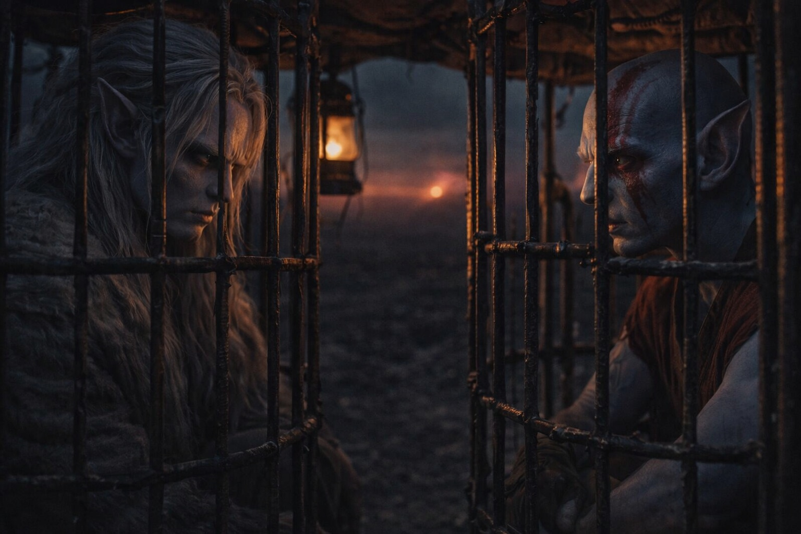
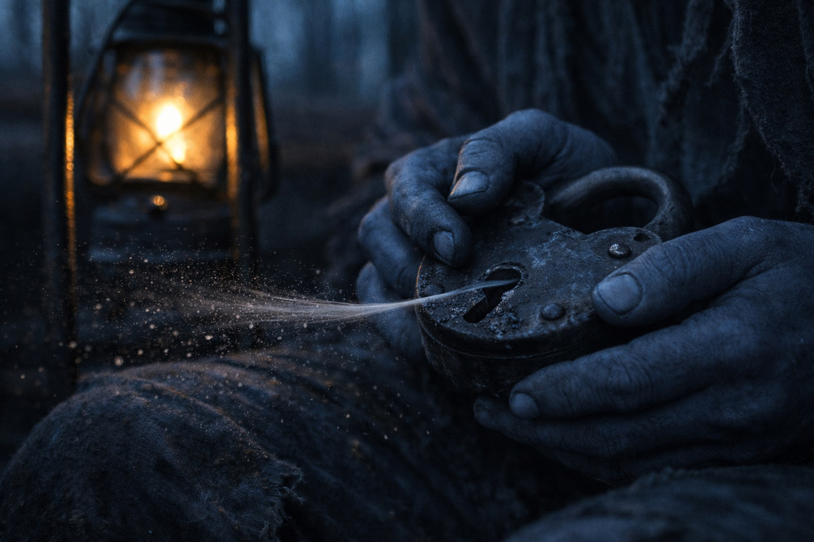
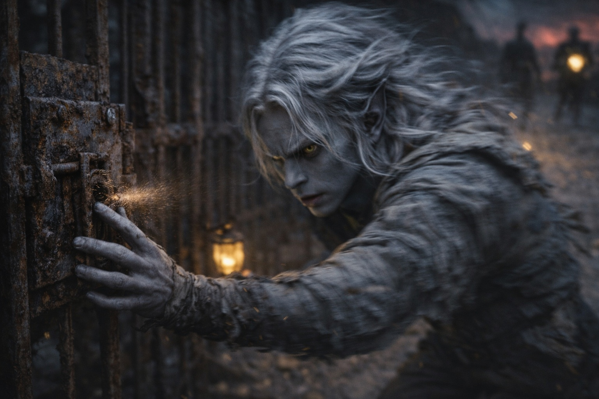

## Capítulo 13 | Parte 3

---

El cuarto día de cautiverio, una corriente atravesó la jaula y Drusniel la sintió antes de que le rozara la piel.

Había comido poco y bebido lo justo para que no se le agrietara la boca. Tenía la cabeza más despejada, aunque le temblaban las manos.

Esperó a que los guardias miraran hacia otro lado y atrajo un poco del aire hacia la cerradura.

Lo estrechó para introducirlo en la ranura. Un pasador cedió a la presión; el dolor le recorrió el brazo desde la muñeca hasta el codo, y Drusniel soltó el aire.

El pasador volvió a su sitio. Drusniel metió la mano temblorosa debajo del muslo.

La cerradura estaba corroída, pero había sentido subir el pasador. Podría probar con los demás cuando aflojara el dolor.

Abrirla le dejaría pocas fuerzas para una segunda cerradura. Miró la jaula de Elion.

Más allá, nueve prisioneros se apiñaban en la tercera jaula. El hombre más cercano a la puerta se había envuelto la muñeca con un trapo para que no le rozara la cadena.

Drusniel se obligó a apartar la vista. Aún no había abierto ni su propia cerradura.

Pasó el día observando.

El guardia del turno de tarde cojeaba al girar sobre la rodilla izquierda.

Nada oculto. Elion también lo había visto.

El conductor del tercer carro comprobaba debajo de su asiento cada vez que se acercaba otro guardia.

Llaves, probablemente.

El cuarto carro olía a aceite de lámpara.

Elion captó el mismo olor. Inclinó la cabeza hacia el carro y esperó a que Drusniel asintiera.

Más tarde, Elion cerró los ojos y palideció. Al abrirlos, describió un paso estrecho entre unas formaciones de piedra al este del camino.

Recordaba haber corrido por allí.

No recordaba de quién eran las piernas.

—¿Puedes encontrarlo otra vez? —preguntó Drusniel.

—Quizá.

—No pareces seguro.

—He corrido por allí. Pero no con estas piernas.

Drusniel miró al este y se fijó en la formación más cercana para recordarla.

Cuando llegó la parte más profunda de la guardia, quedaban dos guardias despiertos.

Drusniel apoyó la mano contra la cerradura y atrajo la corriente que pasaba entre los barrotes.

El primer pasador subió. Lo mantuvo allí mientras buscaba el siguiente, y el dolor volvió a subirle por el brazo.

Clic.

La puerta se abrió. La sujetó antes de que golpeara el lateral del carro y se apoyó en el marco hasta que el patio dejó de oscilar.

La libertad estaba lejos de los carros.

La jaula de Elion estaba hacia ellos.

Podía irse antes de que los guardias vieran la puerta abierta.

Elion lo observaba entre los barrotes. No había gritado para llamarlo.

Drusniel bajó al suelo.

Corrió hacia la jaula de Elion.

---

**Fin de Capítulo 13.3 —> 13.4: [El Que Camina Libre: La Fuga](/el-que-camina-libre-la-fuga/)**
