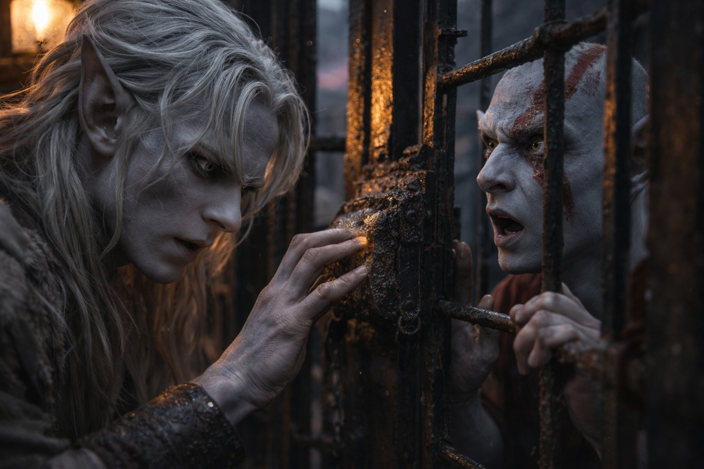
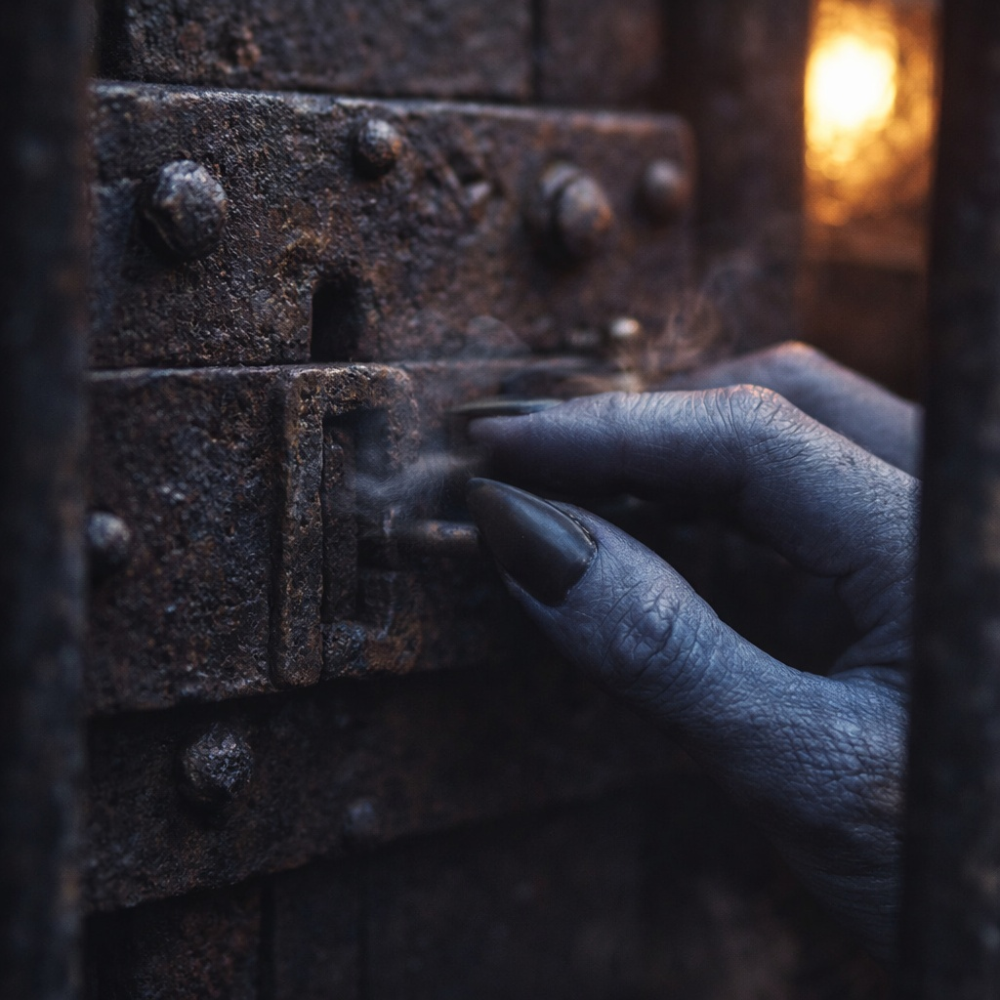
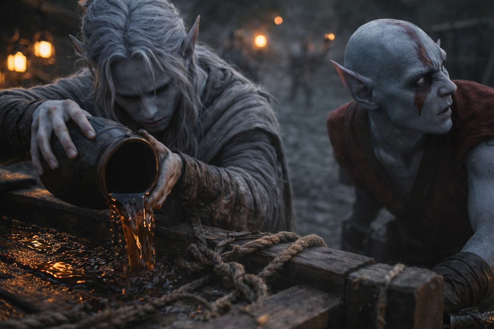
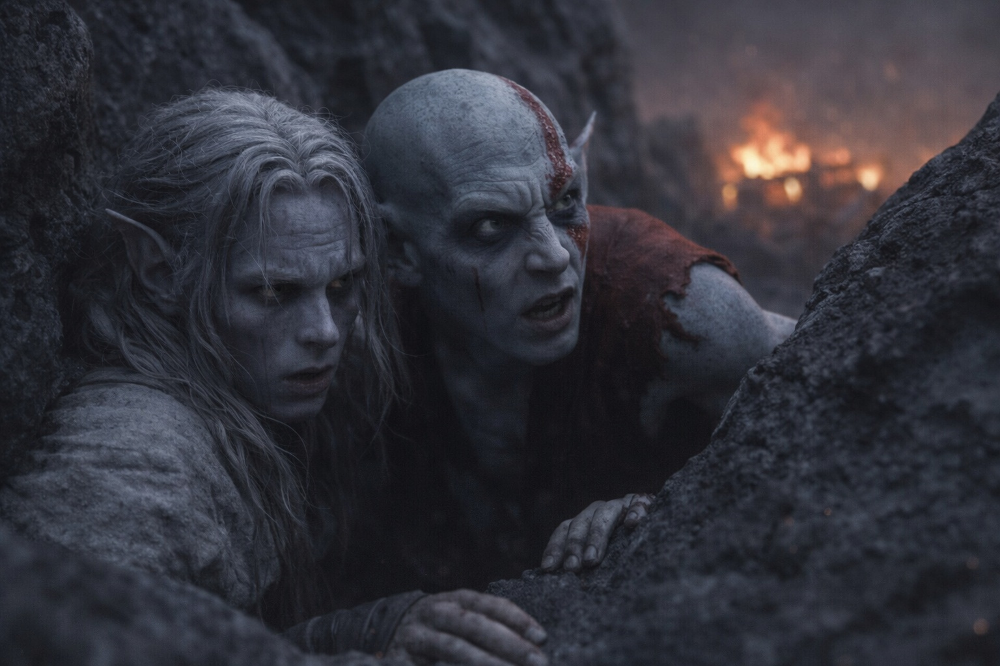

## Capítulo 13 | Parte 4

---

Elion ya estaba junto a los barrotes cuando Drusniel llegó.

—Viniste.

—Estoy abriendo tu jaula. Mantente callado.

Drusniel puso la mano contra la cerradura.

Más vieja que la suya.

Más corrosión.

Distribución distinta de pasadores.

Buscó el aire que se movía entre los barrotes, lo estrechó hasta que cupo en la ranura y cartografió la resistencia mediante presión.

Primer pasador.

Segundo.

El tercero arrastraba.

Drusniel cambió el ángulo.

Presionó.

Clic.

La puerta se abrió.

Dos cerraduras habían consumido casi todo lo que había recuperado.

Elion no se movió.

Durante una respiración se quedó en el umbral.

Jaula abierta.

Patio abierto.

Sin cadena.

Y aun así seguía dentro.

—Elion.

Sus ojos encontraron los de Drusniel.

—Muévete.

Elion salió.

Cruzaron agachados entre los carros.

Nueve prisioneros seguían en la tercera jaula.

Drusniel miró una vez.

No quedaba magia para otra cerradura.

No había tiempo antes de que cambiara la guardia.

Siguió moviéndose.

Cuarto carro.

Aceite de lámpara.

Una linterna de viaje con capucha colgaba del lateral.

Elion tomó la linterna mientras Drusniel agarraba un odre, una bolsa de raciones y una manta enrollada.

Drusniel abrió el primer recipiente de aceite y lo derramó sobre la plataforma.

Elion miró la linterna.

Después el aceite.

—Fuego.

Abrió la capucha de un tirón y lanzó la linterna al carro.

El vidrio se rompió.

La llama corrió por el aceite.

Un guardia gritó.

Ya no era confusión.

Era un problema.

Un guardia corrió hacia el fuego.

El otro dio la alarma.

Hombres se despertaron detrás.

—Corre.

Corrieron.

El carro ardió lo bastante alto como para proyectar sombras duras sobre el camino.

Los guardias más cercanos se dividieron: algunos hacia los suministros ardiendo, otros hacia las jaulas, otros tras los fugitivos.

Esa era la ventana.

Elion llegó primero a las formaciones de piedra.

—Por aquí.

—¿Recuerdo?

—Creo.

Entraron entre las rocas.

Izquierda.

Paso estrecho.

Abajo entre dos losas inclinadas.

Elion avanzó sin dudar durante veinte pasos y luego se detuvo.

—Espera.

—¿Qué?

—No recuerdo este giro.

No era un mapa.

Era un fragmento.

Bien saberlo.

Drusniel escuchó.

Gritos detrás.

Botas sobre piedra.

Miró el suelo.

Polvo negro fino intacto en el paso derecho.

El izquierdo mostraba marcas viejas.

—Izquierda.

Corrieron a la izquierda.

Cincuenta yardas más adelante, Elion reconoció algo.

—Aquí.

Subieron detrás de una cresta rota y descendieron a una hondonada poco profunda.

El fuego seguía visible detrás.

Drusniel dejó caer los suministros.

Las manos le temblaban.

—¿Cuánto de esa ruta era recuerdo?

Elion se dejó caer contra la roca.

—Lo suficiente para perdernos con más eficiencia.

Drusniel soltó una risa a pesar suyo.

—¿Puedes llamar el resto?

—No.

—Bien.

Elion lo miró.

—¿Bien?

—Prefiero saber dónde está la incertidumbre.

Detrás, el cuarto carro ardía exactamente porque ellos le habían prendido fuego.

Una incertidumbre menos.

---

**Fin de Capítulo 13.4 —> 13.5: [El Que Camina Libre: El Después](/el-que-camina-libre-el-despues/)**
