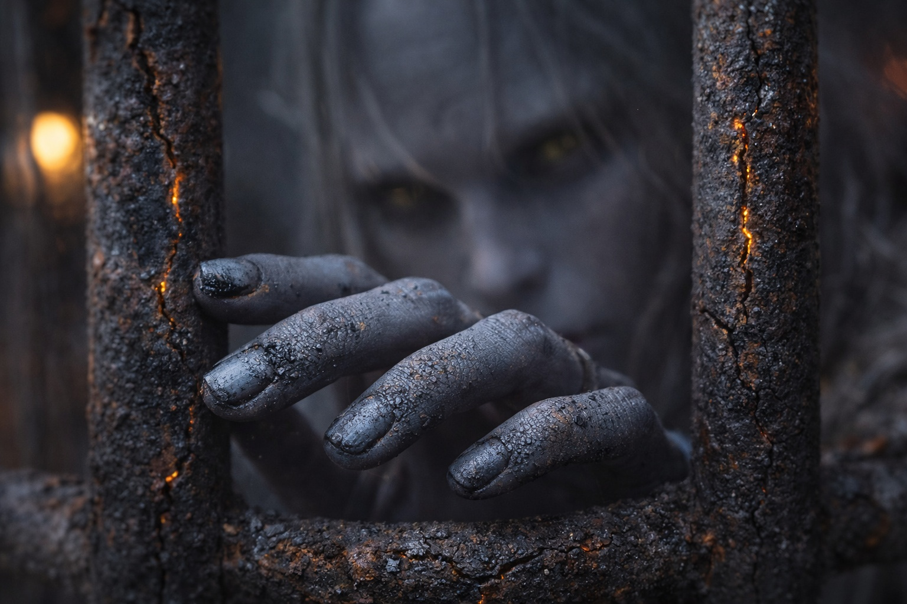

---
order: 1187
title: "El Que Camina Libre: La Jaula"
description: "La habitación se balanceaba cada vez que intentaba ponerse de pie."
date: 2024-06-22
language: es
chapter: 13
subchapter: 1
storyline: drusniel
canon_phase: main
canon_sequence: D-013-001
narrative_weight: high
category: Wyrmreach
author: Drusniel
type: Main
tags: ['#el que camina libre', '#drusniel', '#wyrmreach']
thumbnail: image.jpg
featured: false
counterpart_path: site/content/posts/en/wyrmreach/the-one-who-walks-free-the-cage/index.mdx
counterpart_title: "The One Who Walks Free: The Cage"
---

## Capítulo 13 | Parte 1

---

La habitación se balanceaba cada vez que intentaba ponerse de pie.

Drusniel había contado a los guardias siete veces ya. Siete guardias en el patio. Cuatro carros afuera. Once prisioneros en total, repartidos en tres jaulas. El cuarto carro llevaba suministros y las pertenencias personales de los esclavistas.

*Siete. Cuatro. Once. Tres.*

Los números eran sólidos mientras todo lo demás se había vuelto incierto.

Tres días desde la traición de Merrik. La caravana se había detenido en un puesto de paso en la ruta del este—un edificio bajo de piedra donde mantenían la carga de alto valor separada de los demás prisioneros. Tres días encerrado en una habitación con suelo de madera áspera, una cama estrecha y comida que le dejaba las extremidades pesadas y la mente un paso detrás. Su magia permanecía agotada, un espacio hueco en su pecho donde debería haber poder. El artefacto presionaba contra su piel, frío y silencioso, sin ofrecer nada.

La somnolencia llegaba en oleadas.

Lo había notado el primer día. Cada cuenco que los esclavistas le traían—la receta de Merrik, sin duda—volvía borrosos los bordes del cuarto. Cada vaso de agua le apagaba los reflejos y lo arrastraba otra vez hacia la cama. No lo suficiente para dejarlo inconsciente del todo, solo lo suficiente para mantenerlo lento.

O algo para mantenerlo controlado.

*Stock saludable,* había dicho Merrik. *Los mercados del este pagan premium.*

Drusniel archivó la información. Mercados del este significaba compradores del este, lo que significaba que la caravana se dirigía hacia algún tipo de civilización. Civilización significaba oportunidad. Solo necesitaba sobrevivir lo suficiente para encontrarla.

La vista más allá de la contraventana era extraña y hostil. La arena negra daba paso a formaciones rocosas que no deberían existir, agujas retorcidas de piedra que parecían gritos congelados, crecimientos de cristal que atrapaban la luz tenue y la dispersaban en direcciones equivocadas. El cielo permanecía en ese crepúsculo constante, ni día ni noche, con el resplandor volcánico pulsando en el horizonte como un latido distante.

*Ciento cuarenta y siete marcas en el marco de la puerta. Ya las había trazado dos veces.*

Su trazado era automático ahora. Un hábito nacido de no tener nada más que hacer, ningún otro lugar donde dirigir su mente analítica. Trazaba el marco, trazaba la veta de la madera, trazaba las juntas de la piedra bajo la ventana.

Y observaba a la criatura en la jaula del fondo.

No se había movido en horas.

Los guardias la llamaban poseída por demonios. Los otros prisioneros no la llamaban de ninguna manera, se negaban a mirarla, se negaban a reconocer su existencia, como si ignorarla pudiera hacerla desaparecer. Pero Drusniel observaba, porque observar era lo que hacía, y porque la criatura era lo más interesante en este miserable patio de retención.

Piel gris. No el gris-púrpura de los drow, sino un gris plano y ceniciento que parecía piedra cobrada vida. Marcas rojas en su rostro y brazos, pintura de guerra o coloración natural, no podía decirlo. Rasgos alargados que sugerían ascendencia élfica pero no eran del todo correctos. Y ojos que lo observaban a él con una intensidad que debería haber sido inquietante.

Debería haber sido. No lo era.

Drusniel había sido observado por cosas mucho más peligrosas que un prisionero enjaulado. Había sido observado por la Voz en el mar de pesadillas, por las cosas que se movían en las profundidades, por los ojos calculadores de Merrik midiendo su valor. La atención de esta criatura era diferente. Curiosa. Paciente.

*Inteligente.*

Eso era lo que los guardias no veían cuando la llamaban demonio. Los demonios no observaban con ese tipo de interés enfocado. Los demonios no esperaban. Esta criatura lo estaba estudiando de la misma manera que él la estudiaba a ella, catalogando detalles, formando conclusiones.

Un carro en el patio golpeó un surco profundo al reposicionarse, y la jaula del fondo se balanceó fuerte contra sus ataduras. Drusniel se estabilizó apoyando una mano en el borde de la cama, la visión nadando por un segundo, y a través del desenfoque entre tablillas, los labios de la criatura se movieron.

Casi una sonrisa.

Drusniel no le devolvió la sonrisa. Pero archivó eso también: la criatura era consciente, receptiva, capaz de señales sociales. Fuera lo que fuera, no era irracional.

*Veintitrés prisioneros han sido vendidos desde que comenzó la caravana, según las conversaciones de los guardias. Los mercados del este están a tres días más. Eso deja tiempo.*

Tiempo para qué, no estaba seguro. Su magia todavía se estaba recuperando, todavía ese dolor hueco donde el poder debería fluir. Su cuerpo estaba débil por el cruce, la traición y la comida alterada que lo mantenía embotado. No tenía armas, ni aliados, ni plan.

Pero tenía tiempo. Y una habitación cerrada llena de preguntas.

Y abajo de su ventana, una criatura que lo observaba como si estuviera esperando algo.

Los guardias vinieron antes del amanecer. Dos de ellos, aburridos y eficientes. Lo sacaron de la habitación sin explicación, lo cruzaron por el patio y lo empujaron a la segunda jaula del carro más cercano. La cama y los muros de piedra y la puerta con sus ciento cuarenta y siete marcas desaparecieron detrás de lona y barrotes de hierro. El puesto de paso había cumplido su propósito—engordar y drogar la carga valiosa. Ahora la caravana se movía otra vez, y Drusniel era mercancía de nuevo.

La jaula era más pequeña que la habitación. Más tosca. El suelo era madera astillada, las paredes eran barrotes de hierro, y el cielo era una franja de rojo grisáceo entre solapas de lona. Pero a través de los huecos, todavía podía ver a la criatura en la jaula del fondo. Todavía observando. Todavía esperando.

La jaula se meció cuando el carro arrancó hacia adelante. Esta vez, la habitación realmente se estaba moviendo.

---

*Siguiente: El Que Camina Libre: La Criatura*

**Fin de Capítulo 13.1 — continúa en Capítulo 13.2: [El Que Camina Libre: La Criatura](/el-que-camina-libre-la-criatura/)**
