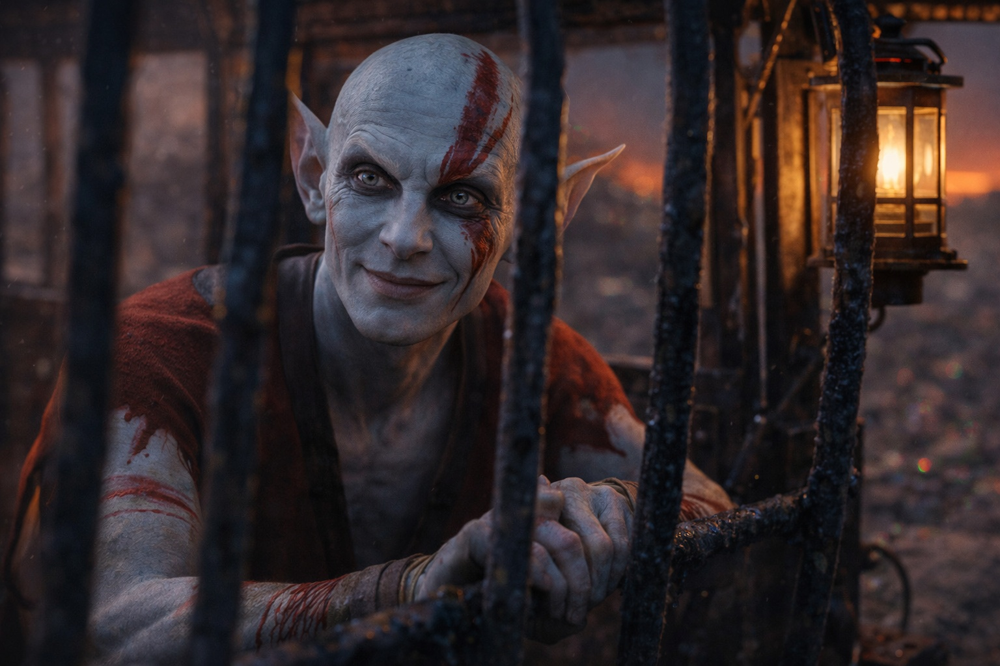

---
order: 1187
title: "El Que Camina Libre: La Jaula"
description: "Siete guardias. Cuatro carros. Once prisioneros. Tres jaulas."
date: 2024-06-22
language: es
chapter: 13
subchapter: 1
storyline: drusniel
canon_phase: main
canon_sequence: D-013-001
narrative_weight: high
category: Wyrmreach
author: Drusniel
type: Main
tags: ['#el que camina libre', '#drusniel', '#wyrmreach']
thumbnail: image.jpg
featured: false
counterpart_path: site/content/posts/en/wyrmreach/the-one-who-walks-free-the-cage/index.mdx
counterpart_title: "The One Who Walks Free: The Cage"
---

## Capítulo 13 | Parte 1

---

Siete guardias. Cuatro carros. Once prisioneros. Tres jaulas.

Drusniel repitió los números hasta que la pesadez drogada detrás de sus ojos dejó de importar.

La caravana se había detenido en un puesto de paso de la ruta del este. Lo mantenían en una habitación de piedra separado de los otros prisioneros, le daban comida dos veces al día y ponían algo tanto en la comida como en el agua.

No suficiente para dejarlo inconsciente.

Suficiente para que ponerse de pie costara demasiado.

Tres días desde que Merrik lo vendió.

Su magia seguía siendo un dolor hueco.

El Nulo descansaba bajo su camisa.

Los guardias lo habían registrado dos veces. Uno sacó la bolsa, la abrió, pesó el metal en la palma y no encontró nada que le preocupara. La instrucción de Merrik había acompañado la venta: los supervivientes del cruce valían más si llegaban con lo que habían llevado consigo.

Así que lo dejaron.

Metal frío.

Inerte, por lo que ellos podían ver.

Error útil.

Más allá del postigo: arena negra, formaciones de cristal, luz volcánica.

Dentro: tablas ásperas, cama estrecha, muro de piedra.

Ciento cuarenta y siete marcas en el marco de madera.

Drusniel las había recorrido dos veces con los dedos.

Después trazó las tablas.

Después las juntas de la piedra.

Cuando no quedó nada más que contar, observó al prisionero de la jaula del fondo.

Piel gris.

Marcas rojas en rostro y brazos.

Rasgos largos que sugerían ascendencia élfica sin coincidir con ella.

Los guardias lo llamaban poseído por demonios.

Los otros prisioneros evitaban mirarlo.

Él miraba a Drusniel.

No constantemente.

En momentos útiles.

Cuando cambiaban los guardias.

Cuando llegaba comida.

Cuando movían un carro.

Drusniel dejó de pensar que aquella vigilancia era accidental.

Un carro golpeó un surco mientras el personal del patio lo recolocaba. La jaula del fondo se sacudió contra sus amarres.

Los labios del prisionero se movieron.

Drusniel casi respondió.

Casi.

De las conversaciones de los guardias había aprendido que ya habían vendido a veintitrés prisioneros.

Los mercados del este estaban a tres días.

Eso dejaba tiempo.

Su cuerpo estaba débil.

Su magia, peor.

No tenía arma.

Pero el tiempo seguía siendo un recurso.

Antes de que cambiara la luz, dos guardias vinieron por él.

Lo sacaron de la habitación y lo empujaron a la segunda jaula del carro más cercano.

La habitación de piedra quedó atrás.

También el marco.

Ciento cuarenta y siete marcas.

La jaula era más pequeña.

Barrotes de hierro.

Suelo astillado.

Lona arriba.

Pero desde allí todavía podía ver al prisionero gris de la jaula del fondo.

Observando.

El carro arrancó.

Drusniel contó otra vez a los guardias.

Siete.

Seguían siendo siete.

---

**Fin de Capítulo 13.1 —> 13.2: [El Que Camina Libre: La Criatura](/el-que-camina-libre-la-criatura/)**
