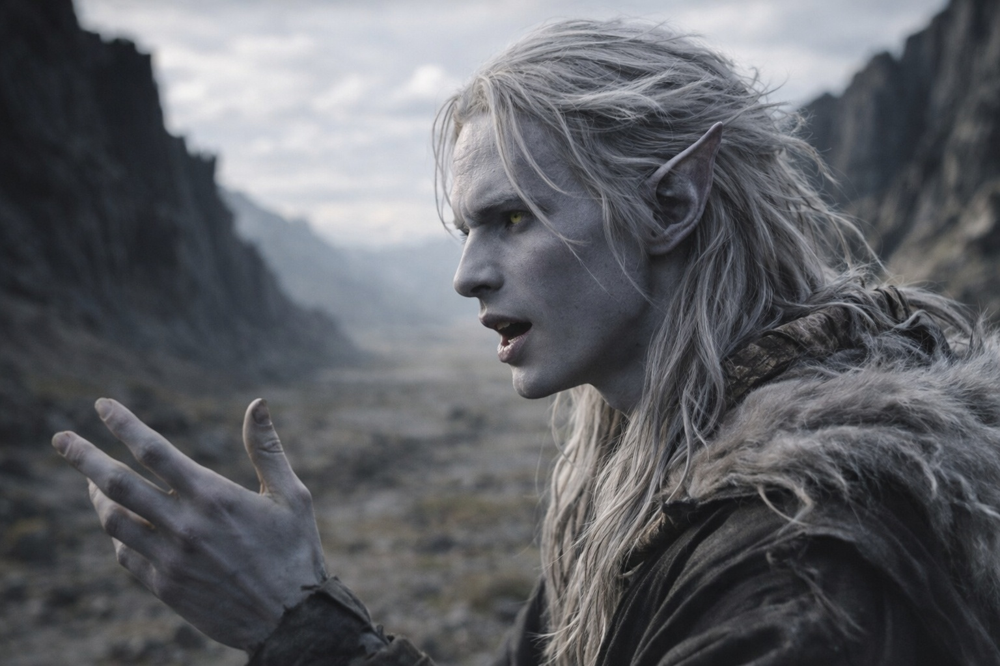

## Capítulo 32 | Parte 3 | La Conversación

---

No preguntó lo que él sabía. Preguntó lo que él creía.

La conversación ocurrió el cuarto día, en un tramo del camino donde el terreno se abría en un largo fondo de valle entre crestas de basalto negro. El guía de Nyxara había llevado al séquito y a los otros dos por delante, dejando una distancia que podría haber sido accidental si algo de lo que Nyxara hacía fuese accidental. Drusniel caminaba junto a ella. El valle era amplio. El cielo estaba visible. Ella caminaba por el lado abierto.

—La barrera —dijo—. Szoravel te dio una tarea. Dime por qué la aceptaste.

—Dice que está fallando. Acepté una evaluación. No me ha mostrado ninguna reparación.

—Eso es lo que Szoravel te dijo. Yo pregunté qué significa para ti.

Drusniel miró el suelo mientras caminaban. Ahora lo recorría con más facilidad. Seguía sin saber qué habían cambiado los cristales en él.

—Nos enseñaron que mantenerla era sagrado. Cada prueba, cada rango, todo se justificaba por lo que debíamos a la barrera.

—Sagrado. —Repitió la palabra sin inflexión.

—Necesario. Eso afirmaban. Rechazar el deber era perder toda voz sobre cómo se cumplía.

—Y tú lo crees.

—Los creía. Ahora quiero comprobar el coste por mí mismo.

Nyxara dejó pasar veinte pasos antes de la siguiente pregunta.

—¿Qué harías si la barrera se debilitara más allá de toda renovación? ¿Si el mantenimiento se volviera imposible?

—Averiguar qué se puede conservar todavía.

—¿Incluso sabiendo que fracasaría?

—Ralentizar el fallo podría dar tiempo para sacar a la gente.

—¿Por qué?

—Hay gente a ambos lados. Si la dejamos como está, también pagan esa decisión.

Ella lo miró y después volvió la vista al camino.

—¿Quién decide cuándo es necesaria la renovación? —preguntó.

—Los que pueden sentir su degradación. Szoravel. Otros con su formación. La barrera comunica su estado a quienes saben escuchar.

—¿Y si esos oyentes discrepan?

—Entonces el que es compatible actúa con la mejor información disponible.

—Incluso si la información es incompleta.

—La información siempre es incompleta. Actúas de todos modos.

—Sí —dijo ella—. Actúas.

Caminaron en silencio durante varios pasos. Entonces dijo algo que él no esperaba.

—Una defensa fallida cuesta tropas —dijo—. Abandonarla también.

Esperó un ejemplo. Ella no le dio ninguno.

Se preguntó en qué defensa estaría pensando.

El séquito estaba lejos. Drusniel habría tenido que gritar para que Srietz lo oyera.

—Sentiste algo en la montaña —dijo. La transición llegó sin preámbulo. No era una pregunta.

Drusniel siguió caminando. Recordó la pared de cristal bajo la mano y la sangre en el labio.

—Sí.

—Dime lo que sentiste.

—Presión. Me volviera adonde me volviera, estaba allí. No encontraba su límite.

—¿Te percibió?

—Creo que sí.

—Y la barrera. ¿Qué relación tiene con lo que hay en la montaña?

—No lo sé. Szoravel no quiere identificar lo que contiene. Si esa cosa pudiera cruzar, no sabría cómo detenerla.

—Pudiera cruzar —repitió ella.

Parecía saber más. Esperó que lo corrigiera, pero ella no lo hizo.

No sabía qué ganaba ella dejándolo con las dudas.

—Una última pregunta. —Se detuvo—. Si la renovación le costara a tu nación su propósito, ¿la llevarías a cabo?

Pensó en las pruebas y en quienes habían declarado necesario su coste.

—Si evitara una pérdida mayor. Necesitaría algo más que la garantía de alguien.

Nyxara asintió una vez.

—Bien —dijo—. Entonces nos entendemos.

Ella reanudó la marcha. Drusniel se quedó donde estaba hasta que ella dio tres pasos.

Ahora sabía qué pruebas pediría él. Ojalá lo hubiera pensado antes de responder.

La siguió. Ella tomó el lado abierto del camino y le dejó a él el abrigo de la cresta.

Cuando los alcanzaron, el guía ya tenía medio campamento montado. Srietz miró de Drusniel a Nyxara.

Drusniel no dijo nada. Las orejas de Srietz le dijeron todo lo que el goblin pensaba sobre ese silencio.

Ella no le había dicho qué pretendía. Él le había contado qué podía hacerlo aceptar.

Comprobó la distancia al guardia más cercano antes de sentarse.

---

**Fin del Capítulo 32.3  —> 32.4: [El Último Lugar Seguro: La Escolta](/el-ultimo-lugar-seguro-la-escolta/)**
