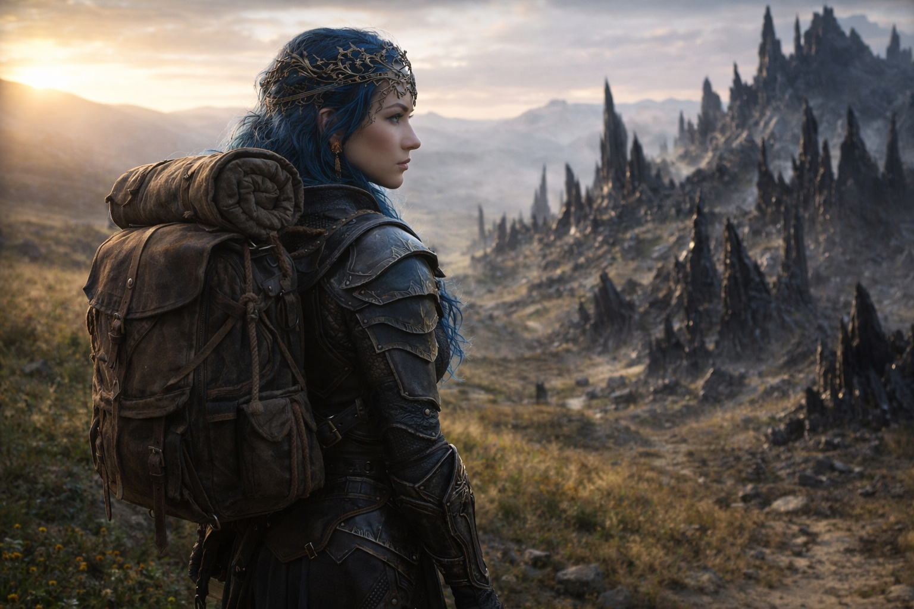
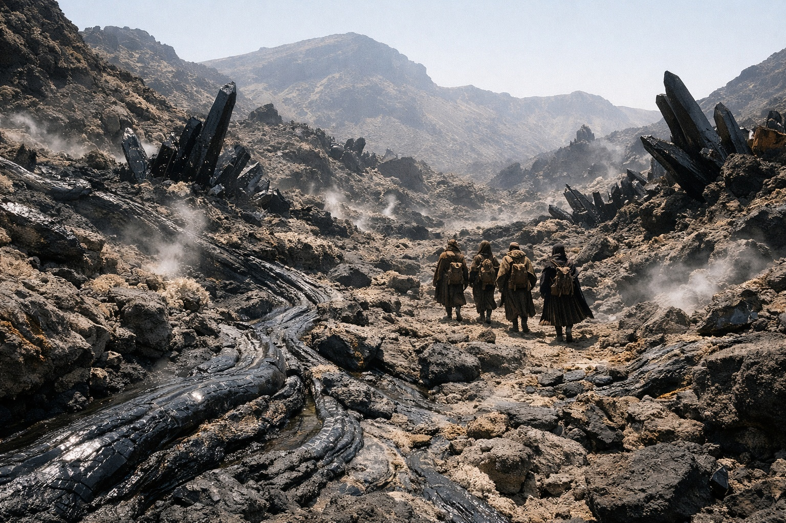
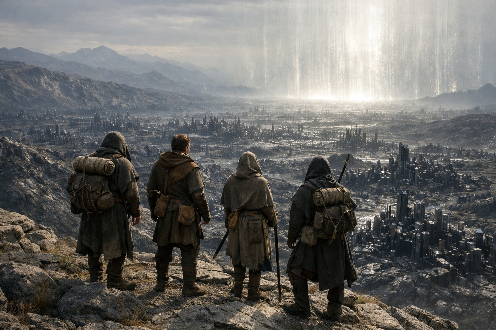

## Capítulo 32 | Parte 4 | La Escolta

---

En la quinta mañana, en el límite oriental de su dominio, Nyxara despidió a la escolta.

Nyxara habló en voz baja con el guía. Los guardias giraron al oeste por parejas y los dejaron junto al mojón.

Drusniel los observó marcharse.

—No vas con ellos —dijo.

Nyxara se ajustó la mochila que había recogido del guía antes de despedirlo.

—El territorio que tenemos delante está en disputa. Múltiples reclamaciones, ninguna resolución. Mi presencia garantiza el paso.

—Tu presencia garantiza tu presencia.

—Son la misma cosa. —Señaló más allá del hito, donde el camino se perdía entre cristales—. Tres días al este hasta el acceso a la barrera. Las facciones saben que no les conviene detenerme.

Srietz vio desaparecer a la última pareja de guardias y se inclinó hacia Elion.

—Ella abandona su dominio —dijo. Bajo. A Elion, pero con el tono justo para que Drusniel lo captara—. Los señores no abandonan sus dominios. No en tierras en disputa. Su territorio es vulnerable sin ella.

Elion la observó.

—No parece preocupada.

—Esa es la cuestión. —Las orejas de Srietz estaban aplastadas—. Una señora que abandona su dominio o no le queda nada que proteger o no necesita estar presente para protegerlo. Lo primero es desesperación. Lo segundo es otra cosa.

—¿Qué?

Srietz se echó la mochila al hombro y cruzó el límite sin responder.

Drusniel se reunió con Nyxara más allá del mojón. Las piedras sueltas cedían bajo sus botas donde terminaba el sendero cuidado.

Nyxara lo recorría como si fuera suyo.

Ella cruzó el terreno quebrado sin reducir el paso ni consultar el mapa.

—Has estado aquí antes —dijo Drusniel.

—Varias veces.

—¿Como señora?

—Como alguien que necesitaba saber qué había más allá de sus fronteras. —Esquivó una fisura en el basalto sin mirar abajo—. La aproximación a la barrera no está en el dominio de nadie. Existe en un espacio anterior a las reclamaciones territoriales actuales. Más antiguo que las facciones. Más antiguo que los señores. La propia tierra cambia de carácter cerca de la barrera.

—¿Cómo?

—Notarás el cambio. Tu adaptación te ayudará a soportar la aproximación. —Lo miró—. Mantén los cristales cerca. No te harán inmune.

—Él quería más tiempo para evaluarme.

—Szoravel y yo estamos de acuerdo en más de lo que ninguno de los dos admitiría.

Las formaciones de cristal crecían más juntas a medida que subían. Drusniel sentía zonas calientes a través de las botas y las rodeaba.

Los cristales de Drusniel zumbaban más fuerte en su cinturón.

—No necesitas venir con nosotros —dijo. Había estado conteniendo las palabras desde que la escolta se marchó. Salieron más simples de lo que había planeado.

Nyxara siguió caminando.

—Lo sé.

No se explicó. No necesitaba hacerlo. Fuera lo que fuese lo que había delante, pretendía verlo ella misma.

Desde la cresta veían entramados de cristal negro que llenaban las tierras bajas. El zumbido llegó a los dientes de Drusniel antes de empezar a bajar.

—El acceso a la barrera —dijo Nyxara, señalando el hueco entre dos formaciones.

Tres días por aquel terreno. Comprobó el agua que llevaba al cinturón y buscó un camino entre los cristales.

Srietz llegó al borde junto a Elion y examinó las laderas de abajo.

—La última vez que una señora abandonó su dominio —dijo a nadie— fue hace cien años. Las fortalezas del norte ardieron. Aquella señora no caminó. Llegó.

Miró a Nyxara, que estaba cerca del precipicio, sin más techo que el cielo abierto.

—Los señores no caminan —dijo Srietz—. Llegan.

Nyxara alzó la cabeza hacia el viento. Siguió allí hasta que los otros estuvieron listos para bajar.

—Deberíamos movernos —dijo—. Se nos va la luz.

Bajaron en fila. Detrás de ellos, el mojón aún señalaba dónde terminaba el camino cuidado.

Lo abandonaron sin ceremonia.

---

**Fin del Capítulo 32.4 —> 33.1: [Lo Que el Faro Perdió: El Titubeo](/lo-que-el-faro-perdio-el-titubeo/)**
