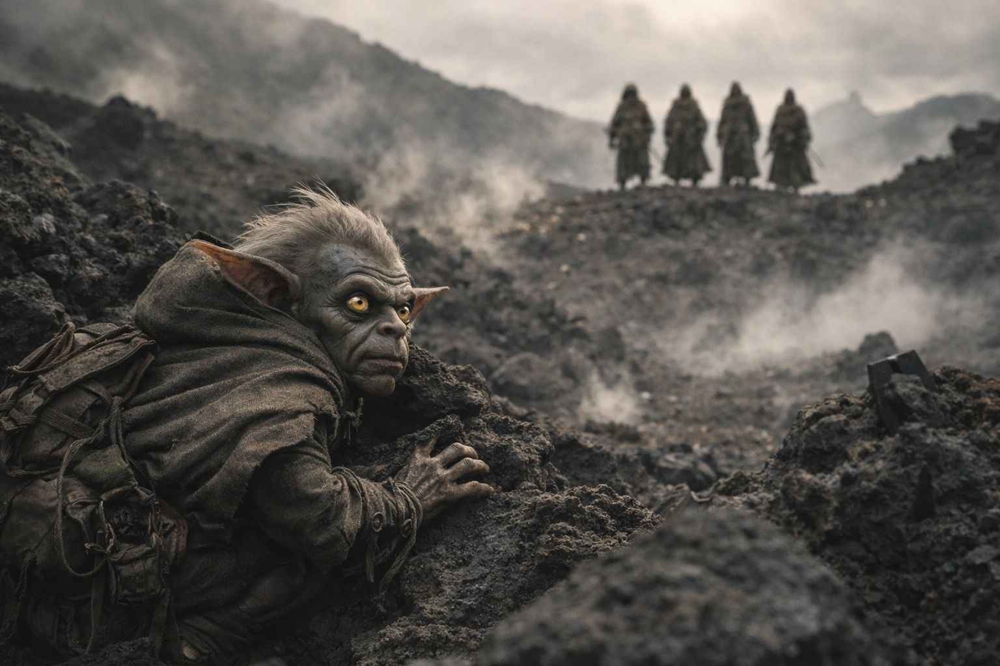
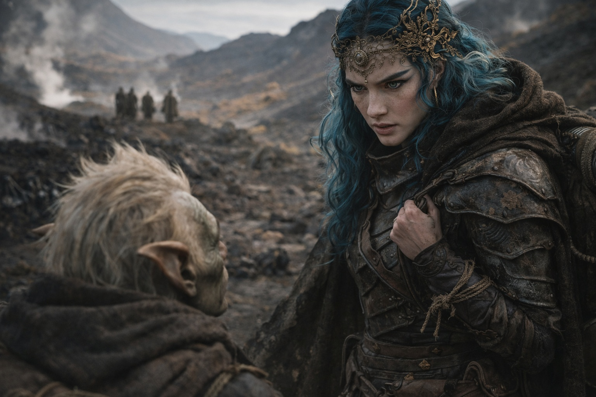

# Capítulo 32.1 | El Último Lugar Seguro: La Llegada

Ella vino del este, no desde detrás de ellos.

Drusniel comprendió la implicación antes de que su mente le pusiera palabras: no los había perseguido. Se había anticipado. Fuesen cuales fuesen las rutas que el mapa de Szoravel había ofrecido, fuesen cuales fuesen los huecos en los horarios de patrulla de los que había estado tan seguro, Nyxara se había posicionado por delante de ellos con la precisión de alguien que sabía adónde iban antes de que partiesen.

Vino con séquito. Una docena de figuras con armadura oscura y funcional, organizadas en una formación que sugería escolta de caravana más que partida de asalto. drow y no drow mezclados, moviéndose con la quietud de gente que lleva caminando junta el tiempo suficiente como para que la comunicación se produzca mediante miradas y distancia en vez de palabras. Se desplegaron por la cresta como si la hubieran medido antes.

Srietz los vio primero. Se detuvo, las orejas girando hacia delante, y emitió un sonido en el fondo de la garganta que Drusniel había aprendido a traducir como *problemas, armados, adelante*.

—Doce —dijo Srietz—. Formación. No combate. Escolta. —Miró a Drusniel directamente, lo cual en sí mismo era todavía lo bastante nuevo como para registrarse—. Ha estado esperando.

Elion se puso a su altura, sus ojos ámbar anaranjado leyendo la cresta con la atención medida de alguien que evalúa probabilidades que no piensa compartir.

—La de delante —dijo—. Alta. Armadura oscura. Los demás se mueven a su alrededor.

Nyxara.

Estaba en el punto más alto de la cresta, observándolos acercarse. Su armadura estaba gastada por el uso, no era ceremonial. Una espada en la cadera, con empuñadura para ser usada. Su rostro sostenía el tipo de paciencia que proviene de no haber sido forzada jamás a esperar por nada que no mereciera el tiempo.

Cuando estuvieron lo bastante cerca, habló.

—Me debéis una conversación. —Su voz llegaba sin necesidad de alzarla. Sin ira. Sin calidez tampoco—. Szoravel os dio lo que tenía. Ahora yo cobro lo que se me debe.

Drusniel se detuvo. Srietz ya estaba inmóvil detrás de él, tenso y calculando. Elion se encontraba entre ambos, su expresión la máscara controlada de alguien que no se comprometería con una posición hasta que las posiciones estuviesen más claras.

—Huimos —dijo Drusniel.

—Lo hicisteis. —Nyxara no sonrió—. Yo no os seguí. No de inmediato. Necesitabais distancia, y yo necesitaba ocuparme de lo que el intercambio de información de Szoravel iba a atraer. —Señaló detrás de ellos, hacia el suroeste, hacia el territorio que habían cruzado—. Dos grupos se movieron hacia la torre a las pocas horas de vuestra partida. Szoravel se encargó de uno. El otro sigue rastreando las crestas.

—Rastreándonos a nosotros.

—Rastreando lo que lleváis. —Miró su mochila. La forma que presionaba contra el cuero desde dentro—. El artefacto atrae atención. Las protecciones de Szoravel lo enmascaraban. Aquí fuera, sois visibles para cualquiera que sepa qué buscar.

Las orejas de Srietz se aplastaron.

—Ella sabe lo del Nulo.

—Ella sabe todo lo que Szoravel sabe —dijo Drusniel. Observó el rostro de Nyxara buscando confirmación. Ella no la proporcionó. No necesitaba hacerlo.

—Ofrezco escolta —dijo ella—. Mi dominio se encuentra entre aquí y la aproximación a la barrera. Atravesadlo, y caminaréis con protección. Rutas aprovisionadas. Caminos mantenidos. Mi gente. —Hizo una pausa para dejar que calara—. La alternativa es que continuéis solos por un territorio donde al menos una facción busca activamente lo que hay en vuestra mochila. Os doy cuatro días antes de que os encuentren.

—¿Y la conversación?

—Sucede durante la marcha. Me contáis lo que Szoravel os dijo. Yo os cuento lo que hay en la ruta por delante. Llegamos a la aproximación a la barrera con vosotros aún respirando. —Levantó una mano, un gesto que abarcaba al séquito, el paisaje, la amenaza que había descrito—. Esto es una transacción. No la disfrazo de caridad.

Drusniel miró a Srietz. La expresión del goblin era algo entre reconocimiento y cálculo.

—Es una coleccionista —dijo Srietz. En voz baja. Dirigiéndose a Drusniel directamente—. Nos están coleccionando.

—Srietz no se equivoca —dijo Nyxara. Lo había oído. No fingió lo contrario—. Colecciono lo que me interesa. Vosotros me interesáis. Pero también mantengo con vida lo que colecciono, que es más de lo que los grupos que tenéis detrás van a prometer.

Elion habló.

—¿Cuánto se tarda en cruzar vuestro dominio?

—Cinco días. Seis si el tiempo empeora.

—¿Y después?

—Después es asunto vuestro. Yo os llevo a través del mío.

Drusniel sintió los cálculos ejecutándose. El paisaje a sus espaldas contenía crestas expuestas, provisiones menguantes y un artefacto que aparentemente se anunciaba a cualquiera con los sentidos adecuados. El paisaje por delante contenía la oferta de Nyxara, su dominio, su protección y el estrechamiento de opciones que la aceptación siempre traía consigo.

Ya lo habían coleccionado antes. Zaelar. El recuerdo debería haberle hecho rechazar.

Pero Zaelar había ofrecido conocimiento y ocultado el coste. Nyxara ofrecía seguridad y nombraba el precio. La diferencia estaba en la honestidad de la transacción, y Drusniel había aprendido lo suficiente sobre transacciones como para saber que los costes declarados eran los que se podían sobrevivir.

—Caminamos con vos —dijo.

Nyxara asintió una vez. Confirmado, no satisfecha. Como si el resultado hubiera sido seguro y la formalidad hubiera sido por su beneficio.

Se giró e hizo una señal al séquito. La formación se desplazó, abriendo un espacio en el centro donde tres viajeros adicionales podían moverse sin alterar el conjunto. Fluido. Ensayado. Ya habían absorbido personas antes.

Mientras se incorporaban al paso del grupo, Srietz se dejó caer junto a Elion. Drusniel captó el murmullo, bajo y rápido, pensado para ser dicho antes de que la situación lo volviera inútil.

—Cuando un señor ofrece escolta, significa que la escolta necesita la carga. No al revés.

Elion no dijo nada. Por delante, Nyxara caminaba por el borde abierto del sendero donde el cielo era amplio, pasando bajo un saliente rocoso con una breve mirada hacia arriba a su parte inferior antes de continuar. Nadie lo comentó.

La ruta giró hacia el este. El séquito se movía a su alrededor como una corriente alrededor de piedras. La mochila de Drusniel presionaba contra su columna, el peso del Nulo familiar y de pronto relevante de maneras que no lo había sido una hora antes.

Lo estaban coleccionando. Srietz tenía razón en eso.

La pregunta era qué pretendía hacer la coleccionista con la colección.

---

*Siguiente: El Último Lugar Seguro: La Seguridad*

**Fin del Capítulo 32.1 — continúa en el Capítulo 32.2: [El Último Lugar Seguro: La Seguridad](/el-ultimo-lugar-seguro-la-seguridad/)**
