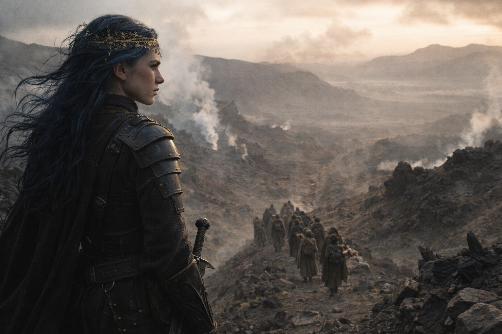
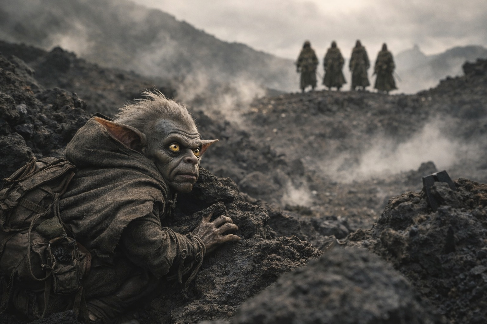

## Capítulo 32 | Parte 1 | La Llegada

---

Ella vino del este, no desde detrás de ellos.

Nyxara había llegado al camino antes que ellos. La frontera de Szoravel no había detenido nada.

La acompañaban una docena de guardias, drow y no drow, con armaduras oscuras y gastadas. Se desplegaron por la cresta sin esperar una orden.

Srietz los vio primero. Se detuvo, las orejas girando hacia delante, y emitió un sonido en el fondo de la garganta que Drusniel había aprendido a traducir como *problemas, armados, adelante*.

—Doce —dijo Srietz—. Formación. No combate. Escolta. —Miró a Drusniel directamente, lo cual en sí mismo era todavía lo bastante nuevo como para registrarse—. Ha estado esperando.

Elion se puso a su altura.

—La de delante. Los demás se mueven a su alrededor.

Nyxara.

Estaba en el punto más alto, con una mano junto a la espada de la cadera. Drusniel no sabía cuánto tiempo llevaba observándolos.

Cuando estuvieron lo bastante cerca, habló.

—Evitaste mi convocatoria. —La voz de Nyxara llegó a lo largo de la cresta—. Hablaremos ahora.

Drusniel se detuvo. Srietz paró detrás de él y Elion se apartó a un lado para vigilar a los guardias.

—Nuestro acuerdo terminó en la frontera —dijo Drusniel.

—Y seguisteis corriendo. —Nyxara señaló al sudoeste—. Dos grupos fueron a la torre pocas horas después de vuestra salida. Szoravel se ocupó de uno. El otro sigue buscando por las crestas.

—Rastreándonos a nosotros.

—Rastreando lo que llevas. —Miró su pecho—. Lo que salió de la montaña contigo ha atraído atención. La torre te daba refugio. Aquí pueden vigilar los caminos.

Las orejas de Srietz se aplastaron.

—Ella sabe lo del Null.

—Lo sabía antes de que llegáramos a la torre —dijo Drusniel. Observó a Nyxara.

—Ofrezco escolta. Mi dominio está entre este lugar y el acceso a la barrera. Mi gente mantiene las rutas y abastece los refugios. —Miró la cresta expuesta—. Solos, tenéis cuatro días antes de que esa facción os encuentre.

—¿Y la conversación?

—Sucede durante la marcha. Me contáis lo que Szoravel os dijo. Yo os cuento lo que hay en la ruta por delante. Llegamos a la aproximación a la barrera con vosotros aún respirando. —Levantó una mano, un gesto que abarcaba al séquito, el paisaje, la amenaza que había descrito—. Esto es una transacción. No la disfrazo de caridad.

Drusniel miró a Srietz. El goblin negó apenas con la cabeza.

—Es una coleccionista —dijo Srietz. En voz baja. Dirigiéndose a Drusniel directamente—. Nos están coleccionando.

—Srietz no se equivoca —dijo Nyxara. Lo había oído. No fingió lo contrario—. Colecciono lo que me interesa. Vosotros me interesáis. Pero también mantengo con vida lo que colecciono, que es más de lo que los grupos que tenéis detrás van a prometer.

Elion habló.

—¿Cuánto se tarda en cruzar vuestro dominio?

—Cinco días. Seis si el tiempo empeora.

—¿Y después?

—Después es asunto vuestro. Yo os llevo a través del mío.

Miró al séquito y después la cresta expuesta a sus espaldas. Tenía comida para el cruce. Lo que le faltaba era una ruta más allá del mapa.

Ya lo habían coleccionado antes. Zaelar. El recuerdo debería haberle hecho rechazar.

Tendría que fijar el límite antes de ponerse en marcha.

—Paso e información. Ningún servicio después. Mis compañeros hablan por sí mismos. —Miró a Srietz y Elion. Ambos asintieron antes de que volviera hacia ella—. Caminamos.

—Mantened el paso —dijo Nyxara.

Hizo una señal al séquito. Los guardias dejaron un espacio entre ellos para los tres viajeros.

Mientras se incorporaban al paso del grupo, Srietz se dejó caer junto a Elion. Drusniel captó el murmullo, bajo y rápido, pensado para ser dicho antes de que la situación lo volviera inútil.

—Cuando un señor ofrece escolta, significa que la escolta necesita la carga. No al revés.

Elion no dijo nada. Por delante, Nyxara caminaba por el borde abierto del sendero donde el cielo era amplio, pasando bajo un saliente rocoso con una breve mirada hacia arriba a su parte inferior antes de continuar. Nadie lo comentó.

La ruta giró al este. Drusniel comprobó el Null bajo la camisa mientras los guardias se colocaban a su alrededor.

Lo estaban coleccionando. Srietz tenía razón en eso.

Conservaría su propia mochila y vigilaría adónde los llevaba.

---

**Fin del Capítulo 32.1  —> 32.2: [El Último Lugar Seguro: La Seguridad](/el-ultimo-lugar-seguro-la-seguridad/)**
