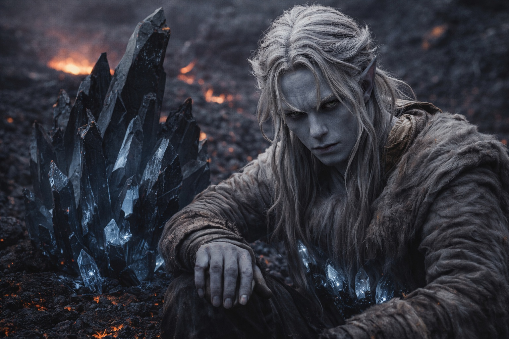

# Capítulo 32.2 | El Último Lugar Seguro: La Seguridad

La comida estaba caliente. La ruta era clara. La compañía era inteligente.

Era la primera vez en semanas que el peligro no era la preocupación inmediata. El séquito de Nyxara se movía por su dominio con la familiaridad de gente que camina por caminos mantenidos en territorio mantenido, y dentro de esos caminos, dentro de ese territorio, la presión constante que había definido cada día desde la torre de Szoravel simplemente se levantó. No desaparecida. Redistribuida. Sostenida por las manos de otras personas.

Comían provisiones de la línea de suministro de Nyxara, cocinadas en puntos de parada establecidos, servidas sobre superficies de piedra que habían sido despejadas y niveladas para ese propósito. El terreno seguía siendo Wyrmreach, aún hostil en su geología, aún incorrecto como Wyrmreach siempre era incorrecto. Pero los senderos estaban marcados. Las fuentes de agua estaban cartografiadas. Los refugios existían donde el séquito esperaba que existieran. Era, comprendió Drusniel el segundo día, lo que la conquista parecía desde dentro: no dominación sino infraestructura. No tiranía sino un camino que iba donde necesitabas que fuera.

Su cuerpo ya no luchaba contra el entorno. Esa era la parte que llevaba días evitando, la observación que había archivado en el lugar donde las verdades incómodas esperaban hasta volverse inevitables. El aire que debería haberle raspado los pulmones se sentía normal. El calor volcánico que debería haberle agotado se sentía como calidez. Las formaciones de cristal negro que salpicaban el paisaje, frecuentes aquí, gruesas vetas de mineral oscuro serpenteando a través del basalto y la obsidiana, vibraban a una frecuencia que su cuerpo reconocía en lugar de resistir. Los cristales en su cinturón vibraban con ellas. Una resonancia. Una simpatía.

Estaba adaptado. Los cristales habían reducido la fricción entre su cuerpo y este lugar hasta que la fricción desapareció, y ahora Wyrmreach se sentía menos como un reino hostil y más como el entorno para el que había sido construido. La comodidad debería haber sido bienvenida. En lugar de eso, se asentó en él como un diagnóstico.

Nyxara lo notó.

—Tu cuerpo ya no lucha contra este lugar —dijo la segunda noche, observándole comer cerca de una formación de cristal negro que sobresalía del suelo como una costilla desplazada. Ella estaba de pie, como siempre estaba de pie durante las comidas, atendiendo la ruta o el séquito o alguna logística que aparentemente requería su atención precisamente en los momentos en que se servía la comida. Drusniel nunca la había visto comer—. ¿Cuánto tiempo llevas usando los cristales?

Consideró mentir. La consideración duró unos dos segundos. Ella ya sabía lo suficiente como para hacer que mentir fuera inútil e insultante.

—Semanas. Desde una cámara bajo los túneles.

—¿Cómo los usaste?

—Llevándolos encima. La adaptación no fue deliberada.

—Rara vez lo es. —Trazó un dedo a lo largo de la formación de cristal junto a ella, como alguien que toca una superficie familiar mientras piensa en otra cosa—. La adaptación es lo que los cristales les hacen a los cuerpos compatibles. Reducen la resistencia. Te hacen encajar en el entorno en lugar de luchar contra él. —Sus ojos volvieron a él. Directos. Interesados. El interés de alguien que cataloga un hecho que sospechaba y ahora confirmaba—. Estás adaptado. Eso cambia lo que puedes hacer aquí. Y lo que este lugar puede hacerte.

—¿Es decir?

—Es decir, la barrera responde a lo que pertenece. Ahora perteneces. Quisieras o no.

Siguió adelante. Atendió algo con el séquito. Dejó la observación donde la había colocado, pesada y precisa.

Drusniel se quedó con ella. Los cristales en su cinturón vibraban.

Los días se acumularon. Nyxara caminaba con ellos, no junto a su séquito sino entre los tres viajeros, y hacía más que preguntar. En cada alto le enseñaba palabras operativas en un registro dracónico antiguo, formas breves para control de corrientes de aire y percepción de agua, luego le corregía postura, ángulo de muñeca y respiración hasta que el patrón se sostenía. Registraba sus errores sin comentario y lo ajustaba otra vez. No era consuelo, era instrucción, pero la precisión no dejaba duda: quería que mejorara.

Eso le detuvo.

—¿Qué sabes sobre la Voz?

—Sé que existe. Sé que intervino. Sé que cargas obligaciones de esas intervenciones. —Lo dijo como decía todo: como un hecho establecido, no como una revelación—. Las redes de Szoravel son extensas pero tienen fugas. Lo que me interesa es qué quiere.

—No sé qué quiere.

—Entonces dime qué ha hecho.

Se lo contó. Más de lo que pretendía. No porque ella presionara, sino porque escuchaba, y la escucha era algo que no había experimentado desde Annariel, desde el vínculo mental que había creído real y no lo era, desde las conversaciones que habían moldeado su comprensión de sí mismo y resultaron ser arquitectura diseñada por otra persona. Nyxara escuchaba como Annariel había escuchado: completamente. Atentamente. Como si lo que decía importara no porque le sirviera a ella sino porque lo encontraba genuinamente digno de ser oído.

La diferencia, se dijo a sí mismo, era que Nyxara era real. Presente. Sus preguntas venían de su propia boca, no de un vínculo fabricado. La magia de Nyxara se sentía pura y limpia de un modo que la de Zaelar nunca se había sentido. Zaelar enseñaba en capas y oscuridades, respuestas envueltas en motivos que nunca nombraba. Nyxara daba una palabra y una forma, luego corregía hasta que la corriente respondía. Se descubrió pensando palabras que debería haber resistido: maestra verdadera, maestra, par estratégica.

Le habló del Mar de Pesadillas. De la primera deuda. Del silencio de la Voz durante el cruce del volcán y lo que ese silencio había significado. De la segunda deuda, cuando sus compañeros habrían muerto de hambre. De la agitación que había sentido en el campamento de Thornfield, las dos palabras presionadas en su conciencia con el peso de una estación que se acerca.

Le contó demasiado. Lo sabía mientras lo hacía.

La tercera noche, Srietz le apartó.

Estaban en un punto de parada, una formación resguardada donde el séquito montaba campamento con la eficiencia de gente que lo había hecho cientos de veces. Srietz apareció al lado de Drusniel mientras los demás estaban ocupados, moviéndose con la quietud que era su estado natural y su arma más fiable.

—Está aprendiéndolo todo. —Su voz era baja. Rápida. La cadencia de alguien que llevaba tres días conteniendo palabras—. Le estás enseñando.

—Ella ya sabía la mayor parte.

—Sabía. Ahora ha confirmado. —Los ojos amarillos de Srietz estaban fijos, lo cual en él significaba que la urgencia era real—. Son cosas diferentes. Saber es una suposición. Confirmar es un arma. Le estás entregando armas y ella te lo agradece.

—Nos está ayudando.

—Se está ayudando a sí misma. Nosotros simplemente estamos dentro de la ayuda. —Miró hacia donde Nyxara estaba con dos miembros de su séquito, revisando algo que Drusniel no podía ver—. Nunca come con nosotros. Nunca come en absoluto. Hace preguntas cuando estás cómodo. Responde justo lo suficiente para mantenerte hablando. Esto es extracción, no amistad.

Drusniel miró al goblin. Srietz le devolvió la mirada. La ira que había definido su rostro durante días seguía ahí, contenida, pero esto no era ira. Era la evaluación operativa de alguien que había pasado tres años aprendiendo cómo se veía cuando alguien recolectaba lo que necesitaba de ti mientras hacía que pareciera generosidad.

—Sé lo que está haciendo —dijo Drusniel.

—Entonces deja de darle lo que quiere.

—Lo que ella quiere es información que necesito que tenga si va a llevarnos al acceso de la barrera con vida.

Las orejas de Srietz se agitaron.

—Esa es su lógica. La estás repitiendo. Así es como sabes que está funcionando.

Se fue. Volvió al lado de Elion en el extremo más lejano del campamento, donde el humanoide gris estaba sentado con las piernas cruzadas y sus ojos ámbar anaranjado rastreando nada y todo.

Drusniel observó a Nyxara. Estaba de pie en el centro del claro del punto de parada, lejos de las paredes de la formación rocosa, lejos de la piedra saliente que habría proporcionado refugio de la lluvia fina que había comenzado. Su séquito se resguardó. Ella no. Se quedó donde el espacio era más amplio y el cielo estaba abierto. Anotó la elección sin entender por qué lo inquietaba.

La comida estaba caliente. La ruta era clara. La compañía era inteligente.

Se pilló a sí mismo relajándose en su órbita, y el pillarse se sintió como una advertencia que no quería escuchar.

---

**Fin del Capítulo 32.2 — continúa en el Capítulo 32.3: [El Último Lugar Seguro: La Conversación](/el-ultimo-lugar-seguro-la-conversacion/)**
