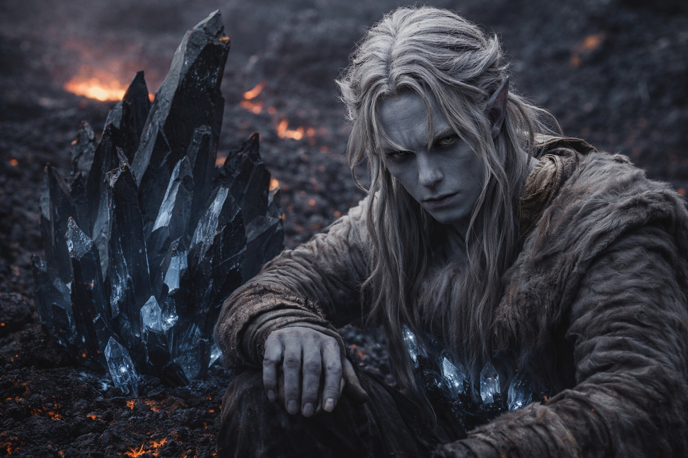

## Capítulo 32 | Parte 2 | La Seguridad

En la primera parada, Drusniel comió caliente sin tener que vigilar el sendero.

Los guardias vigilaban los accesos mientras los viajeros comían. Drusniel terminó antes de darse cuenta de que no había mirado atrás ni una vez.

La gente de Nyxara sabía dónde encontrar agua y refugio. La comida los esperaba en las paradas. El segundo día, Drusniel comprendió que no había desplegado el mapa de Szoravel desde que se unieron al grupo.

Respirar se había vuelto más fácil. Ya no necesitaba detenerse en cada subida, aunque el calor seguía dándole sed. Los cristales del cinturón zumbaban al pasar junto a las formaciones más grandes.

Con los cristales cerca, podía calcular distancias sin el mareo habitual. Temía comprobar si duraría al alejarse de ellos.

Nyxara lo notó.

La segunda noche, Nyxara lo observó comer junto a una formación de cristales. —Tu cuerpo ya no lucha contra este lugar. ¿Cuánto tiempo llevas usando los cristales? —Permaneció de pie. Él aún no la había visto comer.

Consideró mentir. La consideración duró unos dos segundos. Ella ya sabía lo suficiente como para hacer que mentir fuera inútil e insultante.

—Estos desde la montaña. Antes había manipulado otros.

—¿Cómo los usaste?

—Llevándolos encima. La adaptación no fue deliberada.

—Rara vez lo es. —Pasó un dedo por la formación—. Hacen que un cuerpo compatible tolere el entorno. Has notado la diferencia.

—¿Es decir?

—Es decir, la barrera responde a lo que pertenece. Ahora perteneces. Quisieras o no.

Lo dejó junto a la formación y fue a hablar con su guía.

Drusniel se quedó junto a la formación, escuchando los cristales del cinturón.

En cada parada, Nyxara lo hacía practicar fórmulas breves de aire y agua. Le corregía la muñeca y le exigía repetir el movimiento hasta sostener la corriente. Al acabar le temblaban los dedos y tenía la garganta seca. Ella interrumpía el ejercicio cuando empezaba a perder precisión.

Después de un ejercicio, ella dijo: —Puedes controlar esa corriente. La Voz es otro asunto.

—¿Qué sabes sobre la Voz?

—Intervino dos veces. Tú cargas con las obligaciones. —Esperó hasta que él la miró—. Las redes de Szoravel tienen filtraciones. ¿Qué quiere?

—No sé qué quiere.

—Entonces dime qué ha hecho.

Le contó más de lo que pretendía. Ella lo dejaba terminar cada respuesta antes de hacer la siguiente pregunta. Había echado de menos que lo escucharan, incluso cuando quien escuchaba quería algo.

Al menos podía comprobar lo que le enseñaba. Un cambio en el agarre mantenía estable la corriente; una respiración mal hecha la rompía. Empezó a guardar preguntas para la siguiente parada.

Describió el Mar de las Pesadillas y la ruta por las cuevas, después las llamadas sin respuesta en la montaña. Repitió las palabras de la Voz en Thornfield: casi listo; casi allí.

Le contó demasiado. Lo sabía mientras lo hacía.

La tercera noche, Srietz le apartó.

Los guardias montaban el campamento en un refugio. Srietz encontró a Drusniel solo mientras llenaba el odre.

—Está aprendiéndolo todo. —Su voz era baja. Rápida. La cadencia de alguien que llevaba tres días conteniendo palabras—. Le estás enseñando.

—Ella ya sabía la mayor parte.

—Lo sospechaba. Ahora se lo has confirmado. —Srietz habló en voz baja—. Srietz ha visto esto antes. Ella pregunta, tú respondes y ella decide qué hacer con eso.

—Nos está ayudando.

—Se está ayudando a sí misma. Nosotros nos beneficiamos de paso. —Miró hacia donde Nyxara estaba con dos miembros de su séquito, revisando algo que Drusniel no podía ver—. Nunca come con nosotros. Nunca come en absoluto. Hace preguntas cuando estás cómodo. Responde justo lo suficiente para mantenerte hablando. Te está sacando información. No es tu amiga.

Srietz esperó una respuesta. Drusniel apartó primero la mirada.

—Sé lo que está haciendo —dijo Drusniel.

—Entonces deja de darle lo que quiere.

—Lo que ella quiere es información que necesito que tenga si va a llevarnos al acceso de la barrera con vida.

Las orejas de Srietz se agitaron.

—Esa es su lógica. La estás repitiendo. Así es como sabes que está funcionando.

Srietz volvió junto a Elion, al borde del campamento. El elfo le hizo sitio a su lado.

Empezó a llover. Nyxara permaneció en el claro mientras sus guardias se refugiaban bajo el saliente. Drusniel la observó de pie al descubierto y no supo explicar por qué aquella elección lo inquietaba.

Alguien le ofreció otra ración. La aceptó.

Había dejado de comprobar a qué distancia estaba el guardia más cercano.

---

**Fin del Capítulo 32.2 —>  32.3: [El Último Lugar Seguro: La Conversación](/el-ultimo-lugar-seguro-la-conversacion/)**
