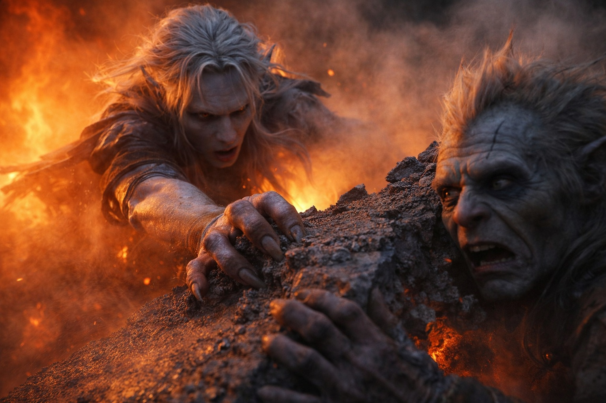
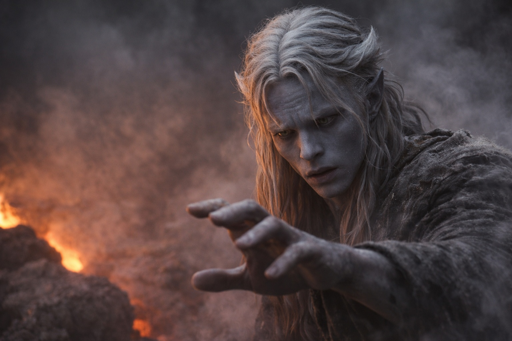
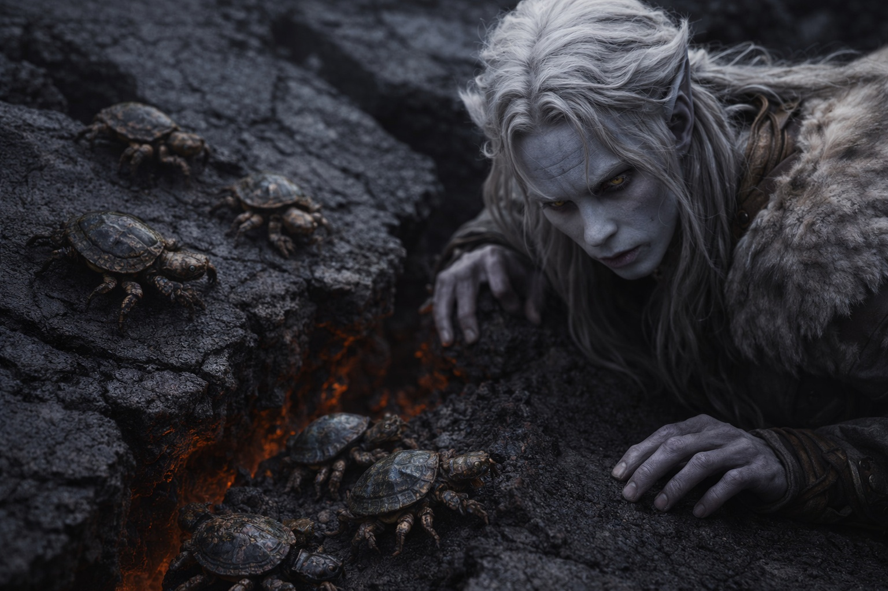

## Capítulo 23 | Parte 2 | El Cruce Difícil

---

El terreno se rompió la tercera mañana.

Unas plataformas inclinadas de basalto cortaban la ruta. Algunas eran tan anchas como puestos de mercado; otras apenas permitían mantenerse de pie. De los huecos iluminados por el rojo de abajo salía vapor con olor a azufre y hierro caliente.

Talryn se detuvo en el borde y estudió el campo sin expresión. Después de un momento, señaló a la izquierda, trazando una línea a través de las placas rotas que solo ella podía ver.

—Fila india. Pisen donde piso.

Srietz se asomó al borde de la grieta más cercana. El resplandor de abajo le tiñó la cara de naranja. —Srietz observa que la ruta recomendada cruza aproximadamente treinta placas distintas, cualquiera de las cuales podría desplazarse bajo el peso. —Se retiró del borde—. Srietz también observa que no hay ruta alternativa.

—No la hay —confirmó Talryn.

Empezaron a cruzar.

Las primeras diez placas fueron estables. Estantes anchos con buen agarre, grietas lo bastante estrechas para pasarlas de un paso sin comprometerse. Drusniel contó los cruces de forma automática, rozando la superficie del basalto con los dedos cuando se agachaba a comprobar la estabilidad. La piedra estaba tibia al tacto, no peligrosamente, pero tibia de una manera que recordaba que el suelo aquí estaba vivo.

En la placa doce, vio las criaturas.

Cosas pequeñas, no más grandes que su puño, aferradas a las caras verticales del basalto donde las grietas se precipitaban al vacío. Caparazones blindados que atrapaban la luz roja de abajo, patas segmentadas agarrándose a la roca con una precisión que rozaba lo obsceno. Parecían el resultado de cruzar un cangrejo con una tortuga y decidir que el resultado necesitaba más aristas. Sus caparazones eran estriados, ennegrecidos, salpicados de depósitos minerales que coincidían con la piedra tan perfectamente que resultaban casi invisibles hasta que se movían.

Uno de ellos cruzó el hueco entre dos placas mientras Drusniel observaba. Soltó su agarre en una cara, cayó unos centímetros, enganchó la pared opuesta con las patas delanteras y se impulsó al otro lado en un solo movimiento fluido. Sin vacilación. Sin cálculo previo. Conocía la grieta como una araña conoce su tela.

—Escoricáscaras —dijo Srietz desde atrás. El goblin también los había notado—. Srietz los ha visto en las regiones volcánicas más profundas. Navegan respiraderos termales, vetas de lava, fisuras activas. Sus caparazones aíslan contra calor que cocinaría cualquier otra cosa. —Una pausa—. A Srietz le gustaría mucho estudiar uno.

—Después.

Siguieron avanzando. Placa trece, catorce, quince. Las grietas se ensancharon. Talryn las cruzaba con zancadas largas, encontrando agarre en bordes que se desmoronaban bajo las botas de Drusniel cuando él la seguía. Ajustó su técnica, pisando donde la piedra parecía más gruesa, leyendo los patrones de fractura como habría leído matrices de hechizos en la academia. Estructura, puntos de tensión, modos probables de fallo.

En la placa diecinueve, el suelo se movió.

No un temblor. Un desplazamiento. El estante entero se inclinó dos grados a la derecha con un chirrido que Drusniel sintió en los dientes. Se agachó, manos planas contra la piedra, y notó cómo la placa se asentaba en su nuevo ángulo con una vibración grave que le subió por las muñecas hasta el pecho.

—Muevan —dijo Talryn. El mismo tono plano. Ya estaba en la siguiente placa.

Se movieron juntos, Elion apresurándose desde la retaguardia.

La placa veinte se desplazó cuando el peso de Elion la abandonó.

La veintiuno aguantó. La veintidós aguantó. La veintitrés crujió pero se mantuvo nivelada. Habían pasado el punto medio, el borde lejano del campo roto visible a través de la bruma de calor. Drusniel se permitió respirar.

La placa veinticuatro se partió por la mitad.

La grieta la recorrió de extremo a extremo, rápida y ruidosa, un sonido como un tronco al quebrarse. Drusniel ya estaba en la veinticinco cuando ocurrió. Srietz no.

Srietz cayó con la mitad rota. La mochila se enganchó en el borde que quedaba y sus piernas quedaron suspendidas sobre el resplandor rojo. Soltó un gruñido ahogado y se aferró a la piedra.

Drusniel extendió la mano.

No la mano física. Las manos estaban demasiado lejos. Extendió la mente, con el reflejo entrenado de un mago que ha pasado años invocando poder como otra gente invoca la respiración. Buscó la Voz.

El silencio que le respondió fue absoluto.

No hubo respuesta. Durante un instante esperó, mientras Srietz colgaba de la placa rota.

Elion atrapó a Srietz.

El cambiaformas había estado detrás del goblin y por debajo, ya sobre la porción volcada de la placa, una mano agarrada a una línea de fractura en el basalto. La otra mano se cerró alrededor de la muñeca de Srietz con la fuerza de quien comprende en el cuerpo, no en la mente, lo que significa caer.

Drusniel reaccionó. Se tumbó sobre la placa veinticinco, extendió el brazo y agarró la correa de la mochila del goblin. Entre los dos, él y Elion izaron a Srietz y lo pasaron a terreno firme. La placa rota se deslizó hacia la sima a sus espaldas con un sonido que tardó demasiado en apagarse.

Se tendieron sobre el basalto, respirando con fuerza. Srietz aferraba su mochila con ambas manos y miraba el hueco donde había estado la placa veinticuatro.

—Srietz solicita un momento —dijo el goblin.

Se tomaron varios. Talryn esperaba en el otro lado, observándolos con una expresión a medio camino entre la preocupación y el cálculo. Imposible distinguir.

Drusniel se sentó con la espalda contra una cresta de lava enfriada y presionó los dedos en una grieta de la piedra junto a él. Trazó su recorrido por la superficie, dejando que la geometría le calmara la respiración. Una grieta larga, que se bifurcaba dos veces, terminando en una mella donde algo había golpeado el basalto años atrás.

La grieta era real. La piedra era real, y también lo era el calor presionando contra su espalda.

La Voz no había acudido.

Nunca había respondido a una llamada. Las dos veces había hablado sin que él la invocara.

Pero la había buscado.

No conscientemente. No deliberadamente. Como cuando buscas la barandilla al tropezar, como el respingo antes de que el golpe conecte. Reflejo. Una respuesta entrenada tan profunda que sorteaba el pensamiento y pasaba directa a la acción. Cuando la crisis golpeó, su primer instinto no había sido la magia, no habían sido sus propias manos, no había sido pedir ayuda a las personas que estaban a su lado.

Su primer instinto había sido la Voz.

Un Escoricáscara cruzó el borde roto y encontró apoyo en la piedra recién expuesta. Otros tres lo siguieron.

Drusniel se miró las manos.

Drusniel los observó hasta que Talryn señaló al grupo que se movieran. Se levantó, comprobó su apoyo y cruzó las placas restantes en silencio.

No buscó nada.

En el siguiente hueco, buscó un apoyo firme antes de cruzar. Aún recordaba el instante en que había esperado a la Voz mientras Srietz caía.

La próxima vez, aquella vacilación podía matar a uno de ellos.

---

**Fin de Capítulo 23.2 —> 23.3: [La Deuda Anticipada: La Conversación](/la-deuda-anticipada-la-conversacion/)**

