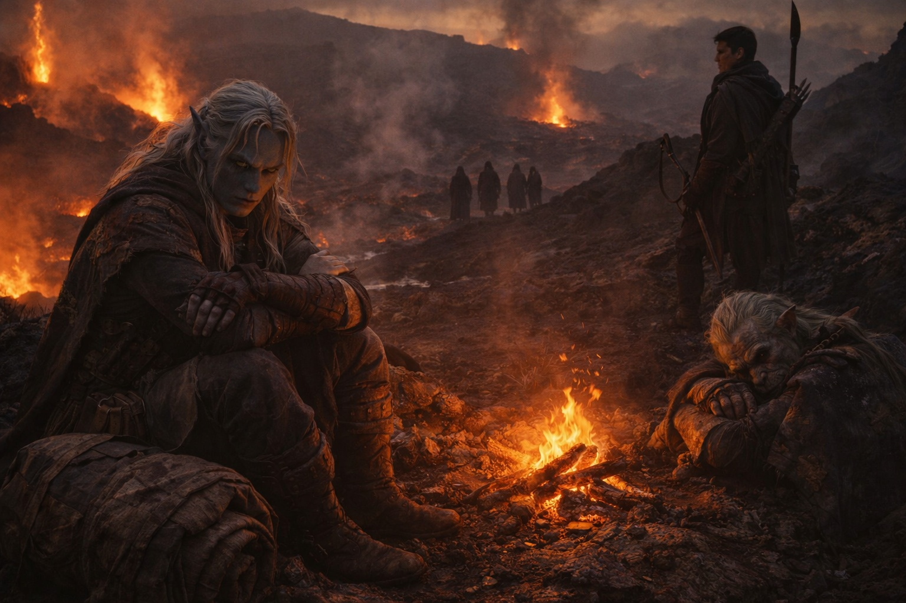
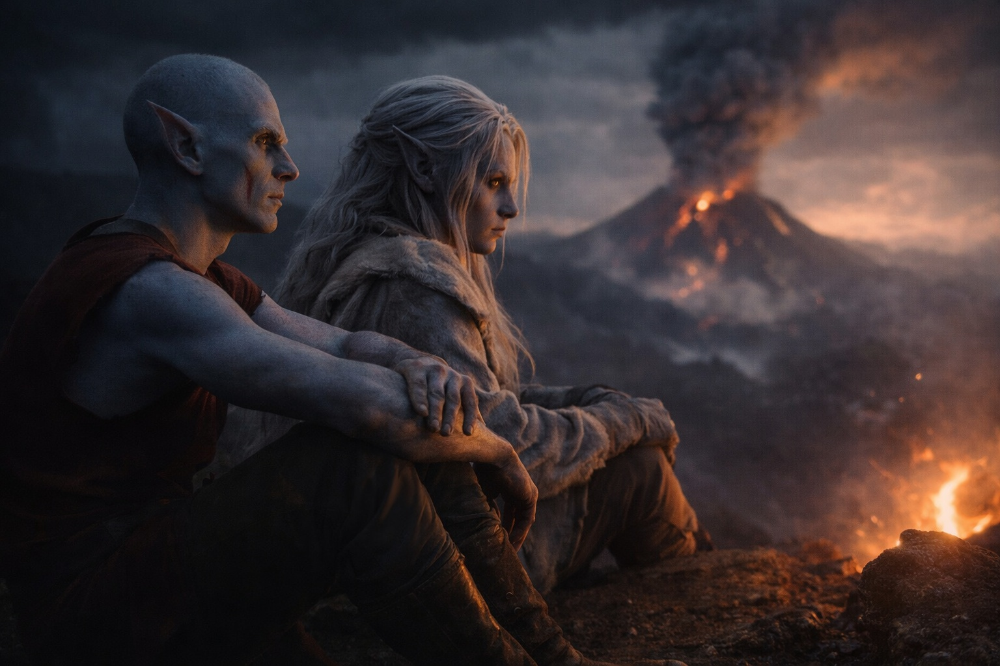
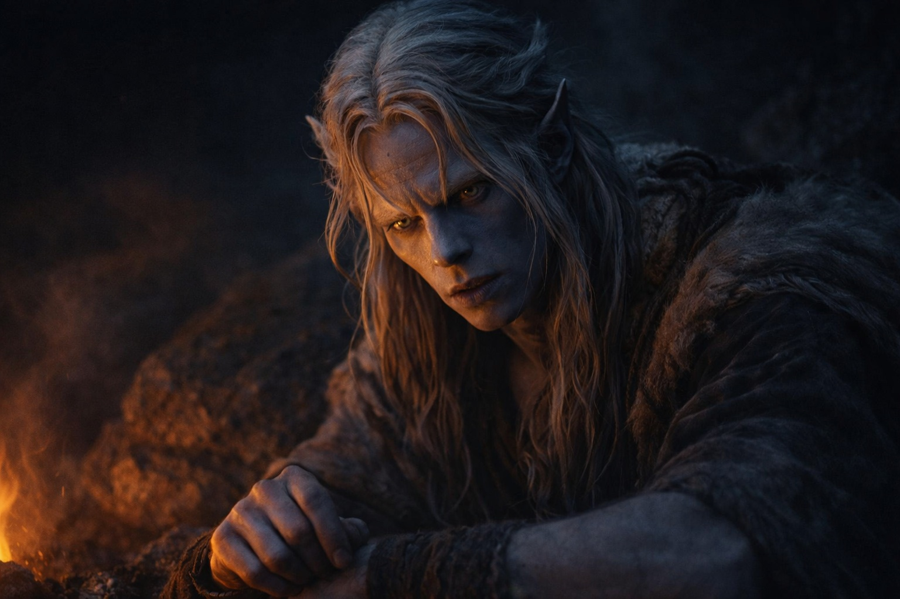
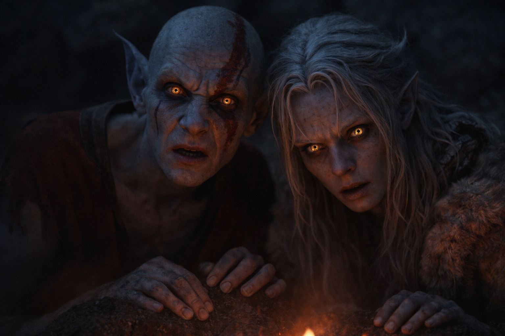
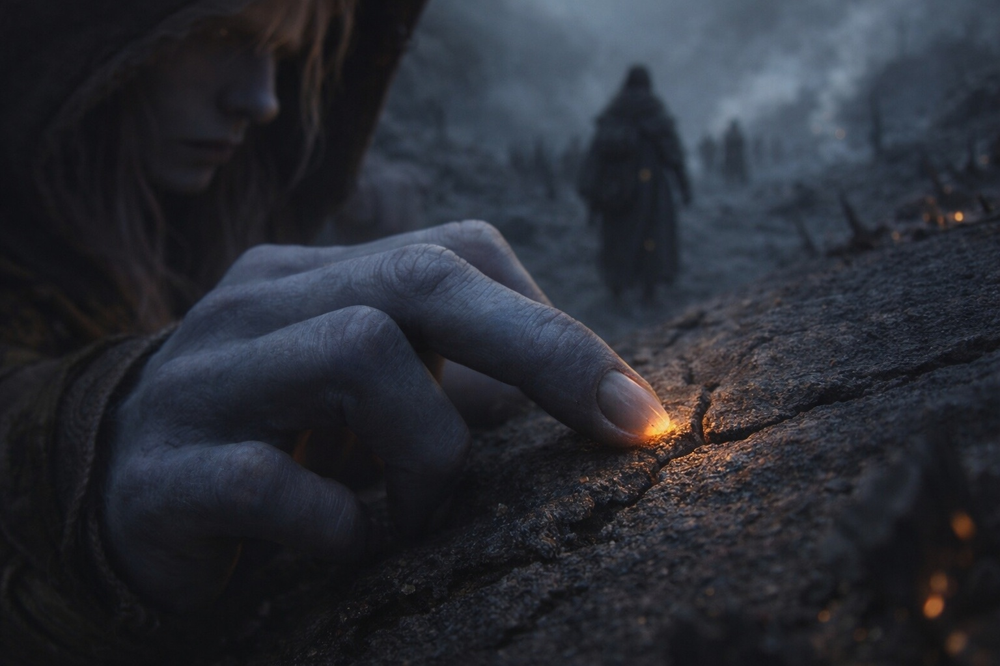

## Capítulo 23 | Parte 3 | La Conversación

---

El momento llegó la noche después del cruce.

Talryn había acampado en un saliente de roca que dominaba el camino por ambos lados. Buena posición defensiva. Drusniel empezaba a sospechar que la guía los conducía por una ruta elegida tanto por las líneas de visión como por la seguridad del terreno. Cada campamento tenía vistas despejadas. Cada parada ofrecía puntos de observación. No acampaban donde era cómodo. Acampaban donde Talryn podía ver.

Srietz se había dormido temprano, agotado por el cruce del campo de placas y la caída que no mencionaba pero que le había dejado un temblor fino en las manos durante el resto de la marcha. El goblin dormía con las orejas aplastadas y la mochila apretada contra el pecho, como si el universo pudiera intentar quitársela de nuevo.

Talryn recorría el perímetro. Drusniel seguía su silueta contra el resplandor de los campos termales y esperaba a que se alejara.

Elion se sentó junto a él. No pidió permiso. No anunció su presencia. Simplemente estaba ahí, a su lado, mirando el mismo horizonte humeante.

Pasó un minuto largo antes de que ninguno hablara.

—Hoy busqué ayuda —dijo Drusniel. Lo dijo en voz baja, consciente de la distancia de Talryn, midiendo el alcance del sonido contra el viento que soplaba desde el este—. Cuando Srietz cayó. No busqué magia. No busqué mis manos. Busqué otra cosa.

Elion no giró la cabeza.

—Lo sé.

—¿Lo viste?

—Vi tu cara. Un segundo de parálisis. Luego volviste. —El cambiaformas cruzó los brazos sobre las rodillas—. Conozco esa expresión.

El viento arrastró ceniza fina entre ellos. Partículas volcánicas tan pequeñas que eran más textura que sustancia, un roce seco contra la piel expuesta.

—Esperé que viniera —continuó Drusniel—. En el mar acepté una deuda. En la cueva, otra. Dos veces, y ya cuento con ella.

—Dos veces.

—Dos.

Elion dejó escapar un sonido. No era risa ni burla. Era reconocimiento, del tipo que sale cuando alguien confirma un número que ya habías calculado por tu cuenta.

—¿Cuántas veces para ti? —preguntó Drusniel.

Drusniel esperó. Elion mantuvo la vista en el horizonte.

Elion apretó la mandíbula antes de responder.

—Cuarenta y tres. Puede que más. Dejé de contar durante un tiempo.

Drusniel se quedó inmóvil. Después de dos deudas, ya había esperado a la Voz mientras Srietz caía. Elion había contado cuarenta y tres contactos. ¿Cómo distinguía lo que era suyo?

—¿Es la misma cosa?

—No lo sé. —La honestidad de la respuesta era cortante, limpia, sin la capa protectora de ambigüedad que Drusniel habría usado—. No la nombro. No hablo de ella. No pregunto qué quiere.

—¿Funciona?

—No.

Un Escoricáscara cruzó la roca junto a la bota de Drusniel, patas diminutas rasguñando el basalto con un ritmo que sonaba como uñas contra pergamino. Lo observó desaparecer por una fisura sin reducir la velocidad.

—La mía me ofrece cosas —dijo Drusniel—. Respuestas. Conocimiento. Siempre llega cuando necesito algo. Nunca cuando estoy bien.

—Lo mío no habla. Sé cómo adoptar una forma que nunca he usado. Después no recuerdo haberlo decidido.

—¿Te pone condiciones?

Elion se volvió hacia él.

—No. Ni deudas. Solo ese conocimiento y el hueco en la memoria. Tú al menos recuerdas haber aceptado.

Drusniel se miró las manos. Los dedos le picaban por trazar una grieta en la roca, por contar algo, por imponer un patrón en la conversación que le permitiera mantener la distancia analítica que siempre mantenía. Se obligó a quedarse quieto.

—Dos veces —repitió Drusniel—. Y hoy he esperado su ayuda antes de intentar nada.

—No te estoy contando esto para asustarte.

—Lo sé.

—Te lo cuento porque yo también pensé que podría controlarlo. —Elion se pasó una mano por la cara—. Ahora no sé cuántas formas he aprendido por mi cuenta.

Las brasas del fuego crepitaron. En algún lugar de la oscuridad, Talryn completó otra vuelta de su perímetro.

—¿Qué quiere la tuya? —preguntó Drusniel.

—No la nombro.

—No te he pedido el nombre. Te he preguntado qué quiere.

Elion se quedó callado un rato largo. El viento cambió de dirección y trajo olor a mineral caliente, cobre y sal mezclados con la acidez permanente del aire volcánico.

—No lo sé. Me preocupa que cada vez me cueste más distinguir mis recuerdos de lo que me da.

—¿Puedes impedirlo?

—No sé cómo.

Drusniel apoyó el pulgar en una grieta de la roca. La siguió hasta donde se bifurcaba.

Dos contactos. El último había sido suficiente para que esperara otro.

Elion llevaba cuarenta y tres.

Drusniel quiso preguntarle cómo seguía adelante, pero Elion ya estaba mirando hacia Talryn.

Algo cambiaba. Algo ya había cambiado.

Y ninguno de los dos sabía el nombre de la cosa que los cambiaba.

—Deberíamos dormir —dijo Elion, y se levantó con un movimiento que contenía demasiada fluidez para ser enteramente humano.

—Sí.

—Drusniel.

—¿Qué?

—No le cuentes a Srietz. Todavía no. El goblin calcula costes. Si calcula este, querrá una solución, y no la hay.

Drusniel asintió. Se quedó sentado mientras Elion se alejaba, mirando la oscuridad donde las brasas proyectaban sombras que se movían como cosas vivas. Trazó una grieta en la roca junto a su pierna con la uña del pulgar. La geometría era simple: una línea recta que terminaba en nada.

Mantuvo el pulgar en la piedra hasta que se le enfrió la mano.

---

**Fin de Capítulo 23.3 —> 23.4: [La Deuda Anticipada: La Verdad del Comercio de Cristales](/la-deuda-anticipada-la-verdad-del-comercio-de-cristales/)**

---

