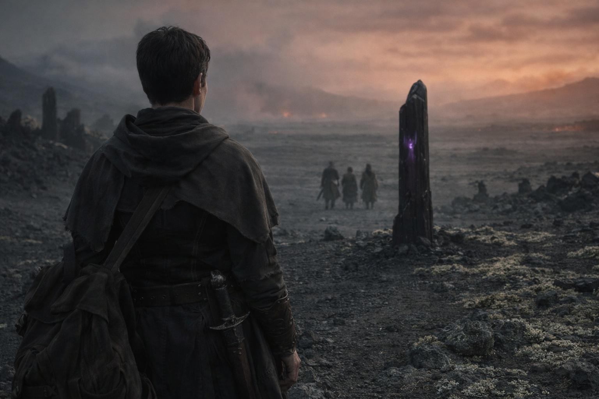
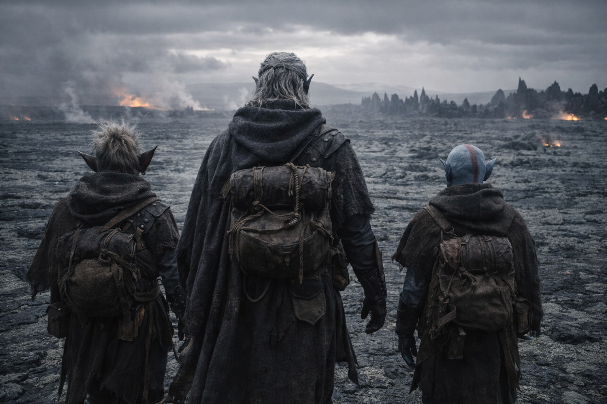

## Capítulo 23 | Parte 5 | La Frontera

---

La frontera no era una línea. Era una sensación.

Los cristales se espaciaron durante la última legua. Más allá había basalto gris, fisuras poco profundas y líquenes pálidos que crujían bajo los pies. Drusniel respiró. El aire era seco y no tenía el olor químico de los campos de Nyxara.

Talryn se detuvo donde la última formación de cristal brotaba del suelo, un pilar de mineral negro tan alto como Drusniel y la mitad de ancho, su superficie atrapando luz que no debería existir en el crepúsculo perpetuo. Dejó su mochila en el suelo.

—Aquí es el límite.

Cuatro días de viaje, cuatro días de vigilancia, y la guía los dejaba junto a una roca. Drusniel sintió que debería haber esperado algo más ceremonial. No sabía por qué.

—Srietz desearía aclarar el estado del disgusto de Lady Nyxara respecto a ciertas conversaciones —dijo Srietz. Su voz era mesurada, pero las orejas no dejaban de girar hacia el terreno abierto, calculando ya la siguiente etapa del viaje.

Talryn lo miró durante un rato largo. La rabia que había mostrado en el paso se había archivado, almacenada detrás de la máscara profesional. Pero la máscara encajaba de manera diferente ahora. Más tensa.

—Lady Nyxara no está disgustada con el goblin. Lady Nyxara está disgustada consigo misma por calcular mal los plazos. —Una pausa—. Me pidió que transmitiera que respeta el conocimiento preciso, incluso cuando se comparte de forma inconveniente.

Srietz procesó aquello.

—Srietz encuentra la distinción delgada.

—Lo es.

Talryn metió la mano en la bolsa de su cinturón y sacó un recipiente sellado, pequeño, no más grande que un vial de medicina, hecho del mismo cristal negro que las formaciones a su alrededor. Se lo tendió a Drusniel.

—Lady Nyxara envía un regalo de despedida. Tres estabilizadores refinados, alta concentración. Para uso en territorio profundo donde los efectos ambientales exceden la tolerancia estándar. Aconseja moderación.

Drusniel tomó el recipiente. Estaba caliente, aunque no podía determinar si por el calor corporal de Talryn o por las propiedades del propio cristal.

—También envía un mensaje. —La postura de Talryn cambió. No más suave. Más recta, como si recitara un texto preparado—. Wyrmreach mata a los que lo combaten. No con garras. Con incompatibilidad. Los cristales no te hacen más fuerte. Te hacen menos equivocado. Úsalos con moderación. Cada uso le enseña a tu cuerpo que este lugar es normal. Cuando tu cuerpo aprende eso, deja de preguntarse si debería serlo.

Drusniel giró el recipiente entre los dedos. Si los cristales hacían soportable Wyrmreach, ¿se daría cuenta cuando hubiera usado demasiados?

Cerró la mano sobre el tapón.

—Y una cosa más. —La voz de Talryn descendió. Miró directamente a Drusniel, y por primera vez en cuatro días, sus ojos contenían algo personal. No calidez. Reconocimiento. La mirada de alguien que identificaba una condición que había visto antes.

—Lady Nyxara dice: la cosa que llevas en la cabeza quiere tu cuerpo. Las antiguas siempre quieren eso.

A Drusniel casi se le cayó el recipiente. No le había contado nada a Nyxara sobre la Voz.

Nyxara sabía sobre la Voz. No por el informe de Talryn. No por la media conversación que podría haber escuchado entre él y Elion. Nyxara lo sabía de antes. Los términos, la observación, la guía que lo miraba dormir. Todo había sido calibrado alrededor de un conocimiento que ya poseía.

—¿Cuánto tiempo lleva sabiéndolo? —La pregunta salió antes de que pudiera detenerla.

Talryn negó con la cabeza.

—Desde antes de que llegarais. Los detalles están por encima de mi nivel de autorización.

—¿Y las antiguas?

—Por encima de mi nivel de autorización.

Talryn se echó la mochila al hombro y comprobó la correa.

—La ruta aprobada continúa al noreste durante dos leguas, luego entra en la región fronteriza de Szoravel. No hay puntos de control. No hay acuerdos de paso seguro. No hay guías. —Ajustó las correas—. La protección de Lady Nyxara termina aquí.

Se giró y caminó de vuelta al campo de cristales.

Drusniel la observó hasta que una hilera de cristales la ocultó.

Srietz exhaló. El sonido arrastraba una semana de comentarios contenidos.

—Srietz tiene varias observaciones —comenzó el goblin.

—Después. —Drusniel seguía mirando el campo de cristales. Las formaciones se alzaban como centinelas, oscuras y pacientes, marcando el límite de un territorio que nunca había sido seguro. Solo gestionado.

*La cosa en tu cabeza quiere tu cuerpo. Las antiguas siempre quieren eso.*

No estaba seguro de que Nyxara tuviera razón. La Voz nunca había movido sus miembros ni hablado por su boca. Había esperado a que aceptara.

Aquella elección le preocupaba más que la advertencia. La había hecho dos veces. Después, cuando Srietz cayó, había buscado a la Voz sin pensar en otra cosa.

Nyxara sabía más que él. Eso no bastaba para fiarse de su explicación.

—Noreste —dijo Elion. El cambiaformas ya estaba de cara al terreno abierto, leyendo el paisaje con sentidos que Drusniel no podía compartir—. Dos leguas de nada antes de alcanzar el territorio de Szoravel. Deberíamos movernos mientras haya cobertura.

El basalto apenas ofrecía refugio. Drusniel calculó la distancia hasta la primera fisura y siguió a Elion.

Guardó los tres estabilizadores en la mochila. Esperaba que siguieran allí cuando saliera de Wyrmreach.

Srietz se puso a caminar a su lado. Elion ocupó la posición de vanguardia que Talryn había mantenido durante cuatro días. El hueco donde había estado la guía se sentía más ancho de lo que una sola persona debería dejar.

Caminaron al noreste por el basalto. A sus espaldas, los últimos cristales marcaban la frontera de Nyxara.

Szoravel estaba más adelante. Drusniel siguió andando, repasando las preguntas que haría al llegar.

---

**Fin de Capítulo 23.5 —> 24.1: [La Visión Clara: La Acumulación](/la-vision-clara-la-acumulacion/)**

