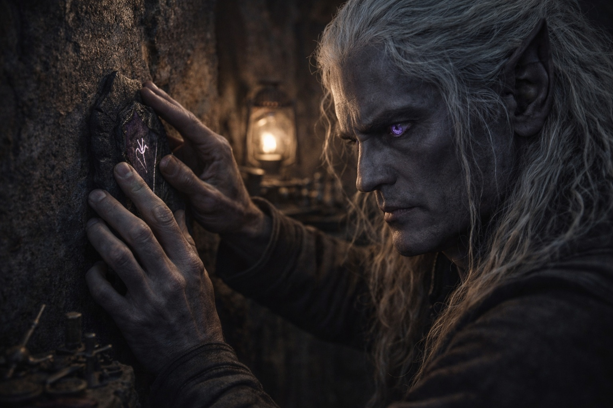
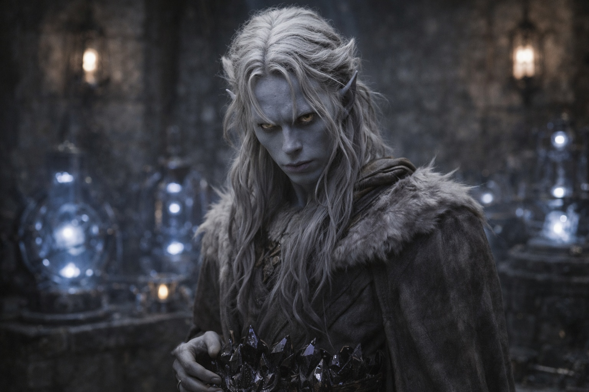
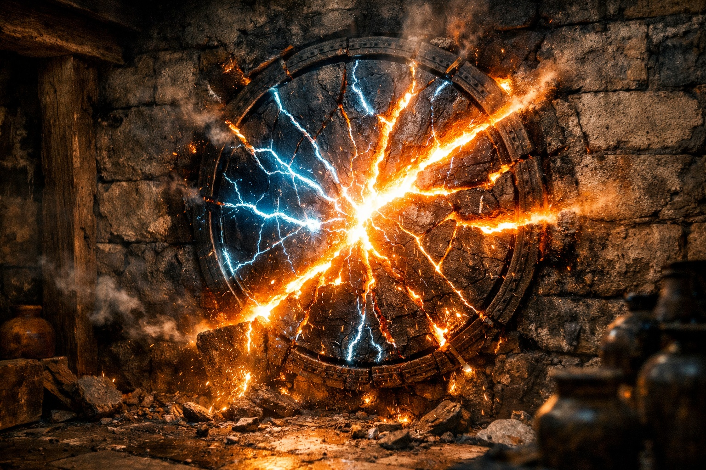
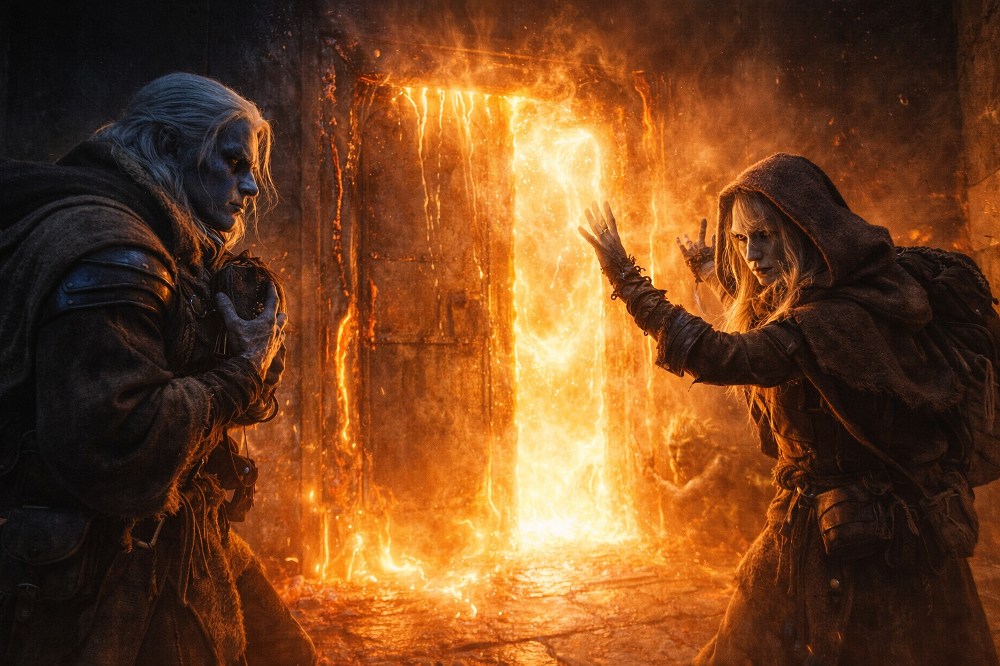

## Capítulo 36 | Parte 1 | La Confrontación

---

Szoravel selló el puesto avanzado en la segunda mañana.

Drusniel lo observó hacerlo. El viejo drow se movía por la cámara con la precisión metódica de alguien que había ensayado esta secuencia, colocando piedras de protección en los puntos cardinales, tejiendo patrones de contención en las paredes, cubriendo la puerta con cerraduras de resonancia que vibraban en frecuencias a las que el Nulo en las manos de Drusniel respondía con una vibración baja e inquieta.

—Ella se equivoca —dijo Szoravel. No le hablaba a Drusniel. Le hablaba a la arquitectura, al procedimiento, a la idea de que la preparación aún importaba—. Tres días no son suficientes. Solo la calibración requiere siete. El protocolo de aproximación requiere otros cinco. No puedes comprimir un siglo de ingeniería de barrera en un plazo establecido por alguien que cree que la escala es estrategia.

—Szoravel.

—Ella se equivoca. La vara de medición lo confirma. El ciclo de degradación se ha acelerado, sí. Pero la aceleración no es inevitabilidad. Hay márgenes. Hay ventanas de contingencia. Diseñé este protocolo exactamente para este tipo de...

—Szoravel. ¿Qué estás haciendo?

El viejo drow se detuvo. Sus manos estaban sobre la última piedra de protección, un disco de metal oscuro que pulsaba con la misma frecuencia que la barrera. Sus ojos violetas encontraron los de Drusniel, y por primera vez desde que habían llegado al puesto avanzado, Drusniel vio algo detrás del hielo y el procedimiento.

Miedo. No de Nyxara. De ser irrelevante. De descubrir que la secuencia que había pasado décadas perfeccionando podía ser anulada por alguien que no valoraba la secuencia en absoluto.

—Me estoy asegurando de que tengamos tiempo —dijo Szoravel—. Yo decido cuándo estás listo. No ella.

Colocó la última piedra de protección. La puerta se selló. El puesto avanzado vibró con energía de contención, el aire espesándose con la densidad particular de un espacio que había sido aislado de todo lo que existía fuera de él.

Drusniel dejó el Nulo sobre la mesa. La calidez del artefacto persistió en sus palmas. Sus cristales zumbaban en su cinturón, cuatro puntos negros resonando con las piedras de protección y la frecuencia de la barrera y la tensión creciente en la habitación.

—Ella no va a esperar.

—Esperará porque la alternativa es el fracaso. Si te aproximas a la barrera sin calibración completa, la interfaz colapsa. Si la interfaz colapsa, la renovación se convierte en una brecha. Ella lo sabe. Estaba en esta habitación cuando lo expliqué.

—También estaba en esta habitación cuando dijo días, no semanas.

—Y se equivocaba.

—¿Se equivocaba?

Las manos de Szoravel se quedaron quietas. La pregunta quedó suspendida entre ellos, cargada con el peso de la confirmación de la vara de medición, las lecturas de los instrumentos, el hecho de que Drusniel había sentido la barrera a través de la frecuencia del Nulo y sabía que la degradación era más rápida de lo que los modelos de Szoravel predecían.

—El protocolo existe por una razón —dijo Szoravel. Su voz había cambiado. Más baja. La voz de un hombre que defendía una posición porque abandonarla significaría admitir que todo su marco de referencia era insuficiente para la escala de lo que estaba sucediendo—. He pasado cuarenta años desarrollando este enfoque. Las matemáticas son correctas. La secuencia es correcta. La preparación contempla variables que sus fuentes de inteligencia no pueden modelar.

—Su inteligencia acertó sobre la aceleración.

—Su inteligencia fue conveniente.

La palabra cayó mal. Drusniel la escuchó como escuchaba la mayoría del lenguaje político: como una estructura que servía al hablante en lugar de a la verdad. Conveniente. La vara de medición había confirmado la aceleración antes de que Nyxara entrara en la habitación. Szoravel había visto los números cambiar. Había elegido interpretarlos como anomalía en lugar de tendencia porque tendencia significaba que su cronograma estaba muerto y anomalía significaba que aún tenía control.

—Te estás encerrando —dijo Drusniel—. Conmigo.

—Nos estoy encerrando con el protocolo. Cuando la calibración esté completa, procedemos. No antes.

La voz de Srietz llegó desde la esquina. Había estado ahí todo el tiempo, completamente inmóvil, sus ojos amarillos siguiendo la conversación con la atención particular de alguien que había pasado tres años observando a personas poderosas tomar decisiones sobre espacios confinados.

—Ella no está enfadada —dijo Srietz. Su voz era plana. No desapegada. Calculadora—. La gente enfadada grita. Discute. Hace amenazas y espera a que las amenazas surtan efecto. —Hizo una pausa—. Ella no grita. No discute. Está decidiendo.

—¿Decidiendo qué? —Szoravel no miró al goblin. Estaba ajustando las piedras de protección, comprobando alineaciones, ejecutando el protocolo como un albañil que inspecciona la argamasa.

—Srietz no lo sabe. Eso es lo que lo hace malo. Cuando puedes predecir lo que un señor decide, te puedes preparar. Cuando no puedes... —Se detuvo. Sus ojos amarillos fueron hacia la puerta sellada—. Srietz ha visto a señores decidir antes. Los silenciosos son los peores. Los silenciosos ya han terminado de decidir para cuando te das cuenta.

Silencio.

Las piedras de protección vibraban. El Nulo descansaba sobre el banco de trabajo, oscuro y cálido. Los instrumentos a su alrededor pulsaban con la frecuencia de la barrera, constante, degradándose, contando hacia algo que ninguno de ellos controlaba.

Entonces el suelo tembló.

No un terremoto. No la inestabilidad volcánica que era la línea base de Wyrmreach. Algo masivo desplazándose fuera del puesto avanzado. Algo lo suficientemente pesado como para que el suelo de piedra transmitiera el movimiento a través de las piedras de protección, subiendo por las botas de Drusniel hasta sus rodillas.

Elion estaba junto a la ventana. Sus ojos ámbar estaban mal. Más abiertos de lo que deberían. Lo que el Sabio le estaba alimentando gritaba algo que su rostro no podía contener.

—Ella está ahí fuera —dijo Elion. Su voz era delgada—. Algo está ahí fuera. Algo...

Las piedras de protección se agrietaron. No por la fuerza. Por el calor. El tipo de calor que no proviene del fuego ni de la magia ni de nada que el entrenamiento de Drusniel pudiera categorizar. El calor de algo demasiado grande para existir tan cerca del suelo, irradiando a través de las paredes del puesto avanzado como el sol irradia a través del cristal.

—Szoravel. —La voz de Drusniel era firme. Sus manos no—. ¿Qué es ella?

El viejo drow no respondió. Ya estaba lanzando conjuros. Sus manos se movían a través de patrones de protección con la fluidez de cuarenta años de práctica, reforzando líneas de contención, superponiendo defensas, haciendo lo único que sabía hacer frente a algo que sus modelos nunca habían contemplado: aplicar más procedimiento.

Las paredes crujieron. El calor se intensificó. A través de la puerta sellada, a través de la piedra, a través de las piedras de protección que se agrietaban una tras otra como hielo en agua hirviendo, algo estaba sucediendo que empequeñecía cada argumento sobre plazos y protocolos y planes de tres semanas.

Drusniel agarró el Nulo. Sus cristales gritaban en su cinturón. Srietz estaba presionado contra la pared del fondo, plano y en silencio, sus ojos amarillos del tamaño de monedas. Elion no se había movido de la ventana. Su boca estaba abierta. Lo que fuera que estuviera viendo, su cuerpo había olvidado cómo responder.

La última piedra de protección se hizo añicos.

La puerta no se abrió. Se fundió. El metal corría como agua, goteando en riachuelos incandescentes por el marco, y a través del espacio donde la puerta había estado, calor y luz y algo más allá de ambos inundaron el puesto avanzado.

—Szoravel —dijo Drusniel otra vez—. ¿Qué es ella?

Las manos conjuradoras del viejo drow habían dejado de moverse. Sus ojos violetas estaban fijos en la abertura. Su rostro contenía una expresión que Drusniel nunca había visto en él: la expresión de un hombre cuyos modelos acababan de fallar de forma absoluta, que estaba mirando el abismo entre el conocimiento y la realidad y descubriendo que el abismo era mayor de lo que sus modelos habían permitido.

En algún punto, había dejado de auditar esa variable.

---

**Fin del subcapítulo  —> 36.2**
