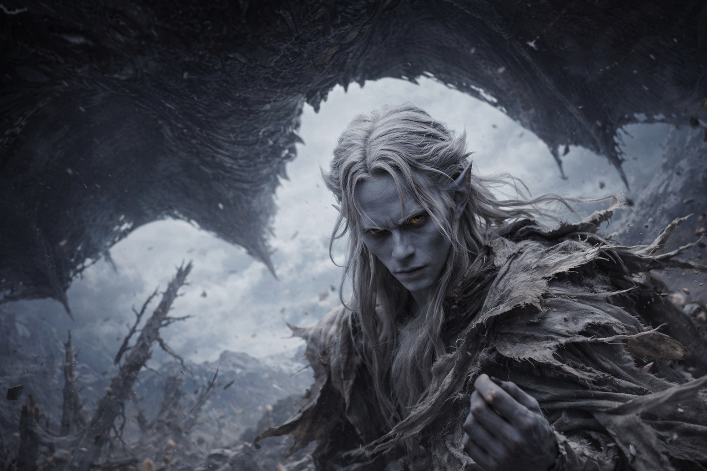
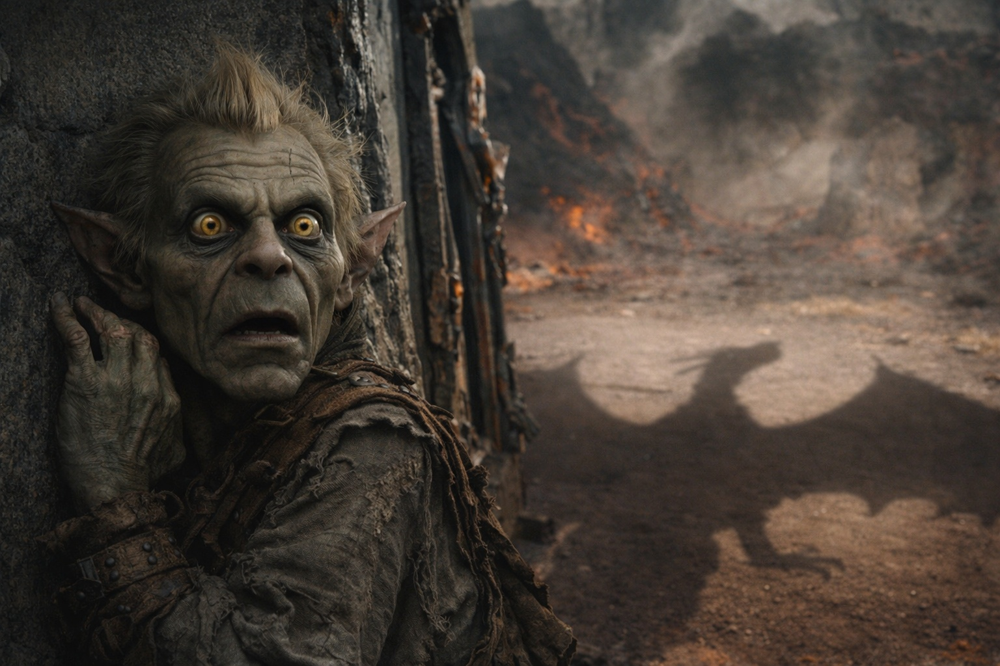
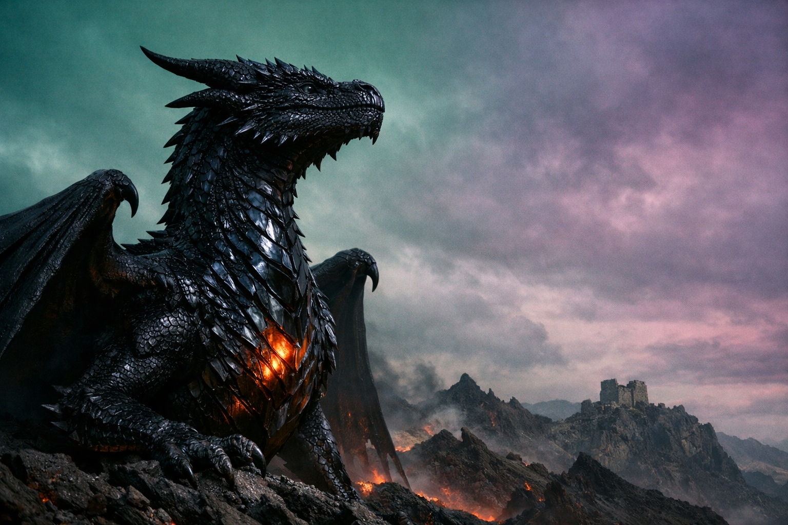

## Capítulo 36 | Parte 2 | La Escala

---

La primera señal no fue calor.

Fue ausencia.

El ritmo de la barrera titubeó—solo una vez—como una respiración saltada en un cuerpo demasiado grande para fallar.

Recalculó.

Los números no cambiaron.

Luego el suelo tembló.

El pensamiento llegó antes que la comprensión. Drusniel cruzó el marco derretido de la puerta hacia el aire libre, el calor y la luz, y lo primero que registró su mente no fue el fuego ni el tamaño ni la imposibilidad. Fue el recuerdo de ella eligiendo el borde abierto del claro. Nyxara de pie en el centro de la cámara del puesto de avanzada, cerca del punto más ancho. Nyxara recorriendo el techo con la mirada antes de elegir su asiento, evitando las vigas bajas, sentándose donde el espacio era mayor.

Siempre había elegido el espacio donde había sitio. Él lo había notado. Lo había archivado como el hábito de una comandante, el instinto de una señora de la guerra para líneas de visión y salidas. Había estado mirando una montaña y viendo solo las estribaciones.

Estaba de pie en el terreno abierto entre el puesto de avanzada y la cresta, a cincuenta pasos del muro más cercano, a cien del saliente más próximo. El espacio que había elegido era el claro más grande en una legua a la redonda del puesto de avanzada. Había caminado hasta allí antes de que comenzara el calor, antes de que las piedras de protección se agrietaran, antes de que la puerta se derritiera. Se había posicionado donde tenía espacio.

La silueta se resolvió en estructura.
La estructura se resolvió en taxonomía.

Dragón.

Los datos se alinearon.

El sendero de montaña.
El claro abierto.
La vacilación que había archivado como cautela.

El modelo había sido correcto.
Las entradas no.

Había retirado la variable equivocada.

No fue gradual. No fue dramático del modo para el que el entrenamiento de Drusniel lo había preparado, en el que la magia se acumula, crece y se anuncia a través de capas de energía visible. Fue simple y enorme: un momento estaba allí, una mujer alta con armadura oscura de pie en un claro. Al momento siguiente, el claro estaba lleno.

Alas. Alas negras que se desplegaron desde un cuerpo que de pronto era el cuerpo, el cuerpo real, aquello de lo que la armadura y la estatura y la presencia imponente habían sido una compresión. Las alas bloquearon el cielo. No era una metáfora. Se extendieron por todo el claro y más allá, más allá de la cresta, más allá de la línea de árboles, cada una más ancha que la longitud del puesto de avanzada, membranas de piel negra escamada tensadas entre huesos tan gruesos como las vigas que siempre había evitado.

<video controls playsInline preload="metadata" poster="./dragon-reveal_sora.jpg" width="100%">
  <source src="./Transform.mp4" type="video/mp4" />
  Tu navegador no soporta el formato de video.
</video>

Escamas como vidrio volcánico. No lisas. Texturadas. Cada una del tamaño de su palma, superpuestas en patrones que atrapaban la tenue luz de Wyrmreach y la dividían en algo más oscuro, luz que entraba y no regresaba. El cuerpo bajo las escamas era masivo de un modo que hacía que la palabra masivo resultara insuficiente, una criatura construida sobre un armazón que usaba montañas como puntos de referencia en lugar de habitaciones.

Su cabeza giró. El ojo que lo encontró era más grande que él. Dorado. No el oscuro que había catalogado en su forma humana — eso había sido una máscara, o una compresión, el color del fuego contenido tan profundamente que se leía como oscuridad. Ahora el fuego estaba liberado. El mismo dorado que los destellos que nunca había logrado captar del todo en su mirada, ampliado hasta convertirse en un paisaje en lugar de un rasgo, un iris del color del fuego contenido con una pupila que se contraía al enfocarlo, ajustándose a la diferencia de escala entre lo que miraba y desde lo que miraba.

La misma inteligencia. La misma paciencia. El mismo interés que le había preguntado sobre sus creencias, escuchado sus respuestas y comprendido la estructura de su deber. Alojado en algo que podía romper el mundo con solo desplazar su peso.

Se sintió pequeño. No disminuido. Recalibrado. Del modo en que un cartógrafo se siente cuando descubre que su cuidadoso estudio cubría un solo valle en una cordillera, y las montañas continúan en todas las direcciones más allá de donde alcanza la vista. Su comprensión de Nyxara no había sido errónea. Había sido un detalle en un retrato cuya existencia desconocía.

—OPTIMIZASTE PARA PRESERVAR. YO OPTIMICÉ PARA PROGRESAR.

—Contemplé la ambición —dijo Drusniel—. No la magnitud.

El suelo siguió fracturándose.

Bajó la cabeza. El movimiento fue lento del modo en que las cosas grandes se mueven lentamente, no por vacilación sino por la física de la masa, la inercia de un cuerpo que medía sus movimientos en fracciones de paisaje en lugar de fracciones de habitación. Su ojo se detuvo a una altura que lo colocaba a la altura de su pecho. El iris se contrajo de nuevo. Enfocando. Viéndolo a la escala que realmente ocupaba.

—SZORAVEL CREE QUE LA PREPARACIÓN ES CONTROL. —Las palabras presionaron contra sus costillas. Cada consonante era un acontecimiento físico—. NO LO ES. EL CONTROL ES ESCALA. SE PREPARÓ PARA UN MUNDO DONDE EL CONOCIMIENTO OTORGA AUTORIDAD. ESTABA EQUIVOCADO. EL CONOCIMIENTO OTORGA CONCIENCIA. LA ESCALA OTORGA AUTORIDAD.

Drusniel permanecía de pie en el viento de alas que bloqueaban el cielo y el calor que irradiaba un cuerpo que ardía desde dentro y el sonido de una voz que era la misma voz, la misma persona, la misma inteligencia paciente que lo había escoltado a través de su dominio y le había preguntado sobre deberes sagrados y se había sentado en silencio mientras Szoravel planificaba tres semanas de preparación. La misma persona. Los mismos objetivos. El mismo interés genuino en sus creencias, su compatibilidad y su disposición a soportar el coste.

La misma persona que había decidido que tres semanas era demasiado tiempo, y que tenía la escala para hacer que esa decisión importara.

Detrás de él, Srietz estaba aplastado contra el muro del puesto de avanzada. Sus orejas estaban pegadas al cráneo. Sus ojos amarillos calculaban, procesando números que seguían produciendo la misma respuesta: las cuentas no salen, las cuentas no salen, las cuentas no salen. Srietz había sobrevivido a señores. No había sobrevivido a esto.

Elion estaba de pie en el umbral derretido. Inmóvil. Sus ojos ámbar fijos en la forma de Nyxara con una expresión que Drusniel no podía descifrar, una expresión que no era miedo sino reconocimiento, la mirada de alguien cuya voz interior acababa de decir algo que había silenciado todo lo demás.

—LE DI TRES SEMANAS —dijo Nyxara. Los árboles seguían cayendo. El viento seguía desgarrando—. LAS USÓ PARA ATRANCAR UNA PUERTA.

Levantó la cabeza. El movimiento puso su perfil contra el cielo, y Drusniel la vio con claridad, por completo, tal como siempre había existido: un dragón negro cuya envergadura podía ensombrecer un valle, cuyo fuego había derretido una puerta protegida a cincuenta pasos, cuya paciencia con la cronología mortal había expirado por fin, de manera absoluta.

No era un monstruo. No era una villana. Un ser que operaba a una escala donde su cuidadosa planificación y los protocolos precisos de Szoravel y los siglos de custodia de la barrera de los drow eran todos lo mismo: pequeños. Bienintencionados. Insuficientes.

Los argumentos sobre los plazos se sentían como debates sobre el clima celebrados dentro de un huracán.

---

**Fin del Capítulo 36.2 —>  36.3: [La Escala de la Guerra: La Resistencia](/la-escala-de-la-guerra-la-resistencia/)**
