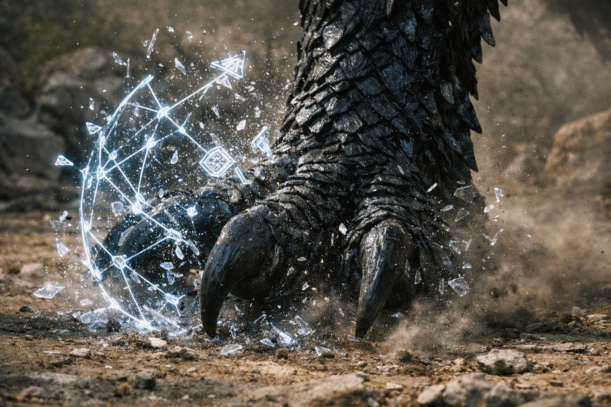
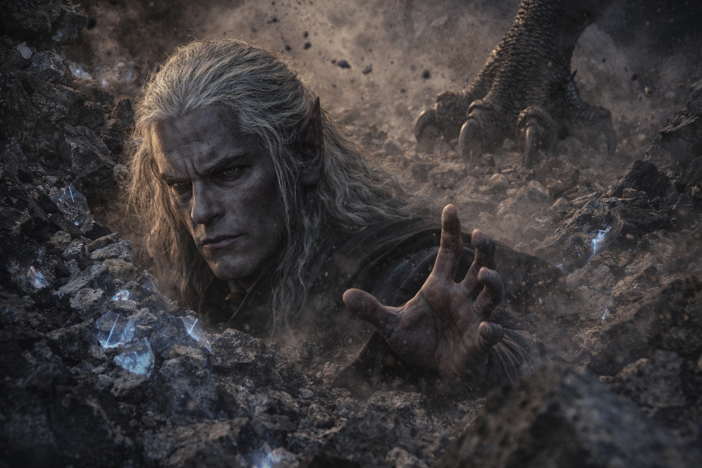
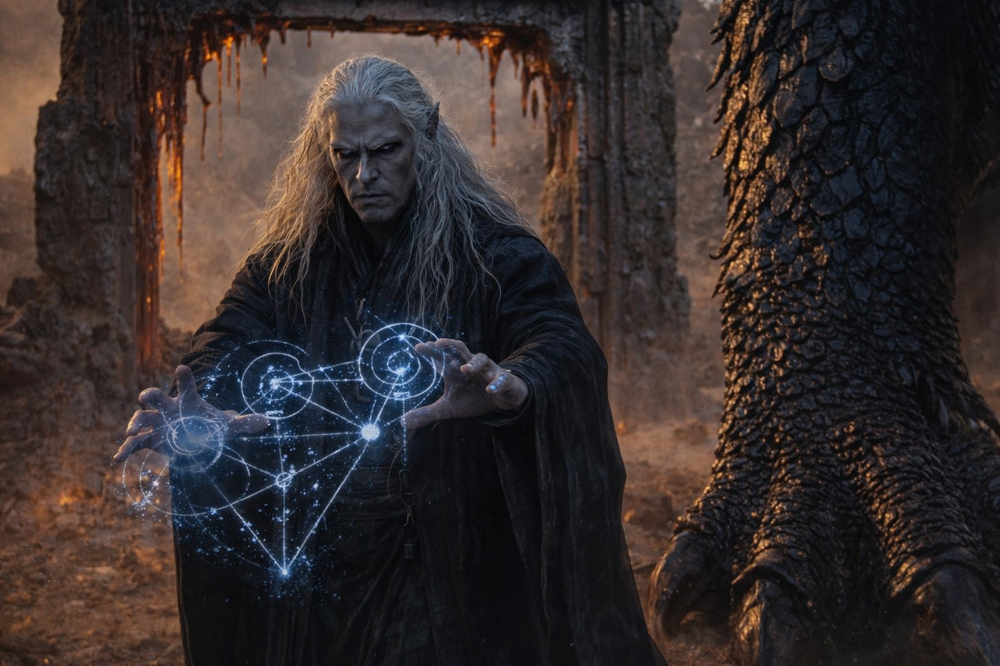
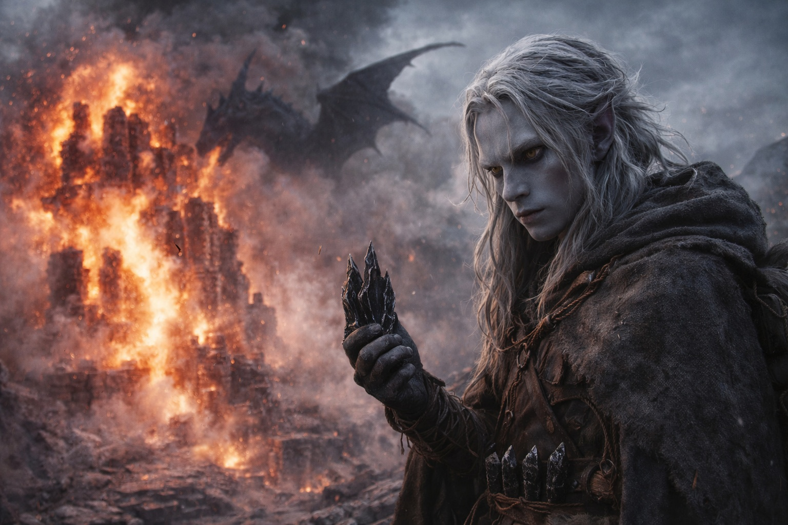

# Capítulo 36.3 | La Escala de la Guerra: La Resistencia

---

Szoravel salió lanzando hechizos.

Atravesó el marco fundido de la puerta y salió al claro con las manos ya en movimiento, trazando geometrías de contención en el aire con una fluidez que hacía que los patrones parecieran lenguaje en lugar de hechicería. Sus ojos violetas estaban fijos en el dragón. Su expresión no era de miedo. Era la expresión de un hombre que había modelado este escenario, que había estudiado la fisiología draconiana y las contramedidas y los puntos débiles con la misma precisión meticulosa que había aplicado a los protocolos de la barrera. Se había preparado para esto. No porque lo esperara. Porque la preparación era lo que hacía cuando la comprensión no bastaba.

El primer sello se materializó entre él y Nyxara. Un entramado de contención, blanco azulado y preciso, con una geometría diseñada para interrumpir las vías neuronales que permitían a un dragón coordinar su cuerpo descomunal. El entramado era trabajo de experto. Drusniel podía ver la arquitectura: cada nodo posicionado para interferir con un grupo diferente del sistema motriz del dragón, una red de disrupción que habría inmovilizado cualquier cosa más pequeña.

El entramado golpeó la pata de Nyxara y se hizo añicos. No por la fuerza. Por escala insuficiente. El patrón de disrupción estaba diseñado para un cuerpo que cupiera dentro de un edificio. La pata de Nyxara era del tamaño de un edificio. El entramado se rompió como se rompe una red cuando se lanza alrededor de algo demasiado grande para su malla.

Szoravel no se detuvo. Sus manos ejecutaron el segundo patrón antes de que el primero terminara de disolverse, redirigiendo la energía hacia un sello de presión, un sello de compresión que apuntaba a las articulaciones, los lugares donde escama se encontraba con escama y los huecos entre ellas exponían el tejido más blando de debajo. El sello era preciso. Hasta donde Drusniel podía distinguir, era anatómicamente correcto en cada detalle.

Nyxara desplazó su peso. El sello de compresión envolvió la articulación de su pata delantera y apretó, y durante una fracción de segundo Drusniel lo vio funcionar, vio la articulación resistir, vio las escamas en el pliegue separarse bajo la presión del sello y la membrana más blanda debajo comprimirse.

Entonces el dragón se movió. No rápido. Deliberadamente. La pata delantera flexionó contra el sello, y el sello resistió un segundo, dos, tres, antes de que la fuerza física de una extremidad que pesaba más que el puesto avanzado simplemente excediera los límites matemáticos de la energía de enlace del hechizo. El sello se desgarró. Szoravel se tambaleó por la retroalimentación. Le sangró la nariz. Sus manos siguieron lanzando.

—TE PREPARASTE PARA ESTO. —La voz de Nyxara no era ira. Observación. El tono de alguien que notaba que una criatura más pequeña había hecho su tarea.

—El sistema requiere— —comenzó Szoravel.

Su tercer patrón fue su mejor obra. Una trampa de resonancia. Apuntaba a las glándulas de fuego del dragón, creando un bucle de retroalimentación que usaría la propia energía térmica de la criatura contra sus sistemas internos de regulación. La trampa se desplegó con precisión cristalina, hilos invisibles de energía en frecuencia de barrera envolviendo el pecho y la garganta de Nyxara.

El dragón se detuvo.

Durante tres latidos, el dragón se detuvo. La trampa de resonancia estaba funcionando. Las glándulas de fuego estaban ciclando retroalimentación en lugar de producción, la regulación térmica interrumpida, la temperatura interna ascendiendo en un circuito que el cuerpo del dragón no estaba preparado para sostener. El rostro de Szoravel cambió. No triunfo. Vindicación. La vindicación de un hombre que había tenido razón, cuyo conocimiento había encontrado la brecha, cuyos decenios de estudio habían producido una contramedida que realmente funcionaba.

Entonces Nyxara exhaló.

No fuego. Todavía no. Aire. Aire sobrecalentado que destrozó la trampa de resonancia como un vendaval apaga una vela, dispersando los hilos de retroalimentación por todo el claro, disolviendo cuarenta años de preparación en una sola exhalación que no era magia sino física, la producción termodinámica bruta de un cuerpo que generaba más calor del que la trampa de Szoravel podía ciclar.

No se detuvo. No se regodeó. No dio un discurso sobre el poder o la escala o la futilidad de la preparación mortal. Balanceó su pata delantera lateralmente, un movimiento tan casual como una mano apartando un insecto de una mesa.

La pata delantera golpeó el puesto avanzado.

El muro más cercano a Szoravel estalló hacia adentro. Piedra y argamasa y restos de sellos y décadas de refuerzo se desmoronaron en una cascada que no era tanto violenta como minuciosa, el colapso integral de una estructura que había sido construida para resistir magia y clima y tiempo, pero no el impacto físico de algo del tamaño de una pequeña fortaleza.

Szoravel estaba lanzando cuando el muro lo alcanzó.

Drusniel lo vio. Estaba a veinte pasos de distancia, cerca del marco fundido de la puerta, y vio las manos de Szoravel todavía moviéndose a través del cuarto patrón, un patrón que era o un escudo o un último intento de contención, los gestos fluidos y precisos incluso mientras el muro se desmoronaba a su alrededor. Los ojos violetas del viejo drow seguían fijos en el dragón. Su boca formaba palabras que el sonido de la piedra derrumbándose tragó antes de que pudieran convertirse en lenguaje.

—El sistema requiere—

El muro lo sepultó.

No de golpe. Por etapas. Piedra cayendo, apilándose, asentándose. Los escombros encontraron su ángulo de reposo en segundos, un montículo de roca volcánica oscura y fragmentos de sellos destrozados y polvo, y en algún lugar debajo Szoravel estaba inmóvil, y el patrón que sus manos habían estado tejiendo estaba incompleto, y la frase que había estado pronunciando no tenía final, y el sistema al que había servido toda su vida no se detuvo a reconocer su ausencia.

Nyxara no miró los escombros. No comprobó. Retiró su pata delantera del muro destruido y giró la cabeza hacia Drusniel, su ojo dorado encontrándolo entre el polvo y la piedra que caía con la precisión de algo que siempre había sabido exactamente dónde estaba él.

Drusniel no se movió. Sus cristales gritaban en su cinturón. El Nulo en sus manos vibraba con la frecuencia de la barrera y la resonancia de la presencia del dragón y la onda residual de los sellos de Szoravel disolviéndose. El polvo se asentó sobre su piel. Fragmentos de piedra rebotaron en sus hombros. El mundo era ruido y escombros y el asentamiento de todo lo que había sido certeza dos minutos antes.

La voz de Srietz. Desde algún lugar detrás y debajo, cerca del suelo, la perspectiva de alguien agachado. —No ha terminado. No ha acabado.

Nyxara no había acabado. El fuego llegó. No hacia Drusniel. Hacia el puesto avanzado. Los muros restantes. Los instrumentos. La mesa de trabajo donde la vara de medición había confirmado la línea temporal que Szoravel no podía aceptar. El fuego brotó de la boca del dragón en un chorro sostenido que era blanco en su núcleo y rojo en sus bordes y lo suficientemente caliente como para que la piedra no se fundiera sino que se sublimara, transitando directamente de sólido a vapor.

El puesto avanzado se derrumbó. La torre que había servido como instalación secundaria de Szoravel, su posición avanzada para el trabajo de la barrera, su sistema cuidadosamente mantenido de instrumentos y protocolos y preparación meticulosa, se desmoronó en fuego y vapor y el sonido particular que hace la piedra cuando deja de ser piedra. El sonido fue breve. El silencio que siguió fue enorme.

Drusniel se quedó en el claro con el Nulo en las manos y Szoravel bajo los escombros y el puesto avanzado ardiendo detrás de él y el dragón ante él, y comprendió.

Los sellos de Szoravel habían sido perfectos. Su geometría de contención había sido impecable. Su comprensión de la fisiología draconiana había sido, hasta donde Drusniel podía distinguir, correcta en cada detalle.

Murió porque correcto y suficiente son cosas distintas.

---

**Fin del subcapítulo — continúa en el Capítulo 36.4**