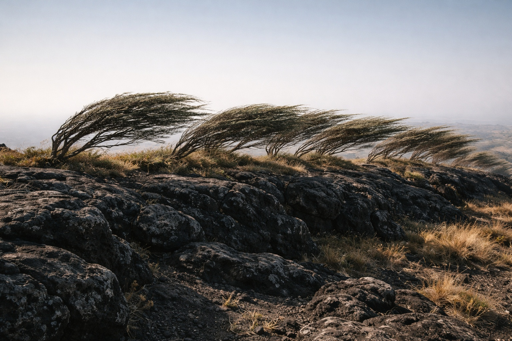
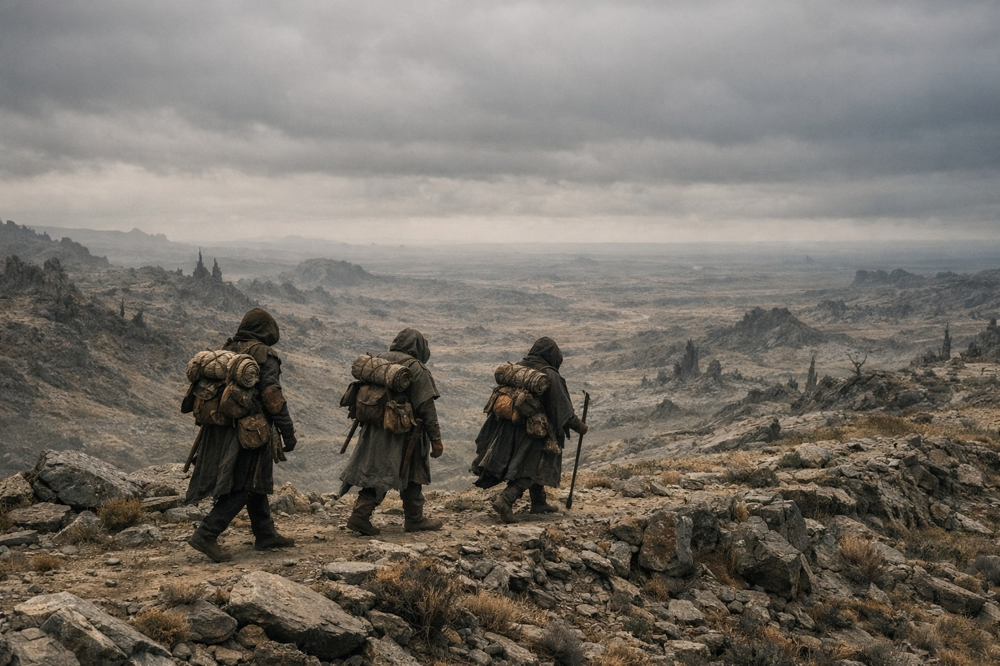

## Capítulo 31 | Parte 3 | El Camino Adelante

Corrieron hasta que la torre fue una mancha en el horizonte, y luego corrieron más.

La ruta oriental de Szoravel seguía una cresta junto a varios peligros marcados. Drusniel no entendía todos los símbolos. Se mantuvo en el sendero donde el mapa señalaba terreno quebrado.

Srietz mantenía el ritmo con zancadas cortas y rápidas. Seguía al lado de Elion y dejaba que Drusniel corriera solo.

Elion cruzaba el terreno quebrado sin reducir el paso. Drusniel no tenía aliento para preguntarle cuánto tiempo podría aguantar así.

Detrás de ellos, el suelo tembló.

La presión le cerró los oídos. Tropezó y recuperó el equilibrio. El cielo estaba despejado, pero el aire olía como justo antes de que cayera un rayo.

Las orejas de Srietz se pusieron rígidas. —Eso no es geológico.

—No. —Drusniel siguió corriendo—. Eso es Nyxara.

Los arbustos se doblaron hacia el este. La presión le tapó los oídos y por un momento dejó de oír las pisadas de los otros.

Había sentido aquella presión en la sala de Nyxara, antes de llegar a Szoravel. Ahora era más fuerte.

—Más rápido —dijo Drusniel.

Bajaron corriendo a un valle de árboles torcidos. Drusniel no sabía si las copas los ocultarían de Nyxara. Aprovechó la cobertura de todos modos.

La presión aumentó y después cedió. Drusniel oyó crujir las ramas y las pisadas de Srietz detrás de él.

¿Ya estaba en la torre?

Escuchó por si los perseguían y no oyó nada. No bastaba para detenerse.

Siguió corriendo.

Cruzaron el valle y treparon la siguiente cresta. El paisaje se abrió hacia el este: más de la geografía hostil de Wyrmreach, piedra y matorral y cielo, extendiéndose hacia la frontera de Thornfield que el mapa de Szoravel situaba a dos días de marcha a buen ritmo. Dos días de terreno abierto donde cualquier señor con ojos podría rastrear tres figuras en una cresta.

Srietz seguía con ellos. Cuando Drusniel miró atrás, el goblin se volvió hacia Elion.

Redujeron el paso cuando Srietz empezó a tropezar. Drusniel los guio por la cresta con el mapa abierto en las manos.

El sol ascendió mientras seguían la cresta. El mapa de Szoravel terminaba en Thornfield. Más allá, Drusniel tendría que comprobar las indicaciones que había traído del sueño.

Detrás de ellos, Nyxara. En algún lugar. Decidiendo.

Caminaron hasta que la cresta ocultó la torre.

---

**Fin del Capítulo 31.3 —>  31.4: [La Partida: La Conversación](/la-partida-la-conversacion/)**
