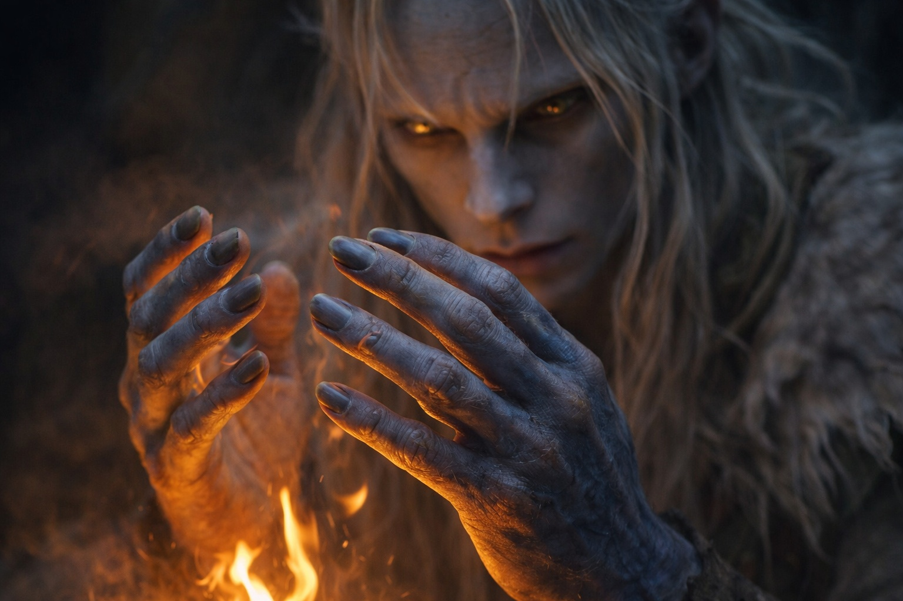
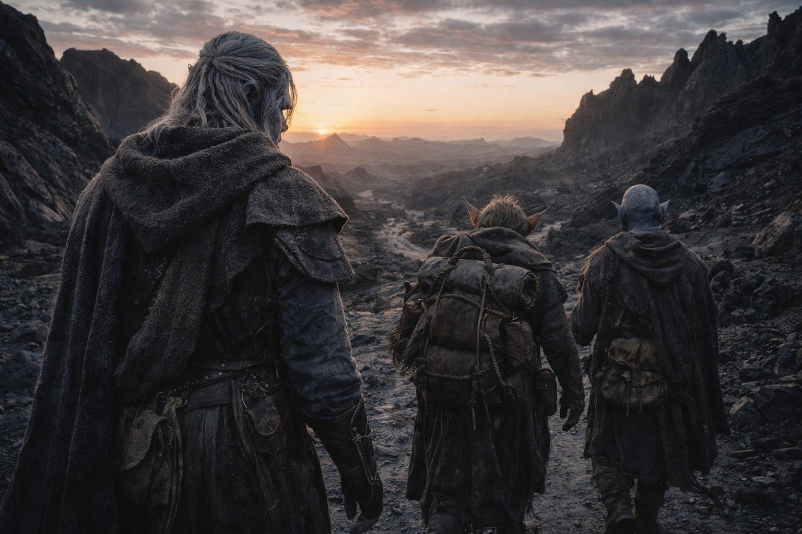

---
order: 1282
title: "La Partida: El Peso"
description: "Contó lo que cargaba porque contar era lo que hacía cuando la alternativa era sentir."
date: 2024-09-25
language: es
chapter: 31
subchapter: 5
storyline: drusniel
canon_phase: main
canon_sequence: D-031-005
narrative_weight: high
category: Wyrmreach
author: Drusniel
type: Main
tags: ['#la partida', '#drusniel', '#wyrmreach']
thumbnail: image.jpg
featured: false
counterpart_path: site/content/posts/en/wyrmreach/the-departure-the-weight/index.mdx
counterpart_title: "The Departure: The Weight"
---

# Capítulo 31.5 | La Partida: El Peso

Contó lo que cargaba porque contar era lo que hacía cuando la alternativa era sentir.

Atardecer. La frontera de Thornfield quedaba atrás, cruzada sin ceremonia en un punto donde el mapa de Szoravel mostraba un hueco en el horario de patrullas de Nyxara. El hueco había estado allí. El horario se había mantenido. Si eso significaba que la inteligencia de Szoravel era precisa o que Nyxara los había dejado pasar era una cuestión que Drusniel archivó bajo problemas que no podía resolver y no examinaría hasta que lo obligaran.

Habían acampado en una formación rocosa que proporcionaba resguardo del viento y líneas de visión, el tipo de refugio natural que Srietz identificaba por instinto y que Drusniel estaba aprendiendo a ver. El goblin había construido un fuego pequeño con vegetación que ardía bajo y caliente y producía un humo mínimo, otra habilidad del catálogo de conocimientos de supervivencia que había acumulado en tres años de esclavitud y los años anteriores en que no fue posesión de nadie.

Srietz le había hablado a Drusniel dos veces desde la conversación en la cornisa de piedra. Ambas sobre asuntos prácticos: purificación de agua, la comestibilidad de una raíz que había encontrado. Las palabras llegaron directamente, no a través de Elion. Progreso. O el comienzo del progreso. O la apariencia del progreso sostenida porque la alternativa, el silencio, era una ineficiencia que Srietz no podía permitirse.

Elion dormía. O representaba dormir. La distinción se había vuelto académica.

Drusniel se sentó contra la roca con su mochila al lado y catalogó.

Las deudas. Dos contraídas con la Voz, la entidad que le había salvado la vida en el Mar de Pesadillas y después había salvado a sus compañeros cuando el hambre los habría reclamado. La Voz había estado ausente durante el cruce del volcán, en silencio cuando más la necesitaba, y ese silencio le había enseñado algo que no podía desaprender: podía sobrevivir sin ella. El conocimiento debería haber sido liberador. En cambio se asentó en su pecho como un signo de interrogación, porque si la Voz era opcional para sobrevivir, entonces las deudas también eran opcionales, y si las deudas eran opcionales, la Voz había pagado un precio por favores que él podría haber gestionado solo. Lo cual significaba que las deudas eran costos legítimos o eran palanca. Y la Voz no había aclarado cuál.

Una deuda con Nyxara. Una conversación, prometida durante la audiencia en su territorio, contenido indefinido, plazo ahora expirado. Ella había venido a cobrar y él había huido. La deuda no se había disuelto con la distancia. Había acumulado intereses. Lo que fuera que ella quería de esa conversación, el deseo sería más afilado ahora, con el filo del inconveniente de la persecución y la indignidad de ser esquivada por alguien a quien consideraba un activo menor.

El artefacto. El Nulo. Fase de Borrar del Chasis del Nexus. En su mochila, envuelto en tela, oscuro y sin rasgos, cargando un propósito sobre el que sus custodios discrepaban. Szoravel quería la barrera renovada. Zaelar quería desmantelarla. Al Nulo no le importaba. Era una herramienta. Lo que hacía dependía de los parámetros ingresados en la activación, y la persona que debía ingresar esos parámetros era Drusniel, porque era compatible. No especial. No elegido. Compatible. Una llave que encajaba en una cerradura específica porque la cerradura era particular, no porque la llave fuera extraordinaria.

Lo había encontrado reconfortante durante aproximadamente una hora. Luego el consuelo se erosionó en algo peor: la comprensión de que la compatibilidad no otorgaba entendimiento. Podía activar el Chasis sin saber qué haría. Podía reparar la barrera o colapsarla dependiendo de la alineación, y las personas que entendían la alineación no podían ponerse de acuerdo sobre cuál era la correcta.

Las direcciones. Una cresta de piedra negra. Un río que corría hacia atrás. Una torre consumida a medias por la tierra. Tres caminos, uno silencioso. Extraídos de las Tierras del Sueño en siete minutos de proyección controlada que le habían costado sangre de su oído y una noche de sueño tan fragmentado que el mundo despierto aún portaba un brillo residual, un desplazamiento de medio grado que hacía que cada superficie pareciera provisional.

Szoravel le había dado tres cristales de calibración. Mañana por la noche se proyectaría de nuevo. Construiría un compuesto. Buscaría las líneas de fractura que se repetían. Las direcciones estructurales que persistían cuando todo lo demás cambiaba. Esa era la ruta. Poco fiable, costosa, facilitada por cristales que reducían la fricción entre su conciencia y un plano donde algo vasto podía encontrarlo.

Era diferente de cuando había empezado.

La comprensión llegó sin ceremonia. Lo sabía intelectualmente desde el Mar de Pesadillas, desde la primera deuda, desde que los cristales empezaron a cambiar como su cuerpo procesaba el entorno hostil de Wyrmreach. Pero saberlo y contabilizarlo eran operaciones distintas, y esta noche, al otro lado de la frontera de Thornfield con sus compañeros durmiendo y el fuego ardiendo bajo, la contabilidad era inevitable.

Cargaba cristales que habían adaptado su cuerpo a condiciones que deberían matarlo. Su conciencia podía proyectarse a un plano de sueño colectivo. Llevaba dos deudas con una entidad cuya naturaleza no podía verificar y cuyos intereses no podía predecir. Era la interfaz compatible para un sistema cuyo propósito sus creadores disputaban. Tenía un compañero que se negaba a mirarlo y un compañero que podría estar albergando algo antiguo en su cuerpo sin saberlo.

Había dejado Umbra'kor como un candidato de prueba fallido con un artefacto robado y una familia muerta. Semanas después era algo distinto. Algo que no tenía nombre porque las categorías no existían para alguien atrapado entre instrumento y persona, entre herramienta y usuario, entre la cosa que mantenía la barrera y la cosa que la rompía.

La Voz se agitó.

No palabras. No las intervenciones claras y articuladas que había experimentado durante las deudas. Una presencia. Un calor en el espacio detrás de su esternón donde las deudas vivían, donde la influencia de la Voz residía, donde la conexión entre ellos era más fuerte. Se agitó como un durmiente que se mueve en la oscuridad: movimiento sin conciencia, peso redistribuyéndose, el sistema ajustándose antes de que el ocupante despierte.

Luego, silencioso como un aliento:

*Casi listo.*

Dos palabras. Más sugerencia que habla, más vibración que lenguaje, presionadas en su conciencia con la delicadeza de alguien probando si una puerta estaba cerrada con llave.

*Casi allí.*

No preguntó dónde. Tenía miedo de saberlo ya.

El fuego ardía bajo. El viento se movía a través de la formación rocosa con un sonido como de respiración. Srietz dormía contra la pared lejana, lo bastante cerca para ayudar, lo bastante lejos para hacer daño. La quietud de Elion mantenía su ambigüedad habitual. El paisaje de Wyrmreach se extendía en todas las direcciones, hostil y equivocado y la única dirección hacia adelante.

Drusniel cerró los ojos. El Nulo presionaba contra su columna a través de la mochila. Los cristales zumbaban en su cinturón. La Voz se asentó de vuelta en cualquier espacio que ocupara cuando no estaba hablando, y el silencio que dejó atrás no era ausencia sino anticipación.

Mantuvo los ojos cerrados. El sueño tardó mucho en llegar, y cuando llegó, fue delgado y superficial y lleno de fracturas que podrían haber sido sueños o podrían haber sido las Tierras del Sueño filtrándose, y cargó todo, todo el peso, todas las deudas, todas las direcciones y distancias y la confianza dañada, hacia la oscuridad.

Por la mañana, caminarían.

Caminaron.

---

**Fin del Capítulo 31 — El Acto 2 Se Cierra**
