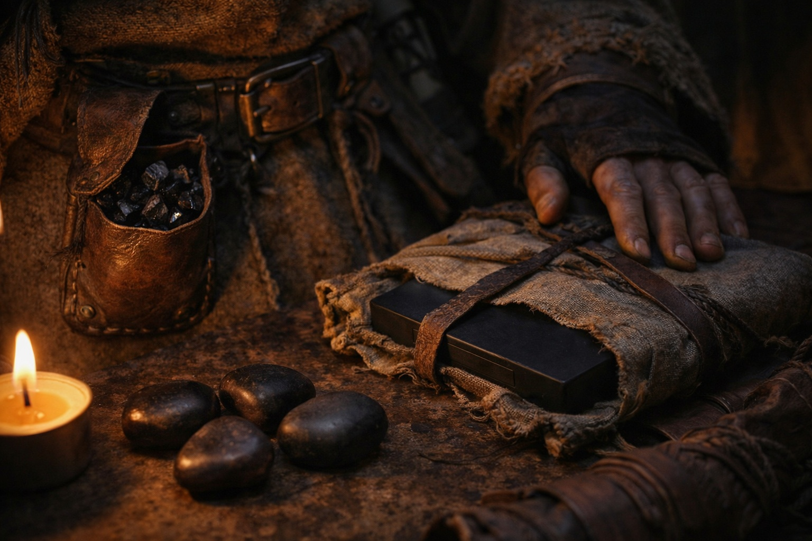
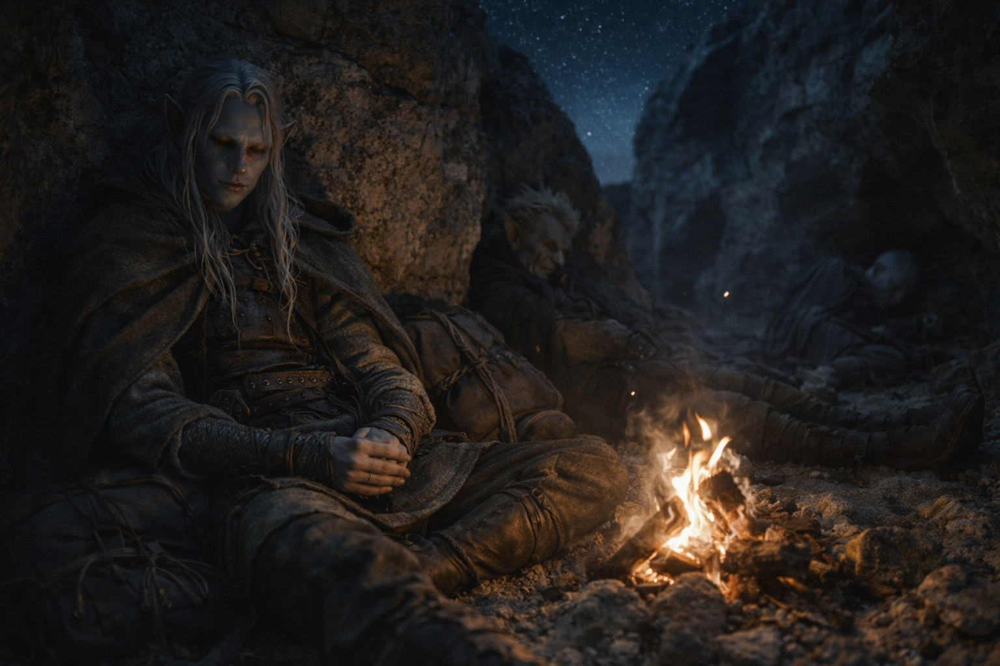

---
order: 1282
title: "La Partida: El Peso"
description: "Drusniel volvió a revisar la mochila, aunque sabía que no faltaba nada."
date: 2024-09-25
language: es
chapter: 31
subchapter: 5
storyline: drusniel
canon_phase: main
canon_sequence: D-031-005
narrative_weight: high
category: Wyrmreach
author: Drusniel
type: Main
tags: ['#la partida', '#drusniel', '#wyrmreach']
thumbnail: image.jpg
featured: false
counterpart_path: site/content/posts/en/wyrmreach/the-departure-the-weight/index.mdx
counterpart_title: "The Departure: The Weight"
---

## Capítulo 31 | Parte 5 | El Peso

Drusniel volvió a revisar la mochila, aunque sabía que no faltaba nada.

Al segundo atardecer habían cruzado Thornfield por el hueco marcado en el mapa de Szoravel. No habían visto patrullas. Drusniel no sabía si atribuirlo al mapa o al permiso de Nyxara.

Srietz eligió un hueco entre rocas desde el que se veían ambos accesos. Encendió una hoguera pequeña con tallos secos que apenas echaban humo.

Srietz le había hablado directamente dos veces desde la discusión: una sobre el agua y otra sobre una raíz que había encontrado. Drusniel no había intentado alargar ninguna conversación.

Elion estaba tendido, inmóvil, con los ojos cerrados.

Drusniel se apoyó contra la roca e intentó decidir qué debía comprobar primero.

Dos deudas. La primera en el Mar de las Pesadillas; la segunda por una ruta a través de las cuevas. Había sobrevivido a la montaña sin otra oferta. Eso no anulaba ninguna de las dos aceptaciones.

Nyxara seguía queriendo una audiencia. Él había aceptado el paso por su territorio, no servicios futuros. Faltaba ver si ella respetaba la diferencia.

Tocó el Null bajo la camisa. Borrar. Su nombre le decía qué eliminaba, no qué quedaría después.

Szoravel lo había llamado compatible. Drusniel seguía sin saber lo suficiente para arriesgarse a activarlo.

Recordaba una cresta negra, un río que corría al revés y una torre medio enterrada. Tres caminos, uno silencioso. Siete minutos en las Tierras del Sueño le habían costado sangre del oído. Después había dormido mal y aún se mareaba al girar la cabeza demasiado deprisa.

Szoravel le había devuelto los tres cristales calibrados. La noche siguiente los usaría para comprobar de nuevo la ruta. Necesitaba encontrar los puntos que permanecían en su sitio cuando el resto del sueño cambiaba.

Era diferente de cuando había empezado.

Intentó recordar una noche en Umbra'kor en la que dormir le hubiera costado tanto.

Podía respirar allí con los cristales cerca. Eso no hacía seguro el siguiente paso. Miró a sus compañeros y recordó lo poco que había preguntado antes de llevarlos ante Szoravel.

Había querido saber qué le habían hecho. Ahora tenía que decidir cuánto más permitiría.

La Voz se agitó.

El frío le oprimió el pecho. Dejó de moverse.

La Voz habló.

*Casi listo.*

Esperó, conteniendo la respiración.

*Casi allí.*

No preguntó dónde. Tenía miedo de saberlo ya.

Miró hacia Srietz, dormido junto a la pared más lejana. Elion no se había movido. Ninguno parecía haber oído.

El frío permaneció cuando las palabras cesaron. Mantuvo una mano contra el Null a través de la camisa hasta que la respiración se le calmó.

Cada vez que cerraba los ojos volvía a ver los caminos que se bifurcaban. No sabía si los recordaba o si empezaba a soñar.

Por la mañana, caminarían.

Caminaron.

---

**Fin del Capítulo 31.5 —>  32.1: [El Último Lugar Seguro: La Llegada](/el-ultimo-lugar-seguro-la-llegada/)**
