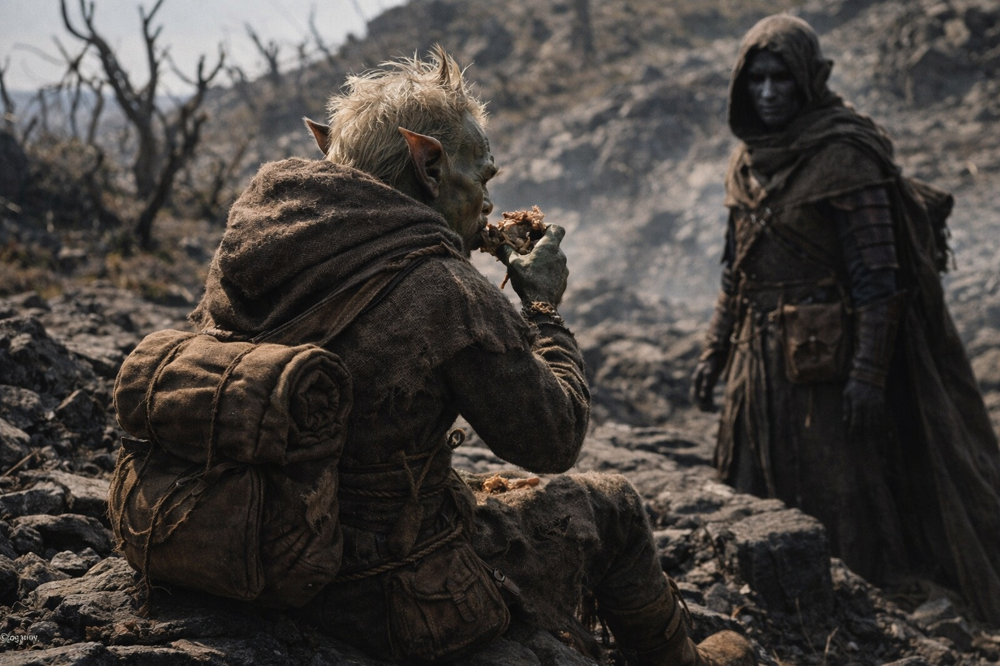
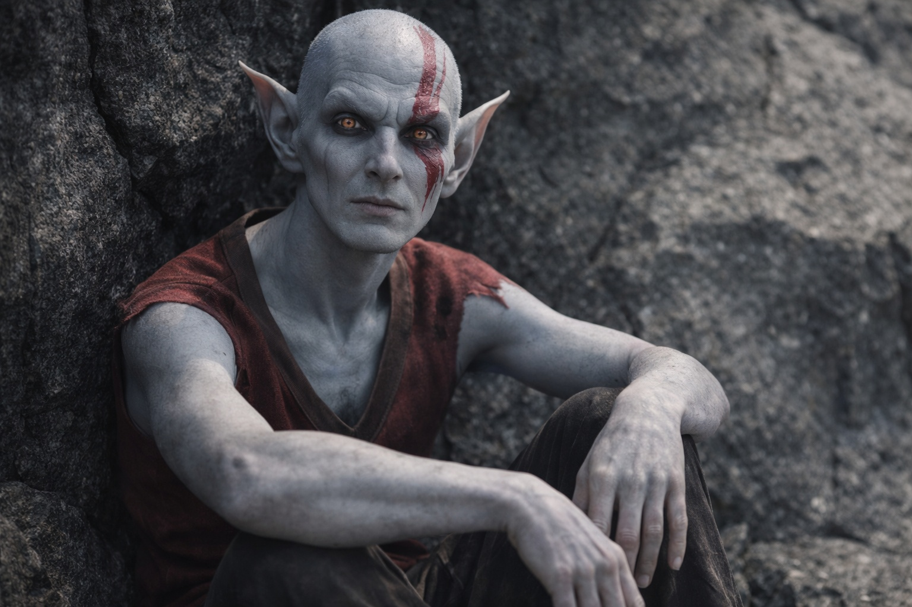
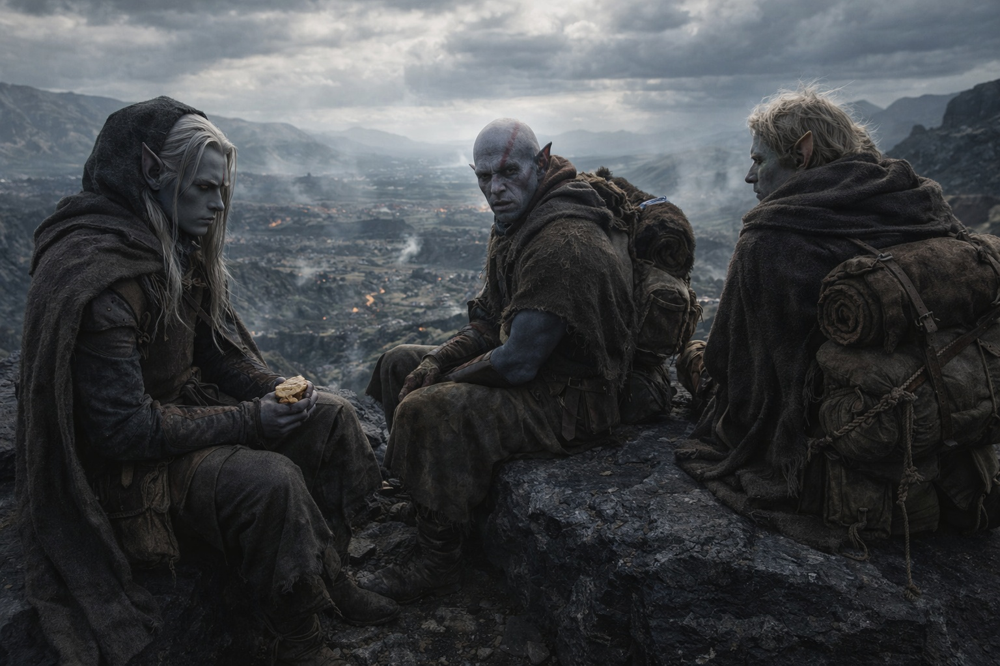
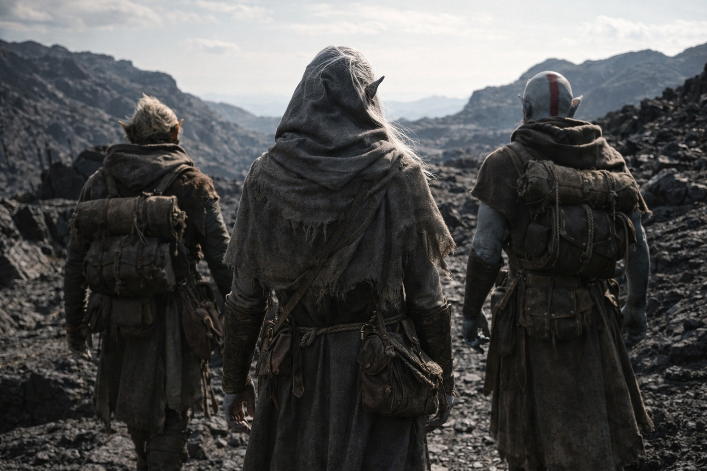

---
order: 1281
title: "La Partida: La Conversación"
description: "El silencio duró hasta el mediodía, lo cual fue más de lo que Drusniel esperaba y menos de lo que merecía."
date: 2024-09-24
language: es
chapter: 31
subchapter: 4
storyline: drusniel
canon_phase: main
canon_sequence: D-031-004
narrative_weight: high
category: Wyrmreach
author: Drusniel
type: Main
tags: ['#la partida', '#drusniel', '#srietz', '#elion', '#wyrmreach']
thumbnail: image.jpg
featured: false
counterpart_path: site/content/posts/en/wyrmreach/the-departure-the-conversation/index.mdx
counterpart_title: "The Departure: The Conversation"
---

# Capítulo 31.4 | La Partida: La Conversación

El silencio duró hasta el mediodía, lo cual fue más de lo que Drusniel esperaba y menos de lo que merecía.

Se habían detenido a comer en una cornisa de piedra negra que ofrecía una vista del territorio a sus espaldas. Ninguna persecución visible. Ninguna presión en el aire. La frontera de Thornfield estaba en algún punto más adelante, una línea en un mapa que Szoravel había trazado con la confianza de alguien que la había caminado y la advertencia de que la línea se movía. Las fronteras en Wyrmreach eran sugerencias, no hechos.

Srietz comía de espaldas a Drusniel. Había sometido las provisiones secas a una prueba con algo de su bolsa del cinturón, una gota de líquido que cambiaba de color al contacto con la comida, y solo había comido tras confirmar lo que fuera que sus estándares exigían. El ritual era familiar. La dirección hacia la que miraba mientras lo ejecutaba era nueva.

—Srietz tiene una pregunta sobre la ruta. —Lo dijo dirigiéndose a Elion. No a Drusniel. Las palabras viajaron por el camino largo, del mismo modo en que Srietz conducía ahora cada conversación: a través de un intermediario, como si la comunicación directa costara algo que ya no estaba dispuesto a pagar—. Srietz querría saber si el drow planea vender a alguien más durante el trayecto. Para que Srietz pueda planificar en consecuencia.

Las palabras aterrizaron en el espacio entre ellos y se quedaron allí. Drusniel masticó. Tragó. Dejó su ración en el suelo. El impulso de defenderse fue inmediato y lo mató, porque la defensa implicaba que la acusación era discutible y la acusación no era discutible. Szoravel había examinado a Srietz como una pieza de equipo. Catalogó sus habilidades, su deterioro, su función. «Componente de supervivencia. Útil. No te mueras.» Y Drusniel se había quedado sentado dejando que ocurriera porque el intercambio de información lo exigía, porque la evaluación de Szoravel era el precio de la información, porque todo en Wyrmreach era una transacción y Drusniel llevaba realizando transacciones con la dignidad de sus compañeros desde el día en que había aceptado la primera deuda.

Elion habló. Había estado sentado contra un saliente rocoso, las piernas recogidas bajo el cuerpo, su piel gris fundiéndose con la roca de un modo que probablemente era inconsciente y posiblemente no. Sus ojos ámbar anaranjados se movieron entre Drusniel y Srietz con la atención concentrada de alguien que había aprendido, en años de cautiverio, a leer la dinámica de una habitación antes de decidir cerca de qué puerta situarse.

—Sigue aquí, Drusniel. —La voz de Elion era tranquila y concreta, la voz de alguien que traficaba con observaciones más que con opiniones—. Eso debería asustarte más que si se hubiera marchado.

Drusniel lo miró.

—Se quedó para que tengas que mirar lo que hiciste. Cada día. Cada legua. Si se hubiera ido, podrías decirte a ti mismo que fue su elección. Su problema. Pero se quedó. Eso significa que el coste es tuyo para cargarlo, no suyo para dejarlo atrás.

La observación fue lo bastante precisa como para cortar. Drusniel la sintió llegar al lugar donde vivían las justificaciones y observó cómo las justificaciones se estremecían.

—Lo sé.

—¿De verdad? —Elion inclinó la cabeza. Las marcas rojas de su rostro captaron la luz—. Nos llevaste a esa torre sabiendo lo que el viejo drow haría. Dejaste que nos examinara porque la información valía más que nuestro consentimiento. Tomaste una decisión sobre lo que valíamos en relación con lo que necesitabas. Y la decisión fue correcta, según los números. Los números siempre son correctos. Esa no es la parte que importa.

—¿Qué importa?

—Que no preguntaste.

Silencio. El viento cruzó la cornisa de piedra negra. En algún lugar más abajo, la vegetación retorcida crujía en su perpetua negociación con la gravedad.

Drusniel se dirigió al silencio. No a Srietz. No a Elion. Al espacio entre ambos.

—El artefacto es una herramienta de mantenimiento. Tres partes. Szoravel tiene una. Alguien llamado Zaelar tiene otra. Yo llevo la tercera. Juntas, en una ubicación específica, pueden extender la vida de la barrera o desmantelarla. Nadie sabe cuál hasta la activación. Mi papel es llegar allí. No porque fuera elegido. Porque soy compatible. —Hizo una pausa—. Eso es lo que Szoravel me dio. Eso es lo que compró la evaluación.

Las orejas de Srietz rotaron un grado hacia Drusniel. No un giro de cabeza. Solo las orejas. Escuchando a pesar de negarse a mirar.

—La barrera está fallando. Lo ha estado durante siglos. Si falla por completo, las cosas que contiene se extienden hacia el mundo de la superficie. Ese es el alcance. Por eso a Szoravel le importó lo suficiente como para ayudar. Por eso Nyxara está lo bastante interesada como para exigir una conversación.

—Srietz comprendió el alcance —dijo el goblin. Todavía dirigiéndose a Elion. Todavía sin mirar—. Srietz no necesitaba ser examinado como una herramienta para comprender el alcance. Srietz necesitaba que se lo preguntaran.

La palabra quedó suspendida: *preguntar*. Una cosa tan pequeña. Nueve letras. La diferencia entre una transacción y una asociación, entre usar a alguien e incluirlo, entre el modo en que Szoravel operaba y el modo en que Drusniel se estaba convirtiendo, pieza a pieza, deuda a deuda, sin darse cuenta hasta que alguien a quien había herido señaló la evidencia.

—Tienes razón —dijo Drusniel.

Las orejas de Srietz se aplanaron. No de ira. De sorpresa. Drusniel había aprendido a distinguir la diferencia en semanas de viaje, y la sorpresa dolía más que la ira porque significaba que Srietz no había esperado la admisión. No había esperado que Drusniel fuera capaz de ello.

—Srietz continuará caminando con el grupo —dijo el goblin. Las palabras iban dirigidas a Elion pero el volumen estaba calibrado para los oídos de Drusniel—. Srietz seguirá proporcionando información sobre rutas, evaluación de suministros y apoyo químico. Srietz no seguirá pretendiendo que son regalos. Son la ventaja de Srietz. Cuando el drow necesite algo que solo Srietz pueda proporcionar, Srietz recordará esta conversación.

—Justo —dijo Drusniel.

—Srietz no preguntó si al drow le parecía justo. —Se puso en pie, se sacudió las manos y empezó a reempacar—. Srietz expuso condiciones.

Elion observó el intercambio con la quietud de alguien que catalogaba datos propios. Sus ojos ámbar contenían algo que Drusniel no pudo descifrar, una capa bajo la observación que podía ser reconocimiento o podía ser la cosa dentro de él, el pasajero, mirando a través de sus ojos.

—¿Y yo? —preguntó Elion.

Drusniel lo miró. —¿Qué pasa contigo?

—Szoravel vio algo en mí. Lo llamó un pasajero. Dijo que estaba dormido. Dijo que contármelo cambiaría mi comportamiento. —La voz de Elion era ecuánime pero la tensión en su mandíbula decía lo contrario—. ¿Vas a decirme lo que quiso decir?

—No sé lo que quiso decir. No lo explicó.

—Pero intentarás averiguarlo.

—Sí.

—Sin preguntarme primero.

El patrón se repetía. Drusniel lo escuchó. El eco de la queja de Srietz en la versión más silenciosa de Elion: la suposición de que la información sobre ellos le pertenecía a Drusniel y no a las personas que la información describía.

—Preguntaré —dijo Drusniel—. Cuando sepa lo suficiente para hacer la pregunta correcta.

Elion lo consideró. Sus rasgos grises se desplazaron de formas que podían ser microexpresiones o microtransformaciones, la frontera entre ambas eternamente difusa. —Te tomaré la palabra.

Empacaron. Caminaron. La formación había cambiado. Srietz seguía caminando junto a Elion, pero la distancia entre ellos y Drusniel se había reducido una fracción. No era perdón. No era confianza. Algo más provisional y más honesto: condiciones.

La frontera de Thornfield estaba adelante. Detrás de ellos, lo que fuera que Nyxara hubiera decidido. Entre ellos, las ruinas de las suposiciones y el comienzo de algo que no era amistad y no era alianza y no era la transacción que había sido, sino algo construido con los restos de las tres.

---

*Siguiente: La Partida: El Peso*

**Fin del Capítulo 31.4 — continúa en el Capítulo 31.5: [La Partida: El Peso](/la-partida-el-peso/)**
