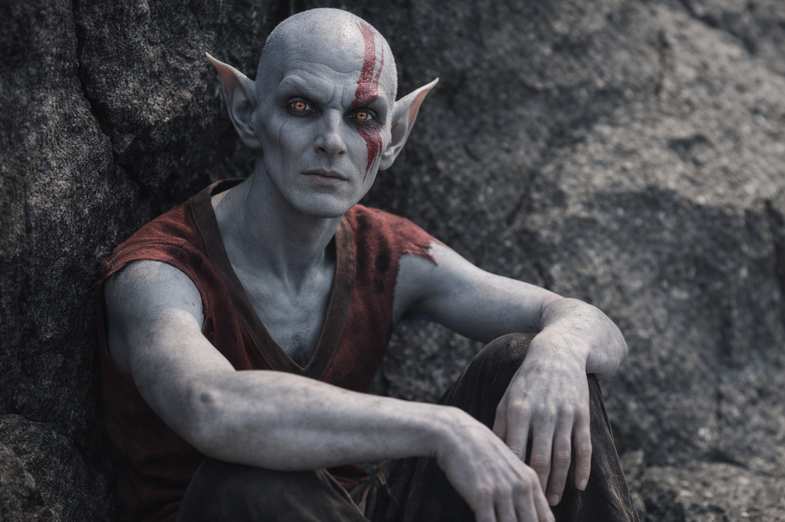
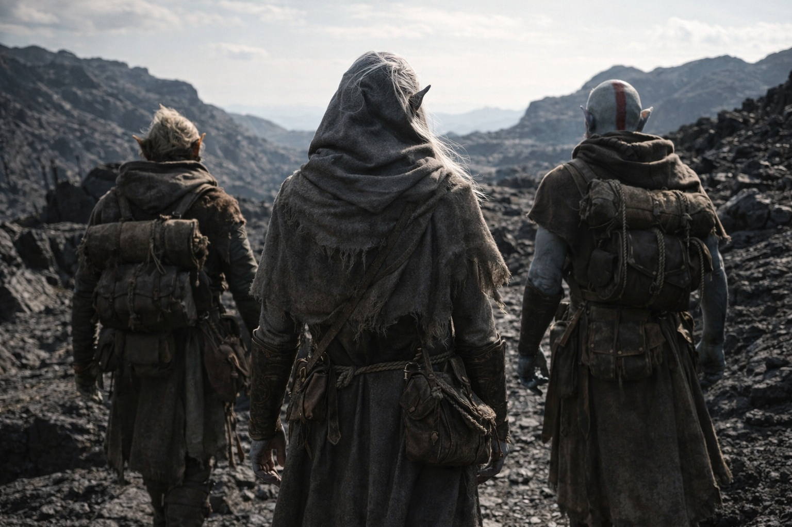

---
order: 1281
title: "La Partida: La Conversación"
description: "El silencio duró hasta el mediodía, lo cual fue más de lo que Drusniel esperaba y menos de lo que merecía."
date: 2024-09-24
language: es
chapter: 31
subchapter: 4
storyline: drusniel
canon_phase: main
canon_sequence: D-031-004
narrative_weight: high
category: Wyrmreach
author: Drusniel
type: Main
tags: ['#la partida', '#drusniel', '#srietz', '#elion', '#wyrmreach']
thumbnail: image.jpg
featured: false
counterpart_path: site/content/posts/en/wyrmreach/the-departure-the-conversation/index.mdx
counterpart_title: "The Departure: The Conversation"
---

## Capítulo 31 | Parte 4 | La Conversación

El silencio duró hasta el mediodía, lo cual fue más de lo que Drusniel esperaba y menos de lo que merecía.

Se detuvieron a comer en una cornisa de piedra negra desde la que podían vigilar el terreno recorrido. Nadie los seguía. Drusniel comprobó la frontera de Thornfield en el mapa antes de guardarlo.

Srietz comía de espaldas a Drusniel. Había sometido las provisiones secas a una prueba con algo de su bolsa del cinturón, una gota de líquido que cambiaba de color al contacto con la comida, y solo había comido tras confirmar lo que fuera que sus estándares exigían. El ritual era familiar. La dirección hacia la que miraba mientras lo ejecutaba era nueva.

—Srietz tiene una pregunta sobre la ruta. —Se dirigió a Elion—. ¿El drow piensa vender a alguien más por el camino? Srietz necesita planificar.

Drusniel dejó la ración. Szoravel había inspeccionado las cicatrices de Srietz, preguntado por Vexrath y exigido un inventario. Drusniel no había preguntado si Srietz quería participar en el examen.

Elion estaba sentado contra el saliente, observándolos a ambos.

Elion habló en voz baja. —Se ha quedado, Drusniel. Al menos podrías mirarlo.

Drusniel lo miró.

—Todavía tiene que caminar a tu lado. No puedes dar esto por terminado solo porque dejamos la torre.

Drusniel bajó la vista hacia la comida sin terminar.

—Lo sé.

—Entonces, ¿por qué dejaste que nos examinara? —preguntó Elion—. Tú querías respuestas. Nosotros tuvimos que quedarnos allí mientras él sacaba lo que quería.

—Pensé que se negaría si no quería.

—Podrías haber preguntado.

Debajo de la cornisa, las ramas rozaban la roca.

Drusniel se volvió hacia Srietz.

—El Null es una fase de un sistema mayor. Szoravel tiene Alterar. Faltan el chasis y otros componentes. Cree que puedo usarlos, pero no ha demostrado ninguna reparación. —Drusniel los miró—. Eso es lo que aprendí.

Las orejas de Srietz rotaron un grado hacia Drusniel. No un giro de cabeza. Solo las orejas. Escuchando a pesar de negarse a mirar.

—Dice que la barrera está fallando. Necesitaba saber si acercar esto empeoraría las cosas.

—Srietz comprendió el alcance —dijo el goblin. Todavía dirigiéndose a Elion. Todavía sin mirar—. Srietz no necesitaba ser examinado como una herramienta para comprender el alcance. Srietz necesitaba que se lo preguntaran.

Drusniel no tenía respuesta para eso.

—Tienes razón —dijo Drusniel.

Las orejas de Srietz se aplastaron. Miró a Drusniel por primera vez desde que se habían detenido.

—Srietz continuará caminando con el grupo —dijo el goblin. Las palabras iban dirigidas a Elion pero el volumen estaba calibrado para los oídos de Drusniel—. Srietz seguirá proporcionando información sobre rutas, evaluación de suministros y apoyo químico. Srietz no seguirá pretendiendo que son regalos. Son la ventaja de Srietz. Cuando el drow necesite algo que solo Srietz pueda proporcionar, Srietz recordará esta conversación.

—Justo —dijo Drusniel.

—Srietz no preguntó si al drow le parecía justo. —Se puso en pie, se sacudió las manos y empezó a reempacar—. Srietz expuso condiciones.

Elion esperó a que Srietz terminara de recoger sus cosas.

—¿Y yo? —preguntó Elion.

Drusniel lo miró. —¿Qué pasa contigo?

—Encontró una presencia dormida dentro de mí. Después interrumpió el examen. —Elion apretó la mandíbula—. ¿Qué quería decir?

—No sé lo que quiso decir. No lo explicó.

—Pero intentarás averiguarlo.

—Sí.

—Sin preguntarme primero.

Drusniel se contuvo antes de responder.

—Te preguntaré antes de volver a involucrarte.

Elion lo estudió. —Te tomaré la palabra.

Recogieron sus cosas y siguieron. Srietz se quedó junto a Elion, pero ahora Drusniel podía oírlos hablar.

En el siguiente desvío, Srietz esperó a que Drusniel comprobara el mapa.

---

**Fin del Capítulo 31.4 —>  31.5: [La Partida: El Peso](/la-partida-el-peso/)**
