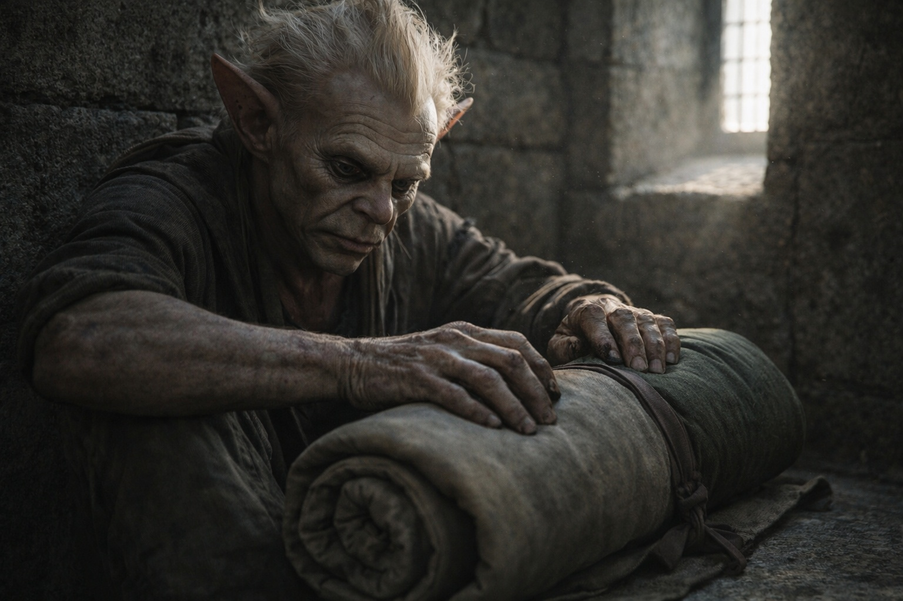
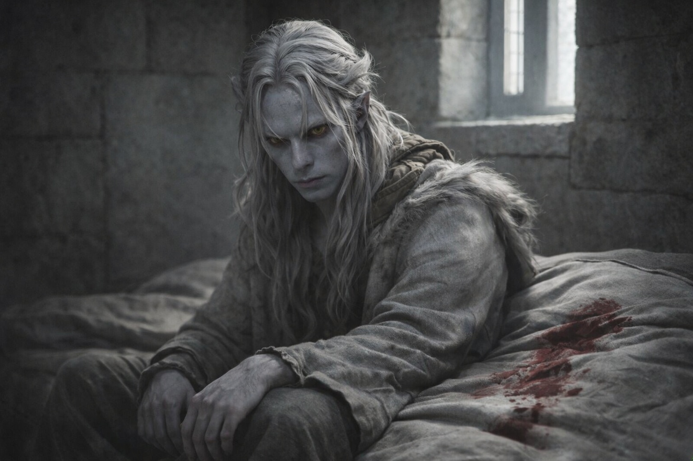

# Capítulo 31.1 | La Partida: La Mañana

Srietz empacó su equipo sin hablar.

Había movido su petate hacia la pared más lejana durante la noche, tan lejos de Drusniel como la habitación lo permitía, y ahora lo enrollaba con la precisión eficiente de alguien que había aprendido, en años de cautiverio y huida, que un petate bien enrollado era la diferencia entre pasar tu mochila por un hueco estrecho y morir del lado equivocado. Sus manos trabajaban. Sus orejas estaban aplastadas. Sus ojos amarillos seguían sus propios dedos y nada más.

Cuando Elion preguntó si estaba listo, Srietz le respondió a Elion. No a Drusniel.

—Srietz está listo. —Una pausa. La pausa sostenía el peso de algo deliberado—. Srietz camina con el grupo. —Otra pausa—. Srietz no camina con él.

No miró a Drusniel ni una vez.

La luz de la mañana entraba por las ventanas estrechas de la torre en haces delgados que no hacían nada por calentar la piedra. Drusniel llevaba despierto desde antes de la luz, sentado sobre el jergón donde la noche anterior le había sangrado el oído. La sangre se había secado sobre la tela en un patrón que podía leer si quería, del mismo modo en que leía grietas en la piedra, del mismo modo en que ahora aparentemente leía fracturas en el tejido de la consciencia. No lo leyó. Algunos datos no eran útiles.

Su cuerpo se sentía como si hubiera sido desmontado y reconstruido en un orden aproximadamente correcto. La desorientación sobre la que Szoravel le había advertido estaba ahí, una sensación persistente de que el mundo estaba medio grado fuera de lo real, como si cada superficie y cada sombra se hubieran desplazado mientras dormía y no hubieran regresado del todo a su posición original. Su oído derecho estaba curado. El dolor de cabeza era constante, bajo, manejable. El recuerdo de las Tierras del Sueño se asentaba en su mente como una piedra en su zapato, presente e inevitable e incorrecto.

Empacó. El Nulo fue lo primero en entrar a su mochila, envuelto en tela, su peso familiar e insignificante y de pronto nada insignificante. Una bomba o un vendaje. Lo había estado cargando durante semanas. Ahora sabía lo que era. O parte de lo que era. Suficiente para que el peso se sintiera diferente.

La torre de Szoravel estaba silenciosa a la manera de un lugar que había estado en silencio durante décadas y resentía la interrupción. La mesa de trabajo donde el disco de mercurio había zumbado estaba despejada, el disco desaparecido, almacenado en algún lugar de las estanterías que cubrían las paredes. El pozo de fuego contenía ceniza y el recuerdo del calor. Los libros estaban apilados donde siempre habían estado apilados, en un orden que probablemente era sistemático y parecía caos.

Elion se movía a través de la rutina matutina con la eficiencia controlada de alguien cuyo cuerpo era una herramienta que había elegido para la tarea. Piel gris, ojos ámbar anaranjado, las marcas rojas en su rostro que podían ser pintura y podían ser otra cosa. Empacó sus pocas pertenencias, revisó la puerta, inspeccionó la habitación. Sus movimientos cargaban una tensión que no había estado ahí antes del examen de Szoravel. La palabra «pasajero» se asentaba entre ellos, innombrada y enorme.

Drusniel había intentado hablar con él sobre eso la noche anterior, después de la proyección onírica. Elion había cerrado los ojos. No dormido. Rehusando.

Justo.

Todos cargaban algo para lo que no se habían inscrito. La pregunta de si discutirlo era el tipo de pregunta que se respondía a sí misma al quedar sin respuesta, y Drusniel estaba aprendiendo, lentamente y a un costo considerable, que algunas verdades sobrevivían mejor en el silencio que en la conversación.

Revisó sus suministros. Agua: adecuada. Comida: dos días, quizá tres si Srietz complementaba del paisaje. Cristales: cuatro negros en una bolsa de cuero en su cinturón, recogidos de la cámara semanas atrás, su superficie tibia contra su cadera. Herramientas: piquetas de escalada, cuerda, el cuchillo que había cargado desde Umbra'kor. El Nulo. La información que Szoravel le había dado, que no cabía en una mochila y pesaba más que todo lo demás junto.

Cargaba: el conocimiento de que la barrera estaba fallando. Que el Chasis era una herramienta de mantenimiento en tres partes. Que Szoravel poseía Alterar. Que Zaelar poseía Percibir. Que el Nulo era la tercera fase, Borrar, y que juntos podían extender la vida de la barrera o desmantelarla, y nadie sabía cuál hasta la activación. Que él era compatible, no elegido. Que la diferencia importaba menos de lo que debería.

Cargaba: dos deudas con la Voz. Una por su propia supervivencia. Una por la del grupo. Cargaba una conversación que debía a Nyxara, contenido indefinido, plazo acercándose. Cargaba direcciones de las Tierras del Sueño que podían ser reales o podían ser los reflejos distorsionados de mil mentes soñando.

Y cargaba el conocimiento de que su consciencia había estado filtrándose hacia un plano donde algo vasto y antiguo podía encontrarlo, y que iba a volver.

Srietz terminó de empacar y salió de la habitación. El umbral sostuvo su ausencia por un momento antes de que Elion lo siguiera. Sus pasos descendieron las escaleras de piedra, los de Srietz ligeros y rápidos, los de Elion medidos y extraños, y entonces Drusniel estaba solo en la habitación de la torre donde había aprendido más en dos días que en las semanas anteriores, y nada de ello había simplificado nada.

Se echó la mochila al hombro. El Nulo presionaba contra su columna. Los cristales zumbaban en su cinturón.

Salió de la habitación y no miró atrás.

---

**Fin del Capítulo 31.1 — continúa en el Capítulo 31.2: [La Partida: Las Últimas Palabras](/la-partida-las-ultimas-palabras/)**
