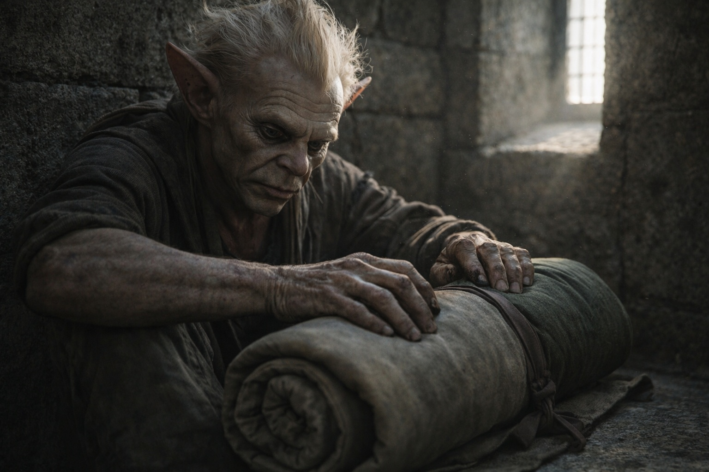
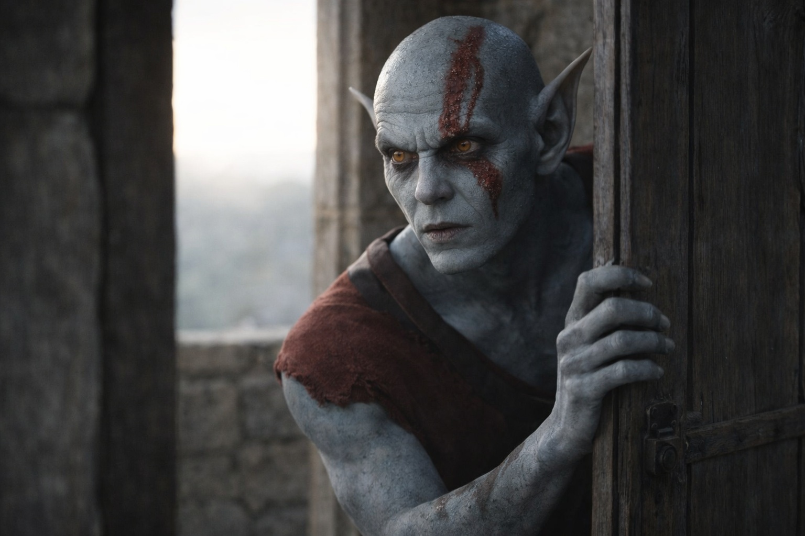

## Capítulo 31 | Parte 1 | La Mañana

Srietz empacó su equipo sin hablar.

Había trasladado el petate a la pared más lejana durante la noche. Ahora lo enrollaba bien apretado, con las orejas pegadas y la vista en las manos.

Cuando Elion preguntó si estaba listo, Srietz le respondió a Elion. No a Drusniel.

—Srietz está listo. —Apretó una correa—. Srietz camina con el grupo. Srietz no camina con él.

No miró a Drusniel ni una vez.

La luz de la mañana llegó al jergón donde Drusniel había pasado la noche. Dobló el paño ensangrentado y lo guardó.

El oído había dejado de sangrar. Seguía con dolor de cabeza y el suelo parecía inclinarse cuando se levantaba. Esperó a que se estabilizara antes de recoger sus cosas.

Comprobó el Null bajo la camisa. Frío e inerte. Szoravel había nombrado su función, pero no le había mostrado una forma segura de usarlo.

La mesa estaba despejada. Szoravel había guardado el disco de medición y en el pozo del fuego quedaba ceniza fría.

Elion recogió sus pocas pertenencias y comprobó la puerta. Apenas había hablado desde que Szoravel encontró la presencia dormida. Las marcas rojas destacaban sobre su piel blanca azulada.

Drusniel había intentado hablar con él sobre eso la noche anterior, después de la proyección onírica. Elion había cerrado los ojos. No dormido. Rehusando.

Justo.

Después, Drusniel lo había dejado en paz.

Comprobó el agua y la comida que le quedaba para dos días. Llevaba al cinturón cuatro de los siete cristales de la montaña; Szoravel aún tenía los otros tres para la calibración. La cuerda, las piquetas y el cuchillo estaban donde los había dejado.

Borrar. Fase II. El Null era un componente y Szoravel tenía Alterar. Seguían faltando el chasis y las demás piezas. Sin ellos, nadie había demostrado una reparación.

Seguía debiéndole dos veces a la Voz. Nyxara quería otra audiencia, aunque él no había prometido ningún servicio más. Y su única ruta más allá del mapa de Szoravel venía de un sueño que no había comprobado.

Y cargaba el conocimiento de que su consciencia había estado filtrándose hacia un plano donde algo vasto y antiguo podía encontrarlo, y que iba a volver.

Srietz salió y Elion lo siguió. Drusniel oyó sus pasos en la escalera y terminó de cerrar la mochila.

Se la echó al hombro. Los cristales zumbaban al cinturón.

Salió de la habitación y no miró atrás.

---

**Fin del Capítulo 31.1 —>  31.2: [La Partida: Las Últimas Palabras](/la-partida-las-ultimas-palabras/)**
