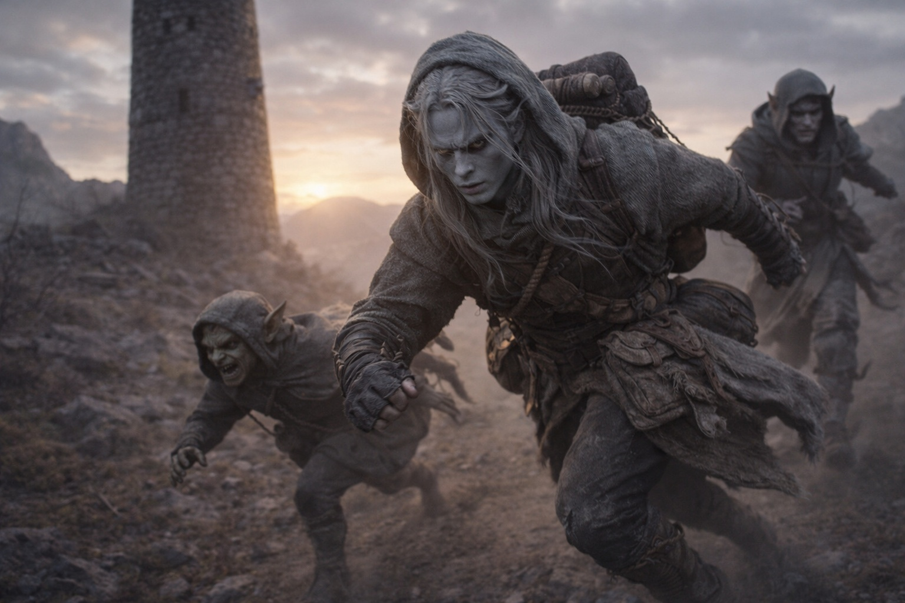

## Capítulo 31 | Parte 2 | Las Últimas Palabras

Szoravel esperaba al pie de la torre con un paquete que no había llevado el día anterior.

No era suyo. Un paquete de suministros, ensamblado con la misma precisión sistemática que caracterizaba todo lo que el drow mayor hacía. Odres de agua. Provisiones secas. Un estuche enrollado para mapas. Tres bolsas de algo que Drusniel no pudo identificar y Szoravel no explicó. Lo colocó en el suelo entre ellos como un mercader coloca mercancía sobre una mesa: la transacción hecha visible, los términos implícitos.

—Suministros para ocho días por la ruta oriental. El mapa cubre el territorio entre aquí y la frontera de Thornfield. Después de la frontera, estás en tierra disputada y mis mapas no son fiables. —Retrocedió un paso del paquete—. Toma lo que necesites. Deja lo que no. No me ofenderé.

El aire de la mañana era frío y cortante y traía el olor de la vegetación escasa que crecía alrededor del dominio de Szoravel, arbustos retorcidos y líquenes que sobrevivían en las condiciones hostiles del Wyrmreach por terquedad más que por adaptación. Srietz ya estaba afuera, de pie junto a un muro bajo con Elion, los dos ocupando el mismo silencio con la facilidad de quienes habían descifrado las tolerancias del otro.

—Las direcciones de las Tierras del Sueño —dijo Drusniel—. La cresta. La torre. ¿Cuánto puedo confiar en ellas?

—¿Cuánto se mantuvo consistente cuando la perspectiva cambió?

—Solo proyecté una vez.

—Entonces no puedes confiar en nada de eso. Las lecturas individuales son ruido. Las lecturas múltiples se convierten en señal. Las líneas de fractura que persisten cuando todo lo demás cambia son las estructurales. No tuviste tiempo para lecturas múltiples, así que tus direcciones son conjeturas refinadas por instinto. Mejor que el azar. Peor que fiable.

Drusniel dejó que eso asentara. Conjeturas refinadas por instinto. Había navegado con menos.

Szoravel cruzó hasta su mesa de trabajo, una losa de piedra al aire libre que servía como su espacio secundario. Un morral de cuero descansaba sobre ella. Lo abrió y sacó la caja de cristales que había usado durante la evaluación, la que había contenido los cristales de diagnóstico. La colocó junto al paquete de suministros.

—Tres cristales de calibración. No los que usé para el examen. Más simples. Te ayudarán a practicar la proyección. Colócalos en triángulo, siéntate dentro, cierra los ojos. El procedimiento que experimentaste anoche. Repítelo. Construye un compuesto de tus lecturas de las Tierras del Sueño. Cuando tres proyecciones independientes coincidan en una dirección, síguelo.

—¿Y el costo?

—El costo es el costo. Tu cuerpo protestará. Tu oído sangrará. La desorientación se acumulará con cada proyección hasta que tu consciencia desarrolle tolerancia o se quiebre. —Lo dijo como lo decía todo: con precisión, sin calidez, con la indiferencia particular de alguien que ya había calculado la tasa aceptable de bajas y la había encontrado dentro de los parámetros—. Aprenderás. O no. Ambos resultados producen datos que puedo usar.

Drusniel casi sonrió ante eso. La sonrisa murió en algún punto entre el impulso y su rostro. —¿Eso fue esto? ¿Recolección de datos?

Szoravel lo miró. Los ojos de esquirla de obsidiana no contenían nada que se pareciera a emoción y todo lo que se pareciera a cálculo. —Llegaste a mi dominio cargando un artefacto que he pasado décadas estudiando. Tienes la afinidad dual que el sistema requiere. Tu cuerpo ha sido adaptado por la exposición cristalina a un grado que te hace funcionalmente compatible con la barrera. Eres, en este momento, la variable más significativa en un sistema al que he dedicado mi vida a comprender. —Hizo una pausa—. Sí. Esto fue recolección de datos. Si también te ayudó, es incidental pero no indeseado.

La honestidad era brutal y de algún modo más fácil de soportar de lo que habría sido la amabilidad. Drusniel recogió el paquete de suministros. Comprobó el peso. Distribuyó artículos en su propio paquete y en la bolsa de suministros designada de Srietz.

—Una cosa más —dijo Szoravel, con la cadencia de una ocurrencia tardía que no lo era.

Drusniel se detuvo.

—Nyxara envió un mensaje esta mañana. La conversación que le debes. La está cobrando.

El aire en los pulmones de Drusniel se volvió frío. —¿Cuándo?

—Ahora. Viene a cobrarla. Envió un mensajero al amanecer, lo que significa que conocía tu ubicación antes de que yo se la dijera, lo que significa que su red es más exhaustiva de lo que estimé. —Szoravel comprobó la posición del sol. Todavía estaba bajo, apenas asomando sobre la cresta al este—. Tienes quizás dos horas antes de que llegue. Te sugiero que corras.

—Correr.

—Al este. Rápido. La ruta del mapa evita sus corredores de patrulla principales. No te perseguirá más allá de la frontera de Thornfield. —Lo dijo con la confianza de alguien que lo creía. La misma confianza que había mostrado en la torre. La confianza que Drusniel ahora sabía podía estar equivocada, porque la evaluación de Szoravel sobre los intereses de Nyxara había sido errónea antes, y ninguno de los dos sabría qué errores importaban hasta que los errores llegaran.

—Podría rastrearnos.

—Te rastreará. Nyxara no envía mensajeros para conversaciones que está dispuesta a posponer. Pero rastrear y perseguir son inversiones diferentes. Tiene un territorio que gestionar y una guerra que no perder. Perseguirte más allá de Thornfield cuesta más de lo que la conversación vale. —Cerró el morral de cuero—. Probablemente.

—Probablemente.

—Trabajo con probabilidades, no con certezas. Lo cierto es que viene. Lo que haga cuando llegue y no estés es una probabilidad que puedo estimar pero no controlar.

Drusniel se echó el paquete al hombro. El peso era diferente ahora. No más pesado. Más específico. Cada artículo en él había sido elegido por alguien que entendía lo que había adelante y había decidido que tanta ayuda, y no más, era lo que la transacción justificaba.

—Gracias —dijo.

Szoravel recibió las palabras como recibía toda información: como datos. —No me agradezcas. Sobrevive lo suficiente para activar el Chasis. Ese es el retorno de mi inversión.

Se dio vuelta y caminó de regreso a la torre. La puerta no se cerró detrás de él porque nunca había estado cerrada. Pero el mensaje era el mismo. La transacción estaba completa. La ayuda había sido dada. La relación había terminado.

Drusniel se quedó al pie de la torre con su paquete y sus cristales y sus direcciones poco fiables y una ventaja de dos horas sobre una señora que quería una conversación que no podía permitirse tener. Miró a Srietz y Elion junto al muro.

—Nos vamos. Ahora. Al este. Rápido.

Srietz se movió antes de que la frase terminara. Cualquiera que fueran sus agravios, cualquiera que fuera la distancia que había construido entre él y Drusniel, los instintos de supervivencia del goblin operaban en una escala temporal más rápida que el resentimiento. Elion se desplegó de su posición contra el muro, su cuerpo cambiando a la configuración de alguien preparado para cubrir terreno rápidamente, extremidades grises encontrando su ritmo.

Corrieron.

---

**Fin del Capítulo 31.2 —>  31.3: [La Partida: El Camino Adelante](/la-partida-el-camino-adelante/)**
