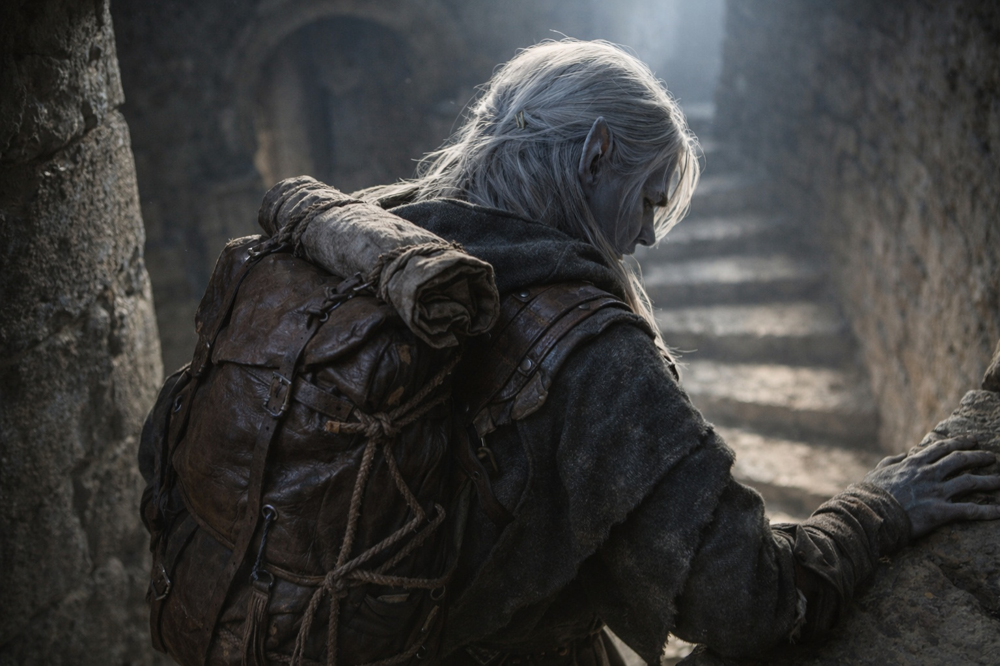

## Capítulo 31 | Parte 2 | Las Últimas Palabras

Szoravel esperaba al pie de la torre con un paquete que no había llevado el día anterior.

La mochila contenía odres, comida seca y un mapa enrollado. Szoravel la dejó entre ambos.

—Provisiones para diez días. Mapa verificado hasta Thornfield. Más allá de la frontera, ningún reconocimiento fiable.

Srietz esperaba junto a un muro bajo con Elion. Ninguno se acercó a Drusniel en la entrada de la torre. El aire frío le atravesó la camisa al agacharse para comprobar los odres.

—Las direcciones de las Tierras del Sueño —dijo Drusniel—. La cresta. La torre. ¿Cuánto puedo confiar en ellas?

—¿Cuánto se mantuvo consistente cuando la perspectiva cambió?

—Solo proyecté una vez.

—Entonces la ruta sigue sin verificar. Continúa las lecturas durante el viaje. La evaluación en la torre queda suspendida.

Drusniel miró hacia el camino. Algo había cambiado desde anoche.

Szoravel cruzó hasta su mesa de trabajo, una losa de piedra al aire libre que servía como su espacio secundario. Un morral de cuero descansaba sobre ella. Lo abrió y sacó la caja de cristales que había usado durante la evaluación, la que había contenido los cristales de diagnóstico. La colocó junto al paquete de suministros.

—Los tres que faltaban de tu recogida. Calibrados. —Szoravel tocó la caja—. Repite la disposición triangular. Tres lecturas independientes antes de tomar una ruta soñada.

—¿Y el costo?

—Registra el sangrado y la desorientación después de cada intento. Detente si dejas de percibir tu cuerpo.

—¿Eso era todo? —preguntó Drusniel—. ¿Recoger datos?

—Sí. Evaluación incompleta. Entrega las lecturas restantes.

Drusniel comprobó las provisiones y las repartió entre su mochila y la bolsa de Srietz.

—Una cosa más —dijo Szoravel.

Drusniel se detuvo.

—Nyxara envió una convocatoria esta mañana. Otra audiencia.

El aire en los pulmones de Drusniel se volvió frío. —¿Cuándo?

—Aquí. Dentro de dos horas. Salida inmediata. —Szoravel comprobó la cresta oriental.

—Correr.

—Al este. Sigue la ruta marcada. Cruza por Thornfield.

—Podría rastrearnos.

—El rastreo sigue siendo posible. Persecución más allá de la frontera: improbable. —Cerró el morral.

—Probablemente.

—Ninguna garantía. La convocatoria está confirmada.

Drusniel ajustó las correas de la mochila. Dos horas no dejaban margen para discutir.

—Gracias —dijo.

—Entrega las lecturas. Ninguna activación sin evaluación.

Szoravel volvió a la torre y dejó la puerta abierta.

Drusniel miró a Srietz y Elion junto al muro. Tenía dos horas, provisiones y un mapa que solo cubría parte de la ruta.

—Nos vamos. Ahora. Al este. Rápido.

Srietz se movió antes de que terminara. Elion se apartó del muro y lo siguió.

Corrieron.

---

**Fin del Capítulo 31.2 —>  31.3: [La Partida: El Camino Adelante](/la-partida-el-camino-adelante/)**
