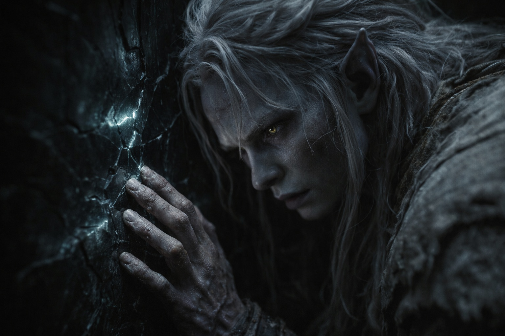

## Capítulo 17 | Parte 5

--- 

No podía dejarlo en paz.

En la decimosexta hora de espera, con Srietz durmiendo inquietamente y sin señales del regreso de Elion, Drusniel volvió a la pared.

Annariel le había hecho copiar aquel dialecto hasta que le dolían los dedos. Él lo había llamado inútil. Ahora estaba agachado en una cueva de obsidiana, descifrando palabras dañadas con las yemas de los dedos.

La primera inscripción continuaba al otro lado de una fractura en la piedra.

Fragmento: *«...el reino fue formado para contener aquello que no podía ser destruido...»*

Varias líneas habían sido arrancadas.

Más adelante, otro fragmento sobrevivía bajo una repisa de roca vítrea.

Fragmento: *«...la naturaleza dual puede cruzar donde la naturaleza simple no puede...»*

Eso era peor.

Si *naturaleza dual* significaba afinidad —y no tenía pruebas de que así fuera—, la línea podía tener algo que ver con la forma en que había cruzado a Wyrmreach. Si *contener* significaba prisión y no límite, el primer fragmento cambiaba la pregunta sobre la función de la barrera.

Dos *si*. Una pared dañada. Poca evidencia.

Siguió leyendo.

La mayor parte de lo que quedaba era inútil: nombres sin contexto, advertencias rotas, media oración. Más abajo, sin embargo, la escritura cambiaba. Las letras eran más toscas, grabadas deprisa en lugar de talladas.

<video controls playsInline preload="metadata" poster="./fragments-and-survival-notes_sora.jpg" width="100%">
	<source src="./ReadCave.mp4" type="video/mp4" />
	Your browser does not support the video tag.
</video>

Fragmento: *«...sigue a los pequeños por los caminos de fuego. Ellos conocen los senderos que se enfrían...»*

Fragmento: *«...cuando cambie el calor, muévete. La piedra respira y se cierra...»*

Fragmento: *«...donde la repisa negra se divide, no tomes el camino inferior...»*

Drusniel leyó esas líneas dos veces.

Las instrucciones prácticas eran más fáciles de creer. Alguien había recorrido aquellos caminos, encontrado peligros concretos y se había preocupado —o asustado— lo suficiente para dejar notas.

Volvió a los dos primeros fragmentos.

*Contener aquello que no podía ser destruido.*

*La naturaleza dual puede cruzar.*

Quería que encajaran. Precisamente por eso desconfiaba de que encajaran.

El Nulo descansaba bajo su camisa. Había cruzado con él. Que eso importara era otra pregunta.

Cuando regresó a la cámara principal, Srietz estaba despierto.

—Drusniel encontró más escritura.

—Sí.

—¿Útil?

—Parte.

—¿Peligrosa?

—Todavía no lo sé.

Srietz lo consideró. —Srietz prefiere peligros con medidas.

—Yo también.

—Entonces quizá cuenta cuánto lleva fuera Elion.

Drusniel miró hacia la boca de la cueva. Elion llevaba fuera dieciséis horas.

La pared podía esperar.

Se sentó junto al agua que habían recogido y volvió a contar el tiempo.

---

**Fin de Capítulo 17.5 —> 17.6: [La Segunda Elección: El Regreso](/la-segunda-eleccion-el-regreso/)**