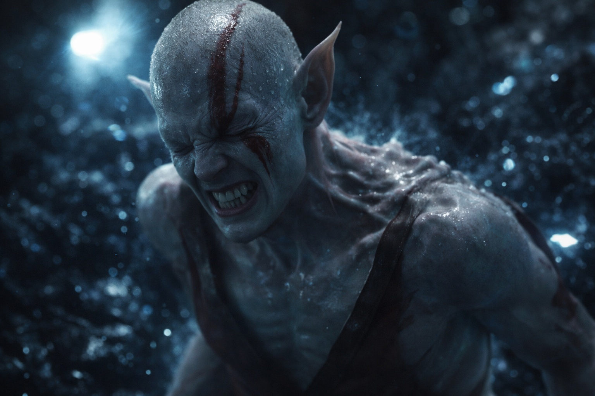
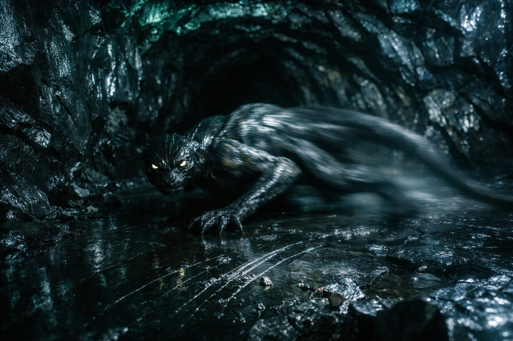

## Capítulo 17 | Parte 3

--- 

—Iré yo.

Elion lo dijo simplemente, como si estuviera ofreciendo ir a buscar agua en lugar de ofrecerse como voluntario para algo que podría matarlo.

Drusniel había explicado la situación cuidadosamente—conocimiento de un asentamiento goblin, dirección y distancia, terreno que tomaría días cruzar a pie.

—¿Fuente? —preguntó Srietz.

—Una en la que no confío.

—Mejor respuesta de la que Srietz esperaba. Peor respuesta de la que Srietz quería.

—No estás recuperado. —Drusniel estudió el rostro del cambiaformas, notando la palidez, el leve temblor en sus manos—. Los cambios durante nuestro escape—

—Fueron menores. Esto sería... diferente. —Elion miró hacia la entrada de la cueva, hacia la naturaleza más allá—. Pero soy el único que puede cubrir esa distancia a tiempo. Soy el más rápido. Y sé cómo moverme por Wyrmreach sin ser visto.

—Sabes a través de memorias que no son tuyas.

—Sigue siendo conocimiento. Sigue siendo útil. —Una pausa—. He hecho esto antes, Drusniel. Sé lo que cuesta. Elijo pagarlo.

Srietz se movió en su rincón.

—Srietz tiene otra pregunta. ¿Qué pasa si la transformación... no funciona?

—Siempre funciona. —La voz de Elion era plana—. La pregunta es en qué estado quedo después.

—¿Y qué estado es ese?

—¿Usualmente? Apenas funcional. A veces peor. —Encontró los ojos de Drusniel—. No te mentiré. Hay una posibilidad de que no regrese. No porque no lo intente, sino porque la transformación toma todo lo que tengo, y viajar después usa lo que queda. Si no queda suficiente...

—¿Entonces por qué arriesgarte?

—Porque si no lo hago, todos morimos lentamente en esta cueva. —Su boca se contrajo—. He sobrevivido peores probabilidades. Probablemente.

Drusniel miró hacia el pasaje que había explorado. No habría podido caminar otros cien pasos.

Elion podía morir durante el viaje. Si lo retenía allí, seguirían sin comida.

—¿Qué necesitas de nosotros?

—Espacio. No querrán estar cerca cuando cambie. —Elion se apartó de ellos y se situó en el centro de la cueva—. Y, Drusniel, no uses magia de aire mientras cambio. La magia de transformación reacciona mal a la presión externa.

—No lo haré.

Elion cerró los ojos. Por un momento, nada pasó. Se quedó parado en el tenue resplandor fosforescente, respirando lentamente, y Drusniel se preguntó si el cambiaformas había cambiado de opinión.

Luego comenzó.

El primer sonido fue un crujido—hueso, inconfundiblemente. La columna de Elion se dobló en una dirección en la que las columnas no deberían doblarse, vértebras deslizándose y reformándose bajo piel que ondulaba como agua sobre piedra.

Srietz retrocedió tambaleándose, manos presionadas contra sus orejas. —Srietz no sabía. Srietz retira lo que Srietz dijo sobre querer entender—

Más crujidos. Los brazos de Elion se estiraron, alargándose, articulaciones multiplicándose. Sus piernas se doblaron hacia atrás en ángulos que hicieron que el estómago de Drusniel diera un vuelco. El sonido de carne desgarrándose—no externa, sino interna, músculos reorganizándose, tendones readhiriéndose a nuevos puntos de anclaje.

Drusniel se obligó a mirar, aunque se sobresaltaba con cada crujido.

Ya no distinguía dónde acababan los hombros de Elion y empezaban los brazos.

El rostro de Elion fue lo peor. Los huesos cambiaron bajo piel que se estiró demasiado delgada, revelando formas que no tenían derecho a existir. Su mandíbula se alargó. Su cráneo se estrechó. Sus ojos migraron, solo ligeramente, a posiciones más adecuadas para lo que se estaba convirtiendo.

No gritó. Drusniel no sabía si eso lo hacía mejor o peor.

Le llegó el olor a sudor y después a carne quemada. Drusniel parpadeó con fuerza; la luz sobre Elion se volvió borrosa.

Perdió la cuenta de los minutos.

Cuando terminó, Elion ya no era Elion.

La criatura se sostenía sobre extremidades largas, con el cuerpo bajo y estrecho para correr. Drusniel no sabía qué era.

Lo miró con ojos que todavía contenían algo familiar. Luego se volvió y se fue, moviéndose hacia la oscuridad más rápido de lo que algo de ese tamaño debería moverse.

Ninguno habló.

—Srietz no dormirá esta noche —dijo el goblin eventualmente, voz temblando—. Srietz no dormirá por muchas noches.

Drusniel se sentó pesadamente. Sus piernas habían dejado de funcionar en algún momento durante la transformación, y no lo había notado hasta ahora.

—Yo tampoco.

Drusniel se acomodó contra la pared de obsidiana y comenzó a contar.

Una hora. Dos. El resplandor fosforescente pulsaba sobre ellos, marcando el tiempo en luz en lugar de sonido. Srietz no se movió de su esquina. Tampoco Drusniel.

Esperaron. Era lo único que quedaba por hacer.

---

**Fin de Capítulo 17.3 —> 17.4: [La Segunda Elección: La Espera](/la-segunda-eleccion-la-espera/)**
