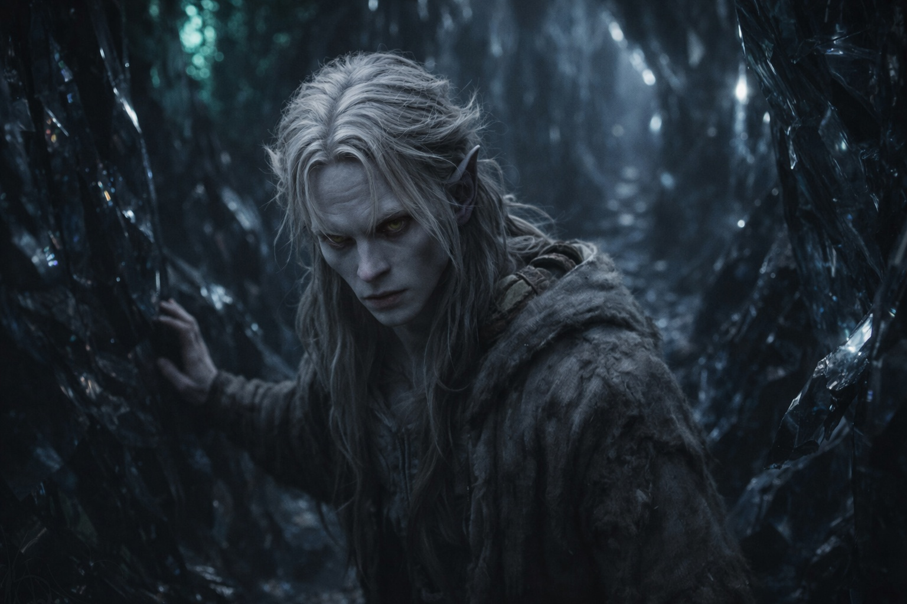
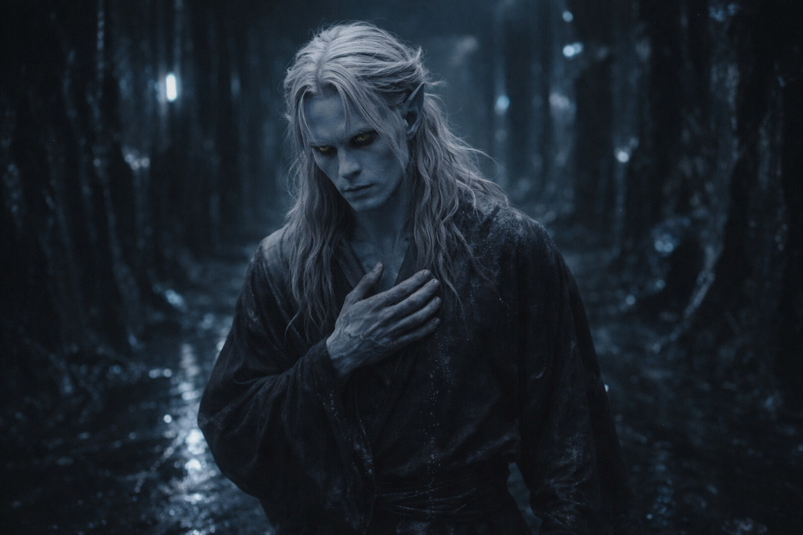

## Capítulo 17 | Parte 2

--- 

Drusniel encontró el pasaje más profundo mientras los otros dormían.

No conseguía dormir. El pasaje se bifurcaba más allá de la luz; tal vez uno de los ramales llevara a algún lugar donde encontrar comida. Dejó a los otros descansando.

Unos hongos pálidos iluminaban los recodos del pasaje de obsidiana. Contaba los pasos y tocaba la pared en cada cruce para recordar el camino de vuelta.

A los quinientos pasos le fallaron las piernas. Se agarró a la pared, pero no pudo apartarse de ella. La Voz habló.

Volvió la presión detrás de los ojos, la misma del Mar de las Pesadillas.

**Una ruta. Una deuda.**

Drusniel se sostuvo contra la pared. Las palabras no habían producido ningún sonido.

—No te llamé.

—¿Una salida?

La primera deuda seguía pendiente. Aún no sabía qué tendría que pagar.

—¿Qué te cobrarás?

No hubo respuesta. Los dedos le resbalaron sobre la pared lisa. Se dejó bajar hasta poder apoyar un pie contra el lado opuesto del pasaje.

Esperó. La oferta no cambió.

Drusniel había aceptado la primera deuda para salvarse a sí mismo.

—¿Adónde lleva?

Seguía sin haber respuesta. Elion y Srietz esperaban atrás, sin nada que comer. Él no había encontrado ninguna salida.

—Acepto.

Un dolor le atravesó la cabeza. Conocía el camino a un asentamiento goblin: los giros, la distancia y los tramos sin cobertura. Nunca lo había recorrido. Apoyó la frente en la pared, intentando retener la ruta pese al dolor.

Cuando el dolor cedió, estaba sentado en el suelo, jadeando.

**Dos deudas.**

La voz ya se había ido para cuando pudo responder.

Drusniel permaneció apoyado contra la pared hasta que pudo ponerse de pie.

Dos deudas.

Se puso de pie, se orientó hacia el camino de regreso y comenzó la caminata de quinientos pasos.

---

**Fin de Capítulo 17.2 —> 17.3: [La Segunda Elección: La Transformación](/la-segunda-eleccion-la-transformacion/)**
