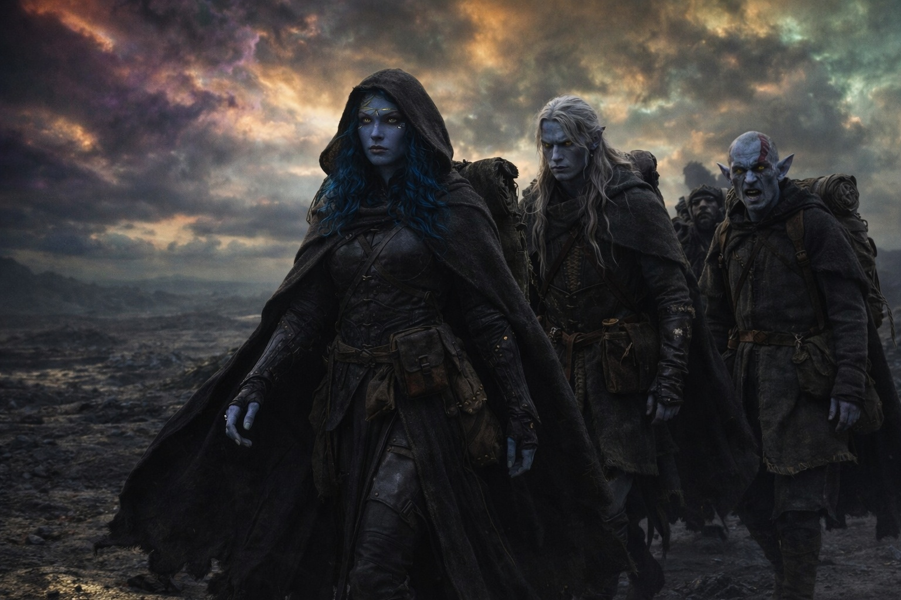
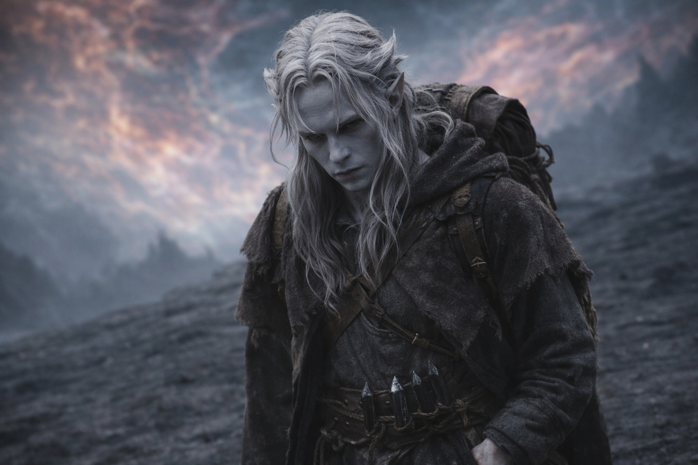
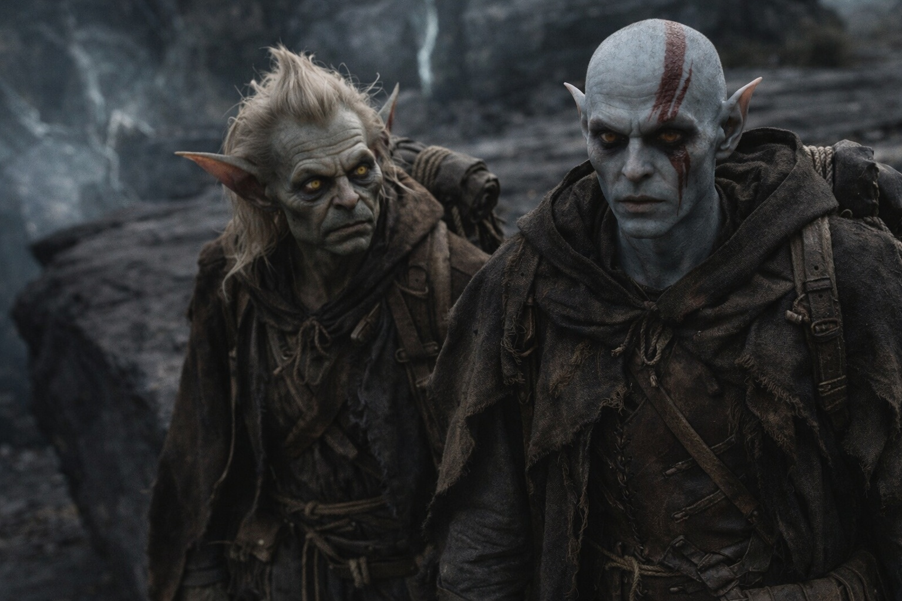
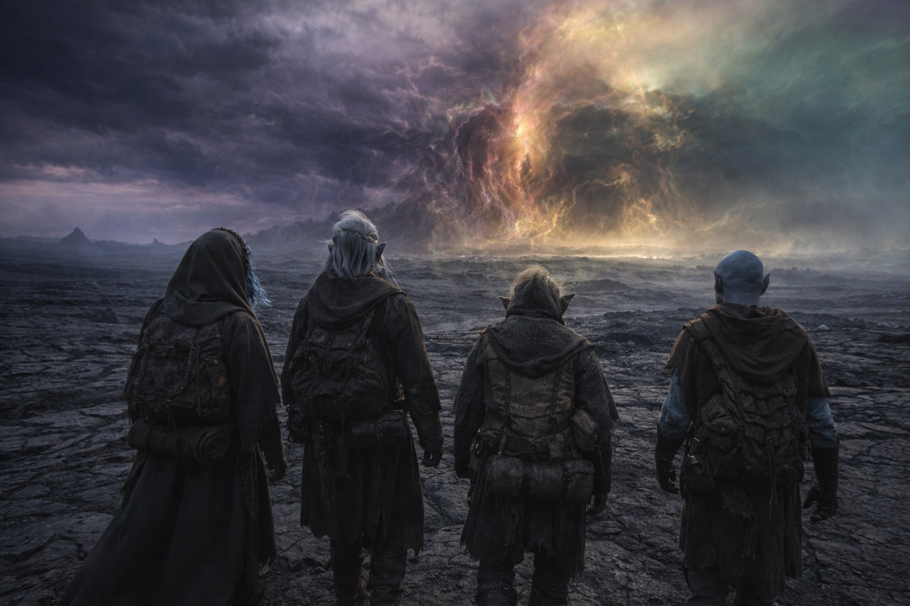

## Capítulo 37 | Parte 1 | El Inventario

---

Drusniel contó lo que sabía como solía contar fracturas.

Uno: la barrera se degrada. No es especulación. Lo había sentido a través del Nulo, una membrana que se adelgazaba en oleadas, cada oleada más amplia que la anterior, los intervalos entre ellas se acortaban a un ritmo que hacía que el plan de tres semanas de Szoravel pareciera un chiste contado por alguien que ya había abandonado la sala.

Dos: puede acoplarse a ella. Doble afinidad. Aire y agua. Los elementos vinculantes que los fragmentos describían, la coincidencia de frecuencia que el sistema requería, la compatibilidad que hacía de su cuerpo un conducto en lugar de un obstáculo. No había pedido la afinidad. No la había entrenado. Existía porque su genética y su entorno y la crueldad particular de su exilio habían producido un patrón de frecuencia que el mecanismo de la barrera reconocía como suficiente.

Suficiente. No elegido. La distinción era de Szoravel, y Szoravel estaba muerto.

Tres: el tiempo se colapsa. Presión externa desde el otro lado de la barrera, fuerzas sondeando la membrana, acelerando el ciclo de degradación. La ventana natural que debería haber estado a décadas de distancia estaba siendo forzada, y el forzamiento ocurría a un ritmo que hacía la predicción poco fiable y la demora suicida.

Cuatro: nadie más puede hacerlo. Los guardianes drow estaban al otro lado de la barrera, manteniendo el sistema desde dentro, pero el sistema requería una interfaz externa. Un portador. Un cuerpo en este lado de la membrana, cargando el componente del Nexus, poseyendo la afinidad correcta, lo bastante adaptado para sobrevivir al acercamiento. Ese cuerpo era el suyo. Había caminado a través de Wyrmreach y sobrevivido, y la supervivencia lo había rehecho en algo que el sistema podía usar.

Cinco: Nyxara es un dragón. Sus metas son metas de dragón. Quiere que la barrera se mantenga porque el fracaso de la barrera pone en peligro su conquista de Astalor, y la conquista requiere un reino estable que conquistar. Es genuina. Es paciente. Opera a una escala que hace su planificación irrelevante y sus creencias útiles.

Seis: Szoravel está muerto. El hombre que entendía la secuencia de calibración está bajo escombros que aún están calientes. Cualquier precisión que el acercamiento debía incluir, cualquier preparación que debía evitar que el momento incorrecto causara brecha en lugar de renovación, murió con él. El protocolo existe. El autor del protocolo no.

Siete: la Voz está en silencio. No ausente. Esperando. La presencia detrás de su esternón había desarrollado dientes desde el puesto de avanzada, una sensación de discurso inminente, de una garganta aclarándose antes de un anuncio. La Voz había sido paciente desde el cruce del volcán. La paciencia en la Voz no era ausencia. Era cálculo alcanzando su conclusión.

Contó estos hechos mientras caminaba hacia el este a través de un paisaje que se parecía menos a un paisaje con cada legua.

La cresta volcánica se había aplanado en una meseta de piedra oscura que parecía más antigua que el terreno que habían dejado atrás, antigua de una manera que hacía que el tiempo geológico pareciera reciente. El cielo seguía curvándose. Colores en los bordes ahora, no solo en el horizonte, púrpura y ámbar y un tono de verde que no correspondía a nada que hubiera visto en el mundo natural. El aire tenía peso. No peso de humedad. Densidad. Como si la atmósfera estuviera compensando la proximidad de la barrera volviéndose más de sí misma.

Nyxara caminaba adelante. Sin prisa. Segura. La diferencia era importante y Drusniel la catalogó junto con todo lo demás: se movía con la certeza de alguien que había hecho esto antes, que había caminado hacia umbrales y los había cruzado, que medía sus pasos en resultados en lugar de distancia. No miró atrás. No lo verificó. Estaba segura de que él llegaría a la conclusión correcta por sí mismo.

Tenía razón.

Srietz caminaba junto a Elion. No junto a Drusniel. La distancia era medida, deliberada, la geometría de alguien que se había reposicionado de aliado a testigo. Sus ojos amarillos estaban en la espalda de Drusniel con la atención de alguien que observa a un hombre caminar hacia un precipicio, sin saber si gritar o retroceder.

Elion apenas caminaba. Su cuerpo se movía, piernas y brazos en el patrón mecánico de alguien cuya locomoción había sido delegada al reflejo mientras la mente consciente se ocupaba de otra cosa. Sus ojos ámbar estaban fijos en un punto que no correspondía al paisaje físico. El Sabio estaba más fuerte que nunca. Lo que fuera que le estuviera diciendo, estaba llenando el espacio donde Elion solía vivir.

Drusniel los catalogó también. Dos compañeros. Uno que calculaba y otro que escuchaba. Ambos caminando con él hacia la barrera porque irse significaba admitir que el coste había sido desperdiciado o porque la cosa dentro de ellos no los dejaba detenerse. La cuenta era la misma.

Contó lo que sabía. Siete hechos. Siete piezas de un patrón que convergía como la piedra fracturada converge en una línea de falla: hacia un único punto donde la tensión superaba la estructura.

El punto era la barrera. La tensión era suya. La estructura era todo lo que él creía.

—Voy a hacerlo —dijo Drusniel al aire abierto.

Nadie respondió. Nadie necesitaba hacerlo.

El cielo se curvó. La meseta se extendía hacia el este. Su mano estaba en su bolsillo, pulgar contra dedos, uno, dos, tres, cuatro, y la barrera estaba a dos días de distancia y se acercaba con cada paso.

**Fin del Capítulo 37.1 —>  37.2: [Lo Que Él Cree: La Creencia](/lo-que-el-cree-la-creencia/)**
