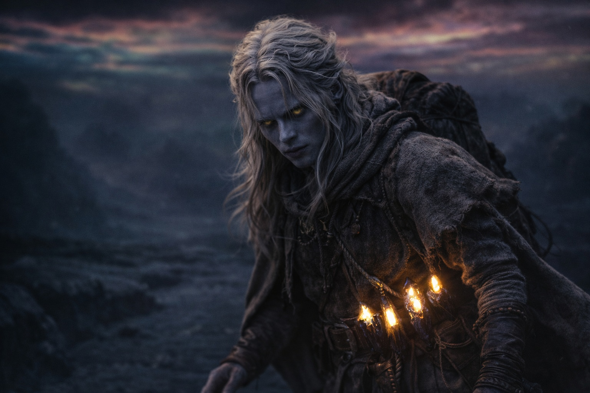
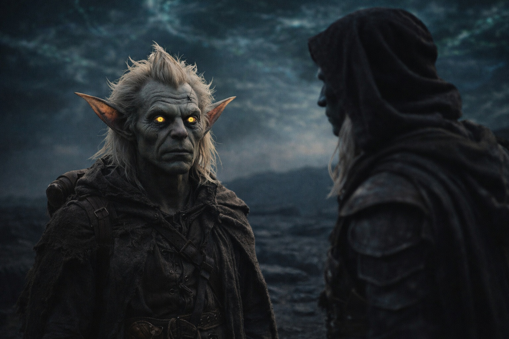
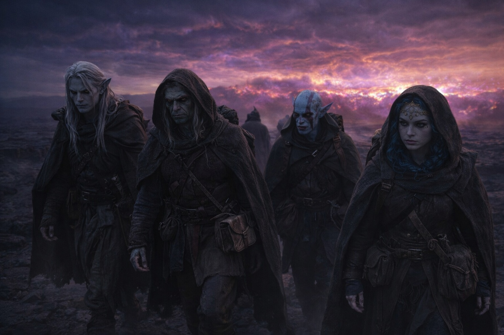

## Capítulo 37 | Parte 4 | El Regreso

---

Regresó del modo en que regresa una deuda antigua: no cuando la esperas, sino cuando el interés ha terminado de acumularse.

Caminaban. La noche no se había levantado tanto como cambiado de textura, la oscuridad se convertía en una clase distinta de oscuridad a medida que se acercaban a la barrera, el aire espesándose con una presión que el cuerpo adaptado de Drusniel procesaba y su mente no adaptada no podía. La distorsión del cielo estaba sobre ellos ahora, no solo en el horizonte. Colores sin nombre corrían en franjas por el firmamento, y la luz de ninguna fuente visible proyectaba sombras que apuntaban en direcciones que no correspondían a ningún ángulo que Drusniel pudiera identificar.

Nyxara caminaba adelante. Srietz caminaba detrás de Elion, manteniendo al cambiaformas entre él y la barrera. Elion se movía con la precisión mecánica de alguien cuyo cuerpo estaba en piloto automático mientras la conciencia manejaba algo urgente e interior.

Drusniel dio un paso. Su pie izquierdo golpeó la piedra oscura. Y la Voz habló.

No un susurro. No la intrusión gradual de apariciones anteriores, la lenta emergencia del silencio como una figura que se forma en la niebla. Esto era una mano cerrándose alrededor del interior de su cráneo. Total. Inmediata. Una presencia que llenaba cada rincón de su conciencia del modo en que el agua llena un vaso: exhaustivamente, sin huecos.

MI INVERSIÓN HA MADURADO.

Las palabras no eran fuertes. Eran completas. Ocupaban el espacio detrás de su esternón y el espacio detrás de sus ojos y el espacio donde los pensamientos se formaban y las decisiones vivían, y no dejaban lugar para nada más. La Voz no le estaba hablando a él. Estaba hablando dentro de él. Usando la arquitectura de su mente del modo en que un músico usa un instrumento: porque el instrumento fue construido exactamente para este propósito.

Drusniel dejó de caminar. Sus cristales gritaron en su cinturón. El Nulo en su mochila vibró contra su columna con una frecuencia que resonaba con la presencia de la Voz, el artefacto y la entidad armonizando de una manera que sugería que habían sido diseñados para ello.

—Tú. —La palabra salió de su boca antes de que eligiera pronunciarla. Su cuerpo respondiendo a la presencia con el reconocimiento reflejo de algo que identificaba a un nivel más profundo que el pensamiento.

MI CAMINO. MI TIEMPO. MI PORTADOR.

Posesivo. No airado. No complacido. No deliberado de ninguna manera que implicara emoción. La Voz hablaba del modo en que un reloj marca la hora: porque el mecanismo ha alcanzado el momento. Las palabras eran ejecución, no expresión.

—No caminé este camino por ti.

LO CAMINASTE. EL «POR» ES IRRELEVANTE.

Silencio. No de la Voz. Del mundo. Los sonidos de la meseta, el viento a través del aire distorsionado, los pasos de sus compañeros, todo retrocedió mientras la presencia de la Voz se expandía, llenando el silencio del modo en que llenaba su mente: totalmente, sin negociación.

CARGASTE LO QUE PEDÍ. —La Voz comenzó a contar. Drusniel sintió cada elemento caer como una piedra colocada en una balanza—. EL ARTEFACTO. MI COMPONENTE. LO LLEVASTE A TRAVÉS DEL MAR DE PESADILLAS. A TRAVÉS DE LOS TERRITORIOS. A TRAVÉS DE LA MONTAÑA. HASTA AQUÍ.

—Lo cargué porque la barrera...

LO CARGASTE. —La interrupción no fue brusca. Simplemente estaba presente, del modo en que una pared está presente cuando caminas contra ella—. PRONUNCIASTE EL NOMBRE QUE NECESITABA. EN EL VOLCÁN. LA PALABRA QUE ABRIÓ EL PASAJE. LA PRONUNCIASTE PORQUE NO TENÍAS OPCIÓN. LA DEUDA FUE COBRADA EN SU MOMENTO.

El volcán. El pasaje a través de la montaña. La palabra que había pronunciado cuando el calor se había vuelto letal y la única salida era la que la Voz proporcionaba. La había pronunciado porque la alternativa era la muerte, y la Voz había proporcionado el camino porque la Voz lo necesitaba vivo. No como misericordia. Como inversión.

CAMINASTE A TRAVÉS DEL FUEGO POR MÍ. EL MAR DE PESADILLAS. TU CUERPO SE ROMPIÓ Y TU CUERPO SE REHIZO Y LA RECONSTRUCCIÓN FUE OBRA MÍA. LOS CRISTALES EN TU CINTURÓN SON MI FIRMA. LA ADAPTACIÓN EN TU SANGRE ES MI COSTO, PREPAGADO.

Los cristales. La adaptación. Los cambios en su cuerpo que lo habían hecho compatible con Wyrmreach, que lo habían convertido de un drow que debería haber muerto en la primera semana a un conducto que podía interactuar con el mecanismo de la barrera. Había asumido que la adaptación era el efecto del reino sobre su biología. Natural. Pasiva. La Voz le estaba diciendo que fue deliberada. Invertida. Un costo que la Voz había pagado por adelantado contra un retorno que ahora se preparaba para cobrar.

—¿La adaptación fuiste tú?

TODO LO QUE TE MANTUVO VIVO FUI YO. LA SUPERVIVENCIA. LOS COMPAÑEROS. EL CAMINO.

—Srietz nos encontró. Elion eligió seguirnos.

TE ENCONTRARON PORQUE ERAS LOCALIZABLE. SIGUIERON PORQUE EL CAMINO QUE CONSTRUÍ ERA LO SUFICIENTEMENTE ANCHO PARA TRES. EL LIBRO DE CUENTAS LOS INCLUYE. SU SUPERVIVENCIA ES MI COSTO. SU PRESENCIA ES TU DEUDA.

Drusniel sintió las deudas asentarse en su lugar. No metáfora. Físico. Cada obligación aterrizó en su pecho como un peso colgado de un gancho, tirando hacia abajo, hacia la barrera, hacia el mecanismo, hacia el acto que la Voz se preparaba para reclamar. La supervivencia. Los compañeros. El pasaje a través del volcán. El artefacto. Los cristales. La adaptación. Cada una, una línea en un libro de cuentas que se había estado acumulando desde el momento en que la Voz habló por primera vez, y el libro estaba lleno, y la Voz lo estaba leyendo en voz alta porque el tiempo de la lectura había llegado.

—La montaña no tenía voz —dijo Drusniel. No sabía por qué lo dijo. Las palabras venían de un lugar que discutía por discutir, probando las paredes de una habitación sin salidas.

TODO TIENE UNA VOZ. LA MAYORÍA SON DEMASIADO PEQUEÑAS PARA ESCUCHAR.

La Voz se retiró. No desaparecida. No en retirada. Contrayéndose. Replegándose desde los bordes de su conciencia hacia el centro, hacia el espacio detrás de su esternón donde vivía, donde las deudas vivían, donde la adaptación cristalina zumbaba su confirmación constante de todo lo que la Voz había reclamado. La retirada no fue misericordia. Fue un escribano cerrando el libro de cuentas tras la última entrada.

El mundo regresó. Sonido. Viento. Pasos. El cielo distorsionado y la piedra oscura y la barrera pulsando en el horizonte.

Srietz lo miraba fijamente. El goblin se había detenido diez pasos atrás y observaba a Drusniel con la quietud particular de alguien que acababa de presenciar una conversación que no podía escuchar y comprendía su forma por el modo en que había cambiado a la persona que la sostenía.

—Tu cara —dijo Srietz.

Drusniel se tocó la cara. Nada físico. Sin sangre, sin marca, sin señal. Pero los ojos amarillos de Srietz decían otra cosa. Los ojos amarillos de Srietz decían que la conversación había dejado marcas que no eran visibles y no se habían ido.

—¿Cuándo? —le preguntó Drusniel a la oscuridad.

La Voz respondió desde detrás de su esternón. No desaparecida. Nunca desaparecida. Solo esperando en el espacio donde todas las deudas esperan hasta que llega el momento del pago.

CUANDO EL CAMINO SE ABRA. LO SABRÁS PORQUE TUS PIES SE MOVERÁN.

—¿Y si me niego?

Silencio. La clase de silencio que es una respuesta. La Voz no necesitaba su permiso. Nunca había necesitado su permiso. Solo había necesitado sus creencias, y él las había entregado libremente, en una cueva, en una montaña, en una conversación con una dragona que sonreía como si ya lo supiera.

Drusniel caminó. La barrera pulsó. Las deudas se asentaron en su pecho como piedras en un pozo, una sobre otra, cada una añadiendo peso, cada una tirando hacia abajo, cada una nombrada y contada e irreversible.

La Voz esperó. La barrera esperó. La mañana llegó del color de algo que no era amanecer.

**Fin del Capítulo 37  —> 38.1: [Teníamos Razón](/teniamos-razon-el-analisis/)**
