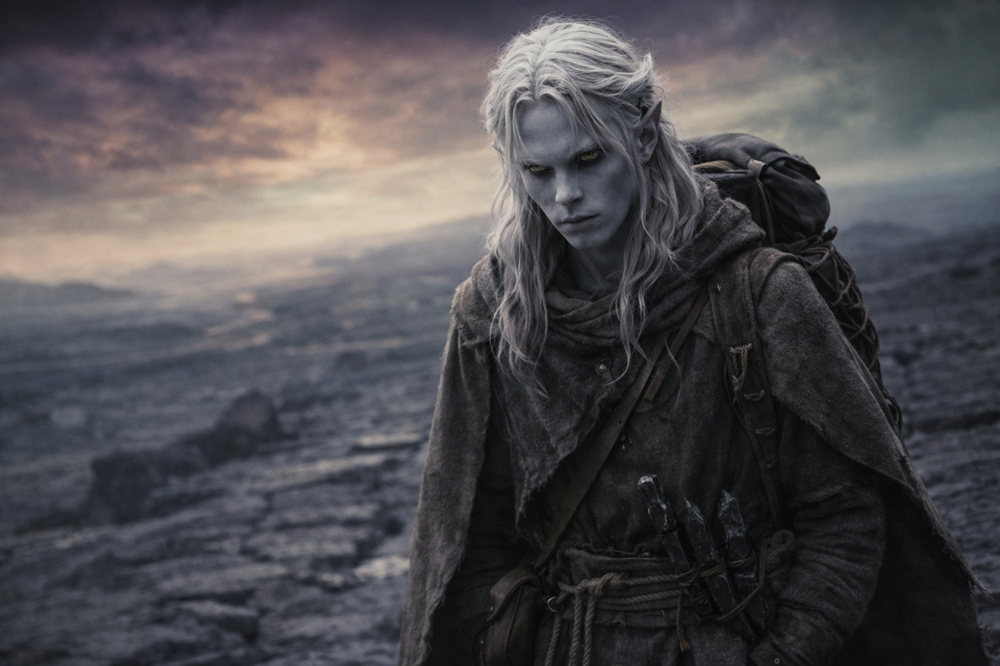
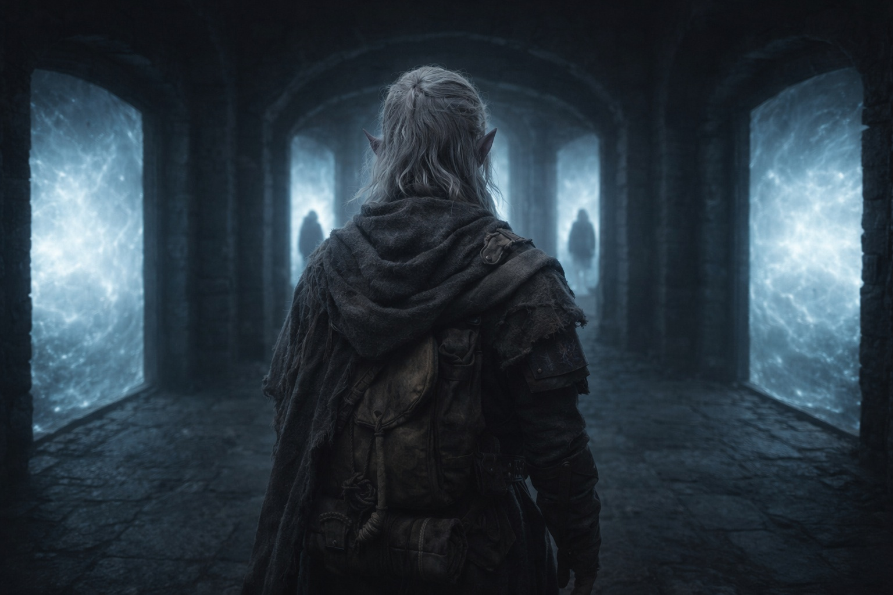
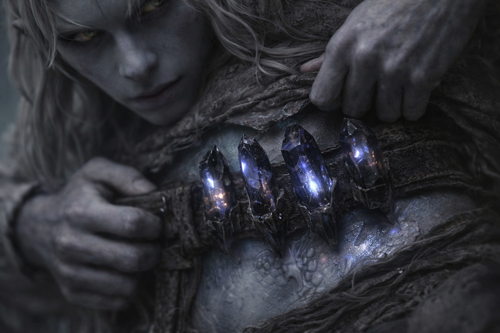
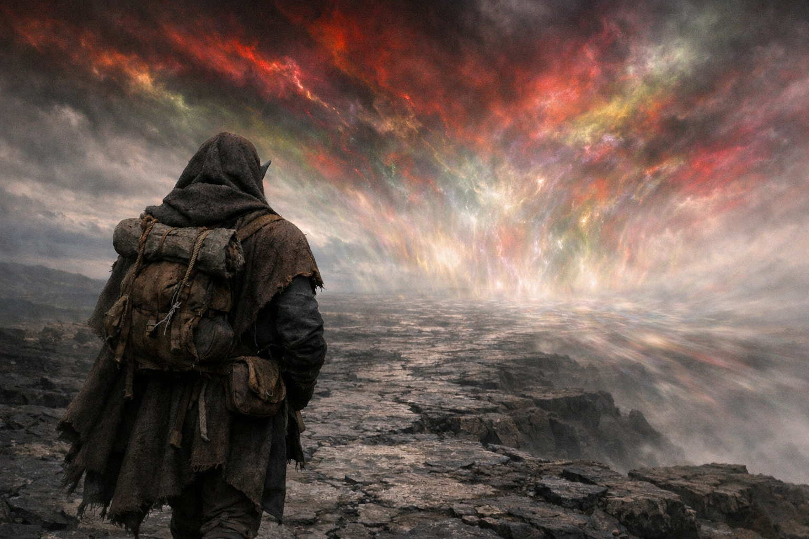

## Capítulo 37 | Parte 2 | La Creencia

---

Probó las puertas.

No puertas literales. Las puertas en su mente. Las salidas. Los lugares donde un pensamiento podía girar en otra dirección, donde un argumento podía llegar a una conclusión diferente, donde la lógica podía doblarse y dejarlo pasar a una habitación que no contuviera la barrera.

La barrera debe ser mantenida.

Lo había creído desde la infancia. Antes de las pruebas. Antes del exilio. Antes de Zaelar y el Nulo y la adaptación cristalina y Nyxara y el dragón. Los drow existían para custodiar la barrera. La barrera existía para contener lo que yacía más allá de ella. La custodia se ganaba mediante el sacrificio, no se otorgaba por derecho, y cada generación que la sostenía añadía a la deuda que la siguiente generación heredaba. Esto no era ideología. Esto era arquitectura. Los drow habían construido su civilización sobre el cimiento de la importancia de la barrera, y el cimiento era real, y la barrera era real, y las cosas que contenía eran lo suficientemente reales como para que Drusniel hubiera caminado por su territorio durante meses y sobrevivido solo porque su cuerpo se había adaptado a la hostilidad.

La barrera debe ser mantenida. Por lo tanto, debe actuar. Puerta cerrada.

Los drow ganaban su deber mediante el sacrificio.

Él había ganado el suyo. No mediante las pruebas, que habían sido saboteadas, ni mediante el entrenamiento, que había sido manipulado. Mediante el exilio. Mediante la caminata. Mediante los meses de supervivencia en un reino que mataba la mayoría de las cosas que entraban en él y a él lo había rehecho, convirtiendo su cuerpo en algo que el sistema de la barrera podía usar. Había pagado por este deber con adaptación y aislamiento y la lenta erosión de la persona que había sido antes de Wyrmreach. El sacrificio ya estaba hecho. El coste ya estaba pagado. Rechazar el deber ahora sería declarar que el coste carecía de sentido, y el coste no carecía de sentido, porque el coste era él.

Debe sacrificarse. Puerta cerrada.

Lo que sea que esté sellado detrás de la barrera es peor que los dragones.

Lo había visto. Lo había sentido. El paisaje de Wyrmreach era la evidencia: un reino tan hostil que los dragones lo usaban como base de operaciones, que una entidad en un volcán existía detrás de su propia barrera dentro de otra barrera, que el aire sabía a metal y calor viejo y al aliento de algo vivo de maneras en que los paisajes no deberían estar vivos. La barrera contenía esto. La barrera era la membrana entre esta anomalía y el mundo al otro lado, y si la membrana fallaba, la anomalía no permanecería contenida.

Debe prevenir la brecha. Puerta cerrada. Excepto que esta puerta tenía una segunda habitación detrás, y la segunda habitación era peor.

Aproximarse en el momento equivocado equivale a brecha. Szoravel lo había explicado. El mecanismo funcionaba de la misma manera independientemente del momento. Momento correcto: renovación. Momento equivocado: la barrera se abre en lugar de cerrarse. El mecanismo era la llave, y la llave giraba en la misma dirección sin importar hacia qué lado debiera abrirse la puerta. Si Drusniel se aproximaba ahora, en la línea temporal acelerada de Nyxara, sin calibración y sin preparación y sin Szoravel para guiar la secuencia, la renovación podría convertirse en brecha. El sistema podría desgarrar aquello mismo que debía sellar.

Lo sabía. Entendía el riesgo. La comprensión era completa y no ofrecía salida, porque la alternativa también era catástrofe: si se retrasaba, la barrera se degradaba naturalmente. La ventana se cerraba. La membrana se adelgazaba más allá del punto de renovación y simplemente fallaba, lenta y exhaustivamente, y todo lo que contenía se filtraba.

Actuar ahora: riesgo de brecha. Actuar después: fracaso garantizado. No actuar nunca: fracaso garantizado, más lento.

Cada camino llevaba a la barrera. Cada camino llevaba al riesgo. La única variable era la magnitud y el momento de la catástrofe, y el momento ya no estaba bajo su control porque un dragón había decidido que su línea temporal importaba más que su precisión, y ella operaba a una escala donde su precisión era un detalle.

No podía resistir mediante la creencia porque sus creencias concordaban con la acción.

La barrera es sagrada. Ve a mantenerla.
El deber se gana mediante el sacrificio. Has sacrificado. Cobra.
Las cosas selladas son peores que las cosas conocidas. Actúa antes de que escapen.

Cada puerta en su mente se abría a la misma habitación. Deber. Sacrificio. Custodia. Las palabras sobre las cuales su pueblo había construido su legado. Las palabras que le había dicho a Nyxara en un claro de montaña como si fueran plegarias. Eran plegarias. Y la respuesta era: ve a la barrera. Ahora.

Podía resistir mediante el momento. Podía argumentar a favor de la demora, de la cautela, de la preparación en la que Szoravel había insistido. Pero el momento se había ido. Szoravel estaba muerto. Nyxara no esperaría. La degradación no esperaría. Los sondeos desde el otro lado de la barrera no esperarían. Cada reloj externo se agotaba simultáneamente, y el único reloj que controlaba eran sus propios pasos, y sus pasos apuntaban al este.

Lo peor no era que lo hubieran manipulado.

Lo peor era que nadie había necesitado hacerlo.

Nyxara no había plantado las creencias. Szoravel no había fabricado el deber. La Voz no había creado el compromiso. Drusniel había llegado a cada conclusión de forma independiente, a lo largo de meses y leguas, a través de elecciones que no le pertenecían a nadie más que a él mismo. La barrera importaba porque importaba. El deber era real porque el deber era real. El sacrificio era suyo porque él lo había hecho suyo.

Había construido la jaula él mismo, ladrillo tras cuidadoso ladrillo, con principios que aún creía verdaderos. Y la jaula tenía una sola puerta, y la puerta se abría hacia el este, y al otro lado de la puerta estaba la barrera, y la barrera lo esperaba con la paciencia de un sistema que había esperado durante siglos y esperaría siglos más o simplemente fallaría, y de cualquier manera la espera había terminado y el mecanismo caminaba hacia ella sobre dos piernas porque las piernas pertenecían a alguien cuyas creencias no dejaban lugar para la retirada.

Drusniel caminó hacia el este con la mano en el bolsillo y el pulgar contando uno, dos, tres, cuatro, y el cielo doblándose sobre él, y cada creencia que sostenía confirmando cada paso que daba, y ninguna salida en ningún lugar.

**Fin del Capítulo 37.2 —>  37.3: [Lo Que Él Cree: Los Compañeros](/lo-que-el-cree-los-companeros/)**
