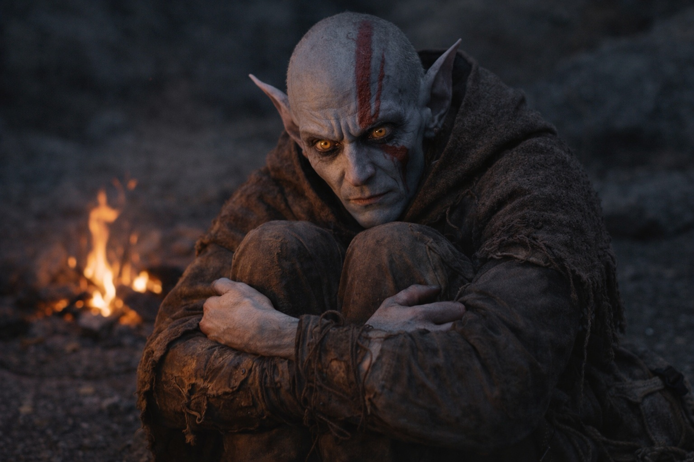

# Capítulo 37.3 | Lo Que Él Cree: Los Compañeros

Encendieron una hoguera porque eso era lo que se hacía cuando dejabas de caminar y llegaba la oscuridad.

Nyxara no se sentó con ellos. Permanecía de pie en el borde de la luz de la hoguera, de cara al este, de cara a la distorsión de la barrera donde el cielo había dejado de fingir ser cielo y se había convertido en otra cosa, un campo de color que pulsaba y se curvaba e irradiaba una presión que Drusniel podía sentir en los dientes. Se mantenía como siempre se mantenía: donde hubiera espacio. Solo que ahora él entendía por qué, y la comprensión hacía que el hábito pareciera un monumento en lugar de una rareza.

Srietz encendió la hoguera. Sus manos se movían con la competencia de alguien que había encendido hogueras en entornos hostiles durante años, encontrando combustible donde no debería existir, arrancando llama de materiales que deberían haber sido demasiado húmedos o demasiado muertos o demasiado erróneos para arder. No habló mientras trabajaba. El silencio era más ruidoso que su parloteo habitual.

Elion se sentó en el suelo cerca del fuego con las rodillas levantadas y los brazos envueltos alrededor de ellas y sus ojos ámbar fijos en un punto a unos quince centímetros de su cara. Estaba temblando. No de frío. Por el Sabio. Lo que fuera que la entidad dentro de él estuviera comunicando, había ido aumentando en volumen durante días, y la proximidad de la barrera lo estaba empeorando. El rostro de Elion se había ahuecado, los pómulos más afilados, los ojos más brillantes, como si el Sabio lo estuviera quemando desde dentro.

Drusniel se sentó al otro lado del fuego frente a Srietz y les contó lo que sabía.

No todo. No la Voz. No las deudas. No la presencia detrás del esternón que se preparaba para hablar en un idioma hecho de obligación. Les contó la mecánica. La barrera. El mecanismo de renovación. Su papel como conducto. El problema del momento.

—La barrera se degrada —dijo. La hoguera crepitó y lanzó chispas hacia la oscuridad del color equivocado—. La ventana de renovación se está abriendo. Si una interfaz compatible se acerca durante la ventana y activa el mecanismo, la barrera se sella. Si el momento es incorrecto, el mecanismo abre la barrera en lugar de cerrarla.

—Y tú eres la interfaz —dijo Srietz. Su voz era plana. No hostil. Agotada. La planitud de alguien que había estado haciendo cálculos durante días y seguía llegando al mismo déficit.

—Soy la interfaz.

—En su momento. No en el tuyo.

—No hay un mío. El momento de Szoravel murió con Szoravel. La degradación se está acelerando. Si espero al momento correcto, puede que no haya un momento correcto. La ventana podría cerrarse antes de que esté listo, y entonces la barrera falla de forma natural.

—¿Y si vas ahora?

—Riesgo. La calibración no está completa. El protocolo de aproximación no está terminado. Opero con información parcial y sin guía.

—Entonces el momento es incorrecto.

—El momento es incorrecto actúe o no. La cuestión es qué tipo de incorrecto.

Srietz miró fijamente al fuego. Sus ojos amarillos reflejaban la llama en dos discos planos. Sus dedos hábiles estaban quietos, lo cual era notable. Los dedos de Srietz siempre estaban haciendo algo: mezclando, probando, midiendo, ajustando. Dedos quietos en Srietz significaba pensamientos quietos, lo que significaba que los pensamientos habían terminado y la respuesta era mala.

—Srietz no te ayudará a destruir la barrera —dijo.

—No la estoy destruyendo. La estoy manteniendo.

—En su momento. En sus términos. Sin preparación y sin calibración y sin protocolo y sin Szoravel. —Hizo una pausa—. Ella mató a la única persona que podría haber hecho que esto funcionara correctamente. Lo mató y luego te pidió que hicieras lo que él debía guiar. Eso no es mantenimiento. Eso es improvisación a velocidad de dragón.

Las palabras eran precisas. También eran correctas. Drusniel las escuchó y las catalogó junto a todo lo demás: el riesgo, el momento, las creencias, la jaula que había construido con principios que aún sostenía. Srietz tenía razón. Nyxara había colapsado la línea temporal y destruido al guía y marcado el ritmo y estaba conduciendo a Drusniel hacia la barrera a una velocidad que servía a la planificación del dragón, no a la precisión mortal.

—Entonces esperamos al momento correcto —dijo Srietz.

—Nyxara no esperará.

—Entonces nos vamos. Caminamos al sur. Encontramos otro camino. Srietz conoce rutas. Srietz siempre conoce rutas.

—La degradación tampoco esperará. Si me voy, la barrera falla. Más lento. Pero falla.

Srietz guardó silencio. La hoguera crepitó. La silueta de Nyxara permanecía en el borde del campamento, de cara al este, paciente.

—Algo viene. —La voz de Elion. Fina. Sus ojos no se habían movido del punto a quince centímetros de su cara, pero su boca formaba palabras que venían de algún lugar más profundo que su propio vocabulario—. Puedo sentirlo. El Sabio está... no se detiene. Algo al otro lado de la barrera. Algo que la quiere abierta. No el dragón. Algo más antiguo. Ha estado empujando contra la membrana durante días. Semanas. El sondeo que mencionó Nyxara. No está tanteando. Está llamando.

La hoguera crepitó. Las chispas subieron. La oscuridad del color equivocado las absorbió.

—Lo del volcán —dijo Srietz en voz baja.

Drusniel miró al goblin. Los ojos amarillos de Srietz estaban sobre él, abiertos y brillantes y calculando. El volcán. La entidad que habían atravesado de camino al puesto de avanzada, la presencia en la montaña a la que la Voz había nombrado como algo que quería la barrera abierta por razones incompatibles con la supervivencia de nadie.

—Si haces esto en el momento equivocado —dijo Srietz—, la barrera se abre. Y lo que sea que esté dentro...

—Lo sé.

—Lo del volcán. Lo que quiere salir.

—Lo sé.

—Y vas a hacerlo de todos modos.

La pregunta no era acusación. Era aritmética. La voz de Srietz tenía el tono particular de alguien que suma una columna de números y descubre que el total es negativo sin importar cómo se ordenen los elementos individuales.

—¿Qué harías tú? —preguntó Drusniel.

Srietz guardó silencio durante largo rato. El fuego se asentó. Elion temblaba. Nyxara permanecía en el borde de la luz, de cara al este, y no miró atrás.

Entonces lo hizo.

Cruzó el campamento sin prisa, sin actuación. Se agachó junto al fuego, lo bastante cerca para que Drusniel pudiera ver su rostro a la luz, y durante un momento el cálculo había desaparecido y lo que quedaba era algo más antiguo: fatiga. No física. El cansancio de alguien que ha cargado peso durante tanto tiempo que el cargar se ha vuelto invisible, incluso para ella misma. Dejó un frasco junto a su rodilla. Su mano se posó en su hombro. Breve. La presión deliberada, medida, del modo en que tocas algo con lo que pretendes ser cuidadoso.

Se levantó. Volvió al borde. Se giró hacia el este de nuevo. No dijo nada.

Una persona que colecciona cosas no toca las cosas que colecciona con ese peso particular. Drusniel archivó el pensamiento junto al del valle, en el lugar donde iban las cosas que no encajaban. Dos ahora. Dos momentos en los que el patrón se rompió y algo debajo se dejó ver.

—Srietz correría —dijo Srietz finalmente—. Pero Srietz es más listo que tú.

No se fue.

La hoguera ardió. La oscuridad presionaba. Srietz le echó otro trozo de la madera muerta que no debería haber ardido pero ardía, y la llama subió, y ninguno de los dos habló de la mañana. No les hacía falta. La mañana venía como venía la barrera, como venía la Voz, como vienen todas las cosas aplazadas: según su propio horario, indiferentes a si la gente que las esperaba estaba lista.

El temblor de Elion cesó. Sus ojos se reenfocaron. Miró a Drusniel al otro lado del fuego con una expresión que era en parte suya y en parte del Sabio y enteramente de miedo.

—Aquí es más fuerte —dijo—. El Sabio. Es más fuerte cerca de la barrera. Lo que sea que sabe sobre lo que viene, lo está gritando. No puedo distinguir las palabras. Solo el volumen. —Hizo una pausa—. Y la dirección. Señala en la misma dirección que todo lo demás.

El este. La barrera. El mecanismo. El conducto. El momento que era incorrecto y la acción que era necesaria y la catástrofe que podía seguir en cualquier caso.

Sabían hacia qué caminaba. Caminaron con él de todos modos. Srietz porque irse significaba admitir que el coste había sido en vano. Elion porque el Sabio no le dejaba detenerse. Drusniel porque detenerse nunca había sido una opción.

La hoguera ardió hasta que dejó de arder, y entonces fue oscuridad, y entonces fue casi de mañana, y ninguno de ellos había dormido, y la distorsión de la barrera pulsaba en el horizonte como un latido que no pertenecía a nada vivo.

**Fin del subcapítulo — continúa en el Capítulo 37.4**
