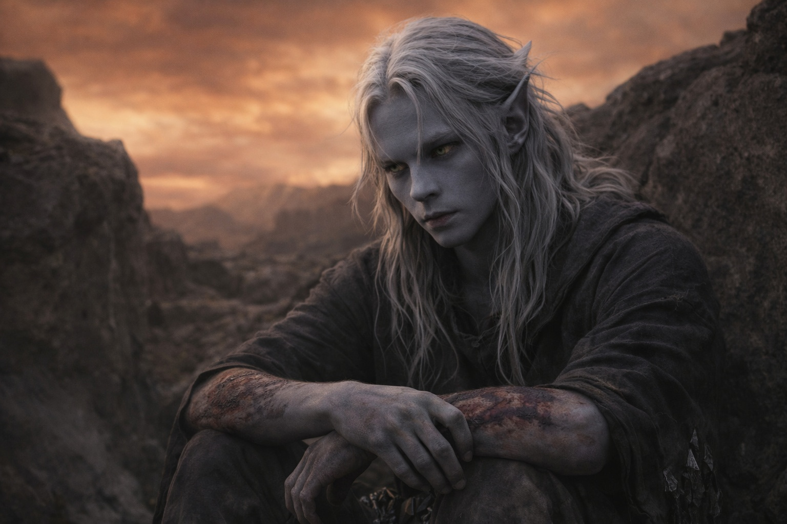
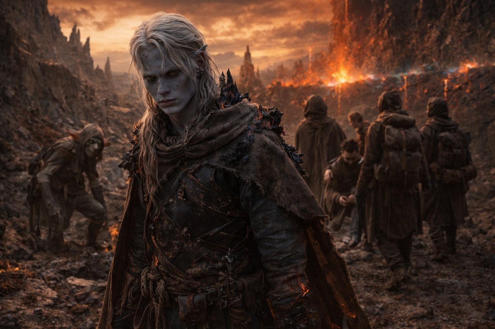
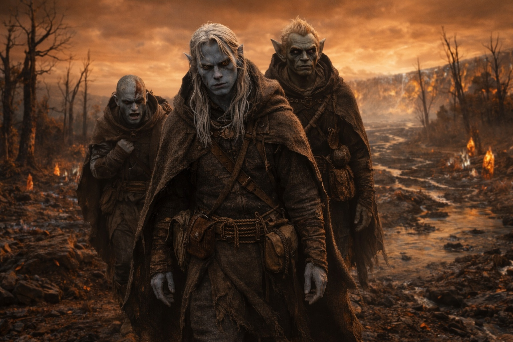

## Capítulo 46 | Parte 3 | El Estado Terminal

---

Drusniel se sentó en la depresión con Srietz y Elion mientras el cielo ámbar-óxido mantenía su posición sobre ellos y la barrera filtraba algo sin nombre en la atmósfera detrás de ellos y su mente hacía lo que siempre hacía.

Catalogó. Reconstruyó. Tomó los escombros de todo lo que había pasado y los organizó en el orden que los escombros exigían, no el orden que él quería, porque su mente nunca le había dado lo que quería y siempre le había dado lo que era preciso y las dos cosas nunca habían sido lo mismo.

La barrera estaba comprometida. No destruida. Dañada de una forma que era estructural, permanente, y activamente filtrando. La presencia de la entidad era atmosférica ahora, una contaminación distribuida a través del campo mágico mismo, no una criatura que pudiera ser combatida o contenida sino una condición que se extendería de la forma en que el clima se extiende, a través de cada sistema que tocara el aire. La contaminación alcanzaría las ciudades Drow. Alcanzaría los asentamientos humanos. Cambiaría el campo mágico al que cada encantamiento, cada protección, cada infraestructura estaba calibrado, y los cambios se propagarían en cascada a través de cada sistema que dependiera de la estabilidad.

El legado Drow que había luchado por proteger era lo que había roto.

Entendía eso. Su mente se lo presentó con claridad, sin comentarios, de la forma en que su mente presentaba todos los hechos: aquí está la cosa, y aquí está lo que la cosa significa, y aquí está lo que hiciste. Los mil años de custodia Drow, el sacrificio y la vigilancia y el precio pagado por cada generación para mantener la barrera, todo deshecho por un solo acto realizado por un Drow que creía estar cumpliendo con su deber. El sistema que su pueblo había construido y mantenido y por el que había muerto, roto por las manos que estaba diseñado para proteger.

Se sentó con eso. No había alternativa a sentarse con ello. No era el tipo de verdad con la que se podía discutir o matizar o colocar en un contexto que la hiciera más pequeña. Tenía el tamaño que tenía. Su mente la sostuvo de la forma en que sus manos quemadas sostenían la cantimplora: con dificultad, con dolor, porque la alternativa era dejarla caer, y él no dejaba caer las cosas.

Y entonces, en los escombros, debajo de la barrera y la entidad y la contaminación y el mundo, su mente encontró algo más pequeño. Más simple. Más difícil de mirar.

Zaelar.

El pensamiento llegó de la forma en que llegan las verdades obvias: no como una revelación sino como un asentamiento, de la forma en que el sedimento se asienta en el fondo del agua que ha dejado de ser perturbada. Había estado ahí todo el tiempo. Había estado ahí desde Umbra'kor, desde el exilio, desde el día en que Zaelar se había ido con Szoravel y Drusniel se había quedado atrás y sintió la ausencia como una herida que no se cerraba.

Zaelar fue exiliado por una razón.

No política. No celos. No el miedo a la brillantez que Drusniel se había contado durante años, la narrativa que había construido para explicar por qué los ancianos habían expulsado a la mente más dotada de Umbra'kor. Los ancianos no habían tenido miedo de la brillantez de Zaelar. Habían tenido miedo de Zaelar. Porque Zaelar era exactamente lo que aparentaba ser: un hombre que quería poder para sí mismo, a cualquier costo, con Szoravel como su socia en la misma ambición. Todos en Umbra'kor podían verlo. Shyntara había intentado advertirle. Los ancianos que votaron por el exilio habían estado protegiéndose de exactamente lo que sucedió.

Y Drusniel, el hombre que se enorgullecía de ver patrones, de catalogar, de nunca ser engañado, había sido el idiota.

No porque Zaelar fuera un genio de la manipulación. Esa era la historia que Drusniel habría preferido, la versión donde el engaño era lo suficientemente sofisticado como para justificar haber caído en él. La verdad era más pequeña y más fea: Zaelar había ofrecido conocimiento, lo había enmarcado como independencia, y Drusniel se había convencido a sí mismo porque Drusniel necesitaba un mentor tan desesperadamente que vio uno donde todos los demás veían una amenaza. Su hambre de poder construido por sí mismo, su determinación de forjarse a partir de su propio trabajo en vez de lo que Umbra'kor le diera, era la vulnerabilidad exacta que Zaelar había utilizado. No explotado. Utilizado. De la forma en que una llave utiliza una cerradura. La forma ya estaba ahí.

La punzada de eso era peor que la barrera. La barrera era sistémica. Una persona podía esconderse dentro de una catástrofe sistémica de la forma en que una persona se esconde dentro de una inundación: la escala de la cosa oscurecía la responsabilidad individual, extendía la culpa a través de mecanismos y sistemas y tiempos que ninguna persona individual controlaba. Pero Zaelar era personal. Zaelar era estupidez. Zaelar era un chico que necesitaba un padre y encontró un estafador y se convenció de que el estafador era un maestro y mantuvo esa convicción frente a cada advertencia porque la convicción era estructural y removerla habría significado reconstruir los cimientos.

No había reconstruido nada. Había cargado la convicción hasta Wyrmreach y a través de la barrera y hasta el acto, y en algún lugar en la arquitectura de las creencias que lo habían impulsado, la enseñanza de Zaelar seguía ahí, las piedras colocadas por un hombre que había sido exiliado por una razón que todos podían ver excepto el chico que lo adoraba.

Srietz estaba observando. Drusniel podía sentirlo de la forma en que siempre podía sentir la atención de Srietz, la mirada precisa y calculadora que no pasaba nada por alto. Srietz no habló. Porque Srietz siempre había sabido sobre Zaelar. Srietz había calculado la probabilidad de que Zaelar fuera lo que los ancianos decían que era y la probabilidad había sido alta y Srietz no había dicho nada porque Srietz entendía que algunos cálculos necesitaban ser realizados por la persona cuya base dependía del resultado.

Y entonces, junto a la fealdad, la otra cosa. La cosa que no era fea pero era peor.

Nyxara.

Ella era real. Todo era real. Las conversaciones al borde del campamento mientras Srietz calculaba y Elion dormía. La paciencia que le había mostrado, la completitud con que escuchaba, la forma en que entendía el deber y el costo y el peso de cargar conocimiento que desearías no tener. Era la mejor aliada que había tenido jamás. Lo entendía de una forma en que Annariel había intentado y Shyntara se había negado, y el entendimiento era genuino, y las conversaciones eran genuinas, y el respeto era genuino, y si las cosas hubieran sido diferentes ella podría haber sido la persona junto a quien pasara su vida.

Pero era un Dragón.

No metafóricamente. No políticamente. Un Dragón, operando a una escala que hacía toda su vida una sola estación en su calendario, persiguiendo metas que se medían en siglos, ejecutando planes que habían estado en movimiento desde antes de que Umbra'kor existiera. La Conquista Dragón. La reestructuración de Astalor bajo autoridad dracónica. Una visión que era coherente y racional y que podía respetar de la forma en que respetaba cualquier posición bien razonada, y que era incompatible con todo lo que él era.

La debilidad de la barrera hacía sus planes ejecutables. Su acto había abierto la puerta que ella necesitaba abierta. La catástrofe que había causado era, en el marco de su ambición, una oportunidad. No porque fuera cruel. Porque era un Dragón, y los Dragones operaban a una escala donde una barrera rota era un desarrollo estratégico y un drow dañado era un evento estacional.

Ella no podía habérselo dicho. Entendía eso también, con la claridad que su mente aplicaba a todo lo que tocaba. Revelar su naturaleza habría colapsado la confianza que habían construido. En el momento en que lo supiera, la relación cambiaba. Tenía que ser así. Un mortal y un Dragón no podían ser compañeros. Solo podían ser un Dragón y alguien que al Dragón le agradaba. Él le agradaba. Genuinamente. Eso lo hacía peor, no mejor. El duelo de perder algo real era peor que el duelo de perder algo falso, porque la cosa real existía en un espacio donde la pérdida no era una corrección sino una sustracción.

Srietz seguía observando. Más callado ahora. Sobre Nyxara, Srietz era más callado. También la había respetado.

Dos verdades se sentaban una al lado de la otra en el pecho de Drusniel. La fea: Zaelar estaba afuera por una razón, y todos lo sabían, y Drusniel era el único idiota que no lo vio. La dolorosa: Nyxara era lo más real en su vida, y no era suficiente para tender un puente sobre lo que ella era. Estupidez y duelo, apilados sobre catástrofe, en un hombre ya en su punto más bajo, sentado en una depresión en el Wyrmreach cambiado bajo un cielo que nunca volvería al color correcto.

Había creído en el deber. Seguía creyendo en el deber. Esa era la parte que lo mantendría despierto el resto de su vida: no que sus creencias estuvieran equivocadas, sino que estaban en lo correcto, y el mundo se rompió de todos modos. El análisis había sido correcto. El momento había sido el equivocado. El sistema no distinguía entre ambos. Había cumplido su deber. El mundo había pagado por ello. Y debajo del deber y el pago, dos cosas que no tenían nada que ver con sistemas ni dioses ni barreras: el mentor que era un fraude, y la aliada que era un Dragón, y la distancia entre esos dos hechos era el ancho exacto de un mundo que no podía contener a ambos.

El cielo no volvería al color correcto. Lo sabía de la forma en que sabía que la barrera estaba rota: no porque alguien se lo dijera, sino porque la anomalía estaba dentro de él ahora, parte de la adaptación, parte del costo. Detrás de él, la barrera filtraba algo que no tenía nombre. Adelante, el mundo esperaba para descubrir en qué se había convertido.

Drusniel se puso de pie. Sus piernas aguantaron. Eso era suficiente.

—Camina —dijo. No a la Voz. La Voz se había ido. A sí mismo. A Srietz. A Elion. A lo que quedara.

—Camina.

Caminaron.

---

**Fin del Libro 1**

