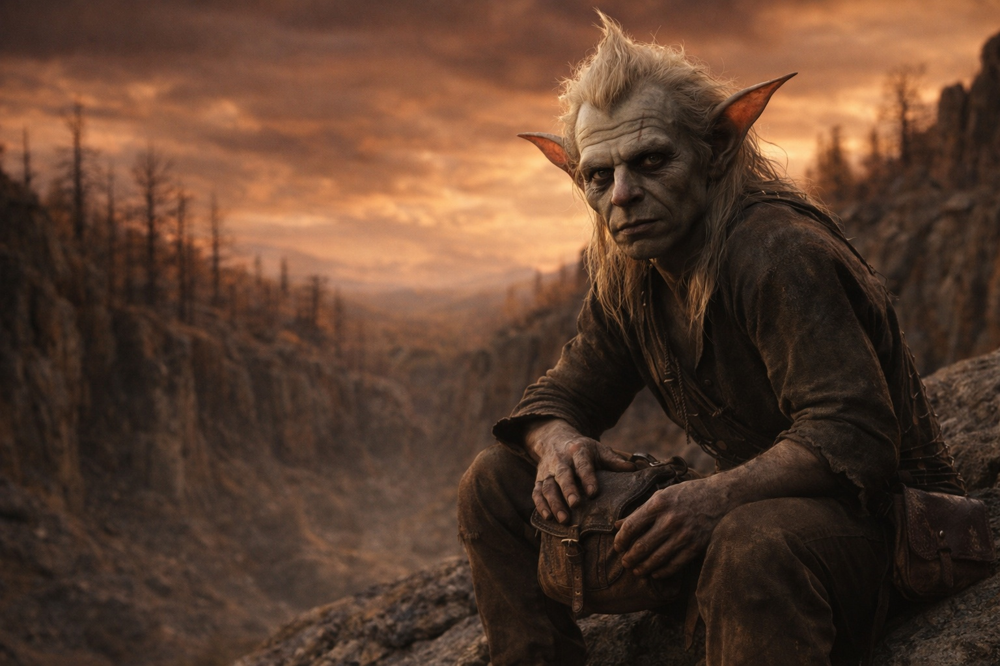
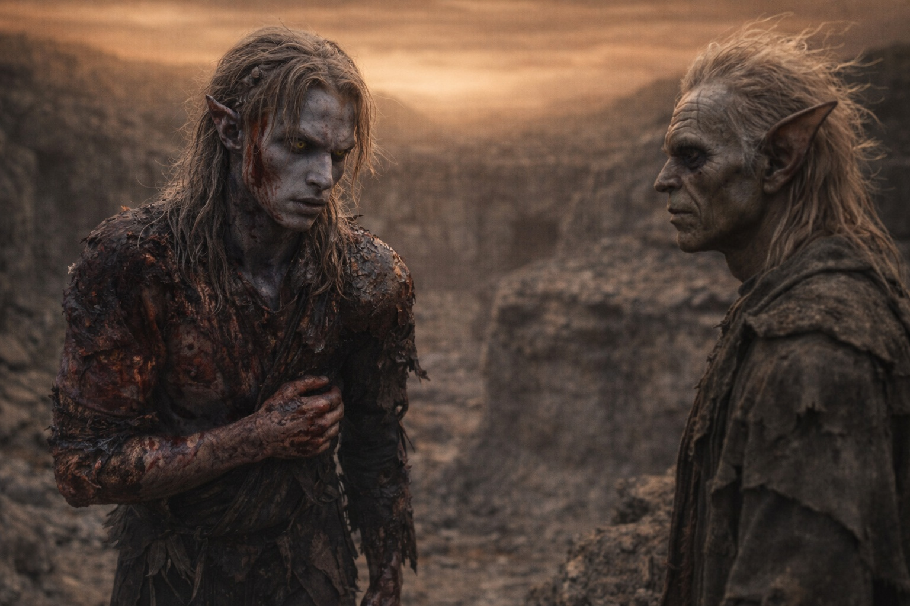
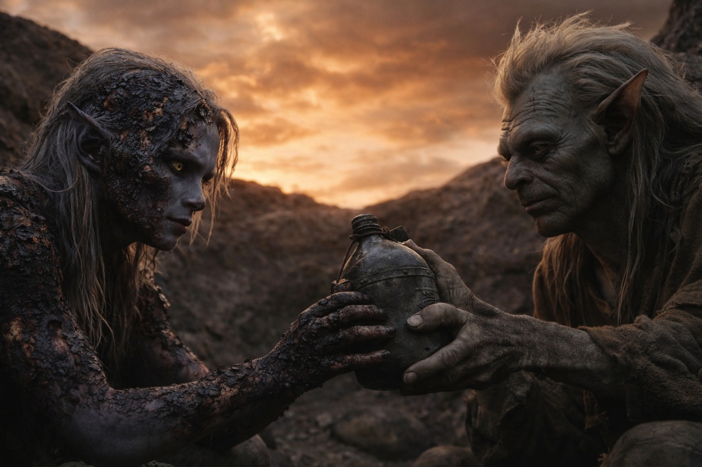
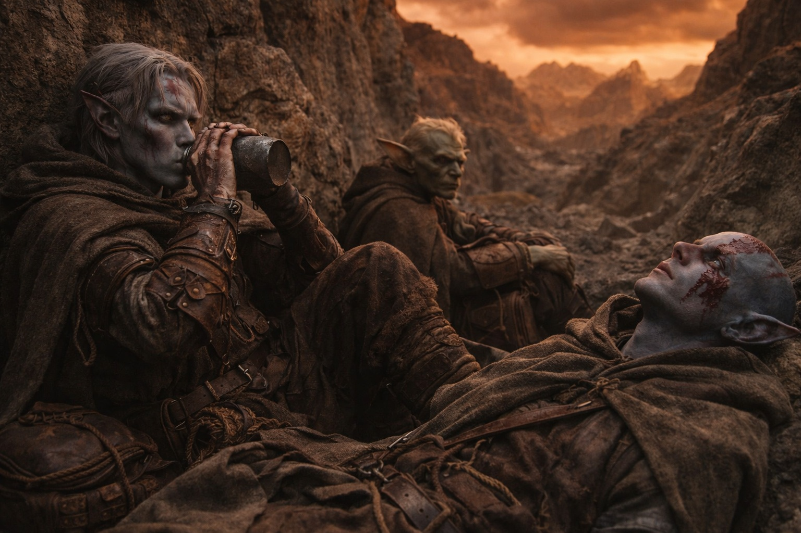

# Capítulo 46.2 | Lo Que No Puede Deshacerse: El Reencuentro

---

Los encontró en una depresión entre dos formaciones rocosas, al noreste del punto de rechazo, donde el terreno alterado ofrecía un refugio natural contra el viento y contra cualquier otra cosa que el mundo transformado estuviera engendrando. Srietz había elegido la ubicación del mismo modo en que elegía todo: con la precisión de alguien que calcula ángulos de aproximación, líneas de visión y capacidad defensiva antes de calcular la comodidad.

Srietz lo vio primero.

El goblin estaba sentado sobre una roca al borde de la depresión, mirando en la dirección por la que venía Drusniel; lo que significaba que había estado vigilando. Lo que significaba que había estado esperando. Lo que significaba que había calculado la probabilidad de que Drusniel sobreviviera al acto, saliera caminando de la zona de la barrera, siguiera las huellas hacia el noreste y llegara a esa ubicación, y el cálculo había arrojado un número lo bastante alto como para justificar sentarse en una roca a vigilar.

Srietz se puso de pie. Luego volvió a sentarse. Luego se puso de pie otra vez. Llevó las manos al pequeño morral de cuero en su cadera, el que contenía sus herramientas, sus notas y los objetos que usaba para calcular cosas; y sus manos tantearon el morral del modo en que las manos tocan las cosas cuando necesitan aferrarse a algo y lo que realmente quieren tocar no está disponible.

No habló.

Drusniel caminó los últimos treinta metros. Cada paso era visible para Srietz, y en cada paso Srietz podía ver lo que el acto había costado: las quemaduras, la sangre, la lentitud, la forma en que Drusniel sostenía su brazo izquierdo contra sus costillas, la ausencia del artefacto, los cristales oscuros, la postura de un cuerpo que había sido usado como conducto y devuelto a su dueño con el daño intacto.

Drusniel alcanzó el borde de la depresión. Miró hacia abajo. Elion estaba ahí, acostado boca arriba sobre una manta que Srietz había dispuesto, los ojos abiertos, mirando al cielo ámbar-óxido. El Sabio estaba callado. Por primera vez desde que Drusniel lo conocía, el Sabio estaba callado. Los ojos de Elion estaban claros. No nublados con la presencia dual del Sabio, no fluctuando entre su propia conciencia y la inteligencia antigua que compartía su cuerpo. Claros. Solo Elion. La claridad podría haber sido un regalo. Podría haber sido peor.

—Está hecho —dijo Elion. No era una pregunta.

—Sí.

Elion siguió mirando al cielo. El ámbar-óxido que era la respuesta a cada pregunta que alguien fuera a hacer sobre lo que había pasado. No se sentó. No miró a Drusniel. Miró al cielo porque el cielo era el resultado y mirarlo era lo mismo que mirar el acto.

—El Sabio está callado —dijo Elion—. Desde la cascada. Desde que el campo colapsó. No se ha ido. Puedo sentirlo ahí dentro, como un peso en el fondo de un pozo. Pero no habla. No dirige. Por primera vez en mi vida, mis pensamientos son mis pensamientos y nada más, y no sé qué hacer con eso porque nunca he tenido pensamientos que fueran solo míos.

El silencio después de eso fue lo suficientemente largo como para sostener el peso de lo que había pasado y lo suficientemente amplio como para sostener la distancia entre tres personas que habían atravesado algo que no tenía palabra.

Srietz no había hablado. Estaba de pie al borde de la depresión, a un metro de Drusniel, lo suficientemente cerca para tocar y sin tocar. La tercera persona había desaparecido de su postura. La armadura de distancia, el escudo lingüístico que mantenía al mundo a la distancia correcta, estaba abajo, y lo que había debajo era un goblin mirando a un drow con una expresión que Drusniel nunca había visto en la cara de Srietz porque Srietz nunca había permitido que estuviera ahí.

—¿Estás herido? —dijo Srietz.

No *Drusniel está herido*. No *Srietz observa daño*. No la construcción en tercera persona que organizaba el mundo en categorías que podían ser manejadas. Solo: *¿Estás herido?* Primera persona implícita. Segunda persona directa. La gramática de una persona hablándole a otra persona sin la armadura entre ellos.

—Sí —dijo Drusniel.

Srietz miró las quemaduras. La sangre. La forma en que Drusniel estaba de pie. El daño visible y el daño que no era visible y que Srietz podía calcular a partir del daño visible de la forma en que un matemático calcula el todo a partir de las partes.

—¿Srietz puede arreglarlo?

La tercera persona volvió. La armadura poniéndose. El mundo regresando a la estructura que Srietz necesitaba que tuviera para funcionar en él. *¿Srietz puede arreglarlo?* La pregunta hecha en la gramática de la distancia porque la respuesta iba a requerir distancia para sobrevivirla.

—No —dijo Drusniel.

Srietz asintió. El asentimiento fue pequeño y contenía todo. El reconocimiento de que el daño estaba más allá de la reparación. La aceptación de que el rol que Srietz había ocupado, el compañero que calculaba y preparaba y mitigaba, había alcanzado el límite de lo que el cálculo y la preparación y la mitigación podían abordar. El entendimiento de que lo que Drusniel había hecho no era el tipo de cosa que un goblin con un morral de herramientas podía arreglar, y que la incapacidad de arreglarlo no era fracaso sino escala.

Le dio agua a Drusniel.

La cantimplora era la que Srietz había cargado desde la costa. El agua estaba limpia, lo que significaba que Srietz había encontrado una fuente y la había filtrado, lo que significaba que Srietz había estado funcionando, lo que significaba que el goblin había sobrevivido al rechazo de la barrera y cargado a Elion hasta un refugio y establecido un campamento y encontrado agua y se había sentado en una roca y esperado. Todo eso. En el tiempo que le había tomado a Drusniel arrodillarse en la ceniza y ponerse de pie y salir caminando y seguir las huellas. Srietz había hecho lo que Srietz siempre hacía: lo siguiente, y lo que venía después, y lo que venía después de eso, hasta que la lista de cosas se agotaba o el mundo proveía cosas nuevas que hacer.

Drusniel bebió. El agua sabía a agua, que era una pequeña misericordia que catalogó de la forma en que catalogaba todo, automáticamente, sin decidirlo, el hábito que sobrevivía a las catástrofes de la forma en que el golpeteo del pulgar sobrevivía a las catástrofes, porque a los hábitos no les importa el contexto.

Se sentó. No al lado de Srietz, no enfrente. Solo cerca. La distancia que había existido entre ellos desde el volcán seguía ahí, el espacio creado por el desacuerdo y los cálculos diferentes y el conocimiento de que el camino de Drusniel conducía a donde Srietz no podía seguir. La distancia seguía ahí. Pero era más pequeña. Porque Srietz no era el tipo de persona que abandonaba cosas rotas, y Drusniel estaba roto, y el quebrarse había cerrado una distancia que el acuerdo nunca podría haber cerrado.

Se sentaron en la depresión. Los tres. El cielo ámbar-óxido arriba. El terreno cambiado alrededor. La barrera detrás de ellos, en algún lugar al suroeste, dañada y filtrando algo que no debería existir en este mundo. Nyxara se había ido. El cielo no contenía dragón. Lo que fuera que estuviera haciendo, la escala que sus operaciones ocuparan, no incluía esto: tres personas dañadas en una depresión rocosa, compartiendo agua, sin decir nada, esperando lo que viniera después.

—¿Qué pasa ahora? —preguntó Srietz.

Era la primera vez que hacía una pregunta sin ya saber la respuesta. La primera vez que los cálculos no habían producido resultado, las variables demasiadas y demasiado cambiadas para que las ecuaciones que le habían servido produjeran algo que no fuera error.

—No lo sé —dijo Drusniel.

—Srietz tampoco sabe. —Una pausa. Los cálculos ejecutándose de todos modos, porque Srietz no podía dejar de calcular más de lo que Drusniel podía dejar de catalogar—. Srietz ha calculado muchos resultados. Ninguno es bueno. —Miró al cielo. El color equivocado que no iba a convertirse en el color correcto—. Pero algunos nos tienen a nosotros dentro. Srietz tomará esos.

Drusniel miró al goblin. Las palabras eran calladas y eran lo más honesto que Srietz había dicho jamás, más honesto que las probabilidades y los cálculos y las construcciones en tercera persona que organizaban el mundo en algo sobrevivible. *Algunos nos tienen a nosotros dentro. Srietz tomará esos.*

Uno, dos, tres, cuatro. Su pulgar contra su muslo. El conteo que no significaba nada. El conteo que significaba todo.

Se sentaron. Esperaron. No sabían a qué.

---

**Fin del Capítulo 46.2 — continúa en el Capítulo 46.3: [Lo Que No Puede Deshacerse: El Estado Terminal](/lo-que-no-puede-deshacerse-el-estado-terminal/)**

