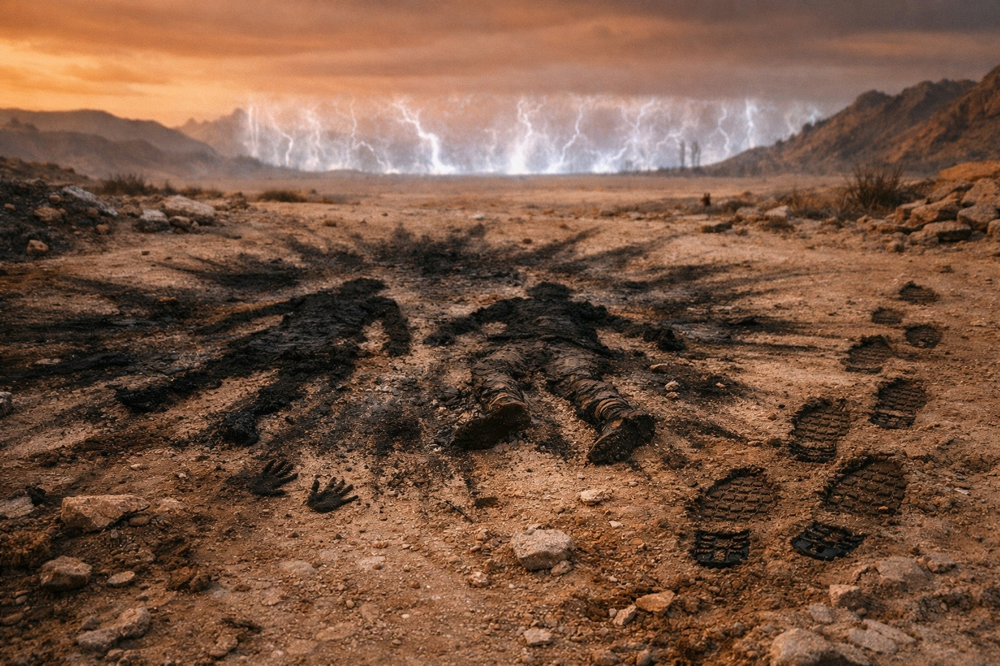
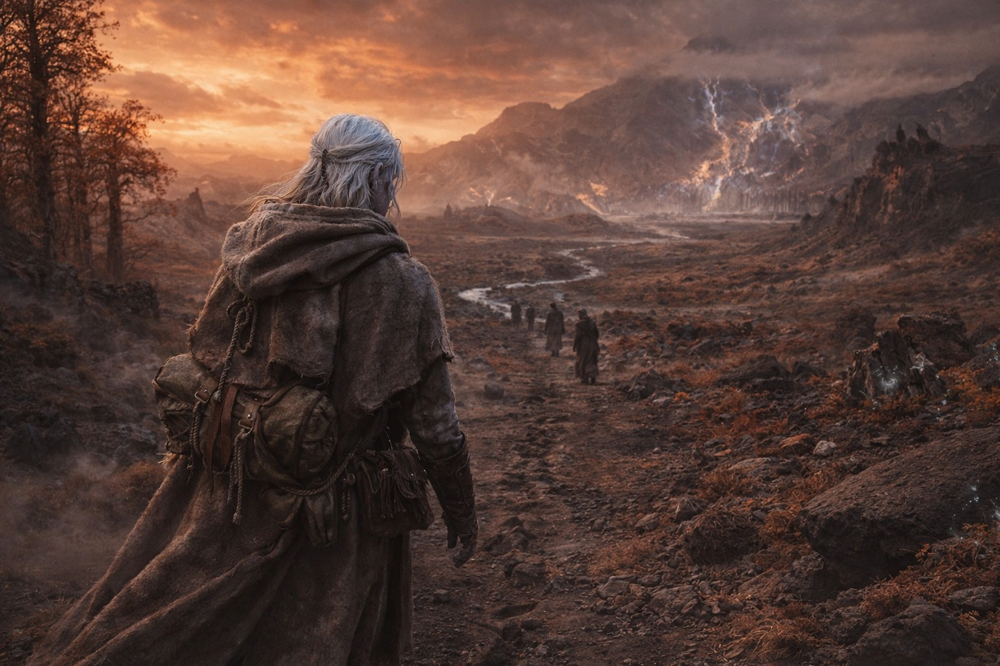

## Capítulo 46 | Parte 1 | El Regreso

---

Se puso de pie porque ponerse de pie era el siguiente paso, y el siguiente paso era lo único que quedaba.

Sus piernas aguantaron. La adaptación cristalina había sido calibrada para mantenerlo funcional; y funcional significaba ponerse de pie, y ponerse de pie significaba caminar, y caminar significaba abandonar el interior dañado de la barrera y regresar a lo que fuera en lo que se había convertido el mundo mientras él estaba adentro rompiéndolo. Sus costillas se quejaron. Sus manos quemadas se quejaron. Su magia vacía se quejó del modo en que se quejan las cosas vacías: resonando con un vacío a un volumen que la mente es incapaz de ignorar.

Uno, dos, tres, cuatro. El pulgar contra el muslo. Luego, caminó.

El interior de la barrera dio paso a la zona perimetral, el espacio de transición entre el centro del mecanismo y el mundo abierto. El cambio fue gradual. Las venas de energía muertas en el suelo se afinaron hasta desaparecer. La cúpula agrietada sobre su cabeza terminó y el cielo color óxido ambarino ocupó su lugar: ininterrumpido, permanente. El suelo pasó de ser piedra forjada al terreno de Wyrmreach que había recorrido durante semanas: la tierra veteada de obsidiana, la escasa vegetación, el paisaje que ya era hostil antes de la brecha y que ahora lo era de un modo distinto.

El mundo de este lado de la barrera seguía siendo el mundo. Pero era el mundo con algo nuevo en él, algo que no había estado ahí ayer, y cada árbol y piedra y parche de cielo lo sabía, aunque no pudieran decir qué había cambiado.

Caminó a través de él.

El terreno estaba alterado de formas lo suficientemente específicas como para catalogar y lo suficientemente erróneas como para resistir el catalogado. Un arroyo que debería haber fluido al este ahora fluía al norte, el agua corriendo contra la pendiente del terreno como si las reglas que gobernaban la relación del agua con la gravedad hubieran sido renegociadas localmente. Un grupo de árboles cuya corteza había cambiado de color en un lado, las superficies orientadas al sur oscurecidas a un óxido profundo que coincidía con el cielo. Cristales en las formaciones rocosas que habían estado inertes durante siglos ahora brillando débilmente, no con el pulso organizado de la red de la barrera sino con algo sin dirección, la energía de un sistema que había perdido su enrutamiento y goteaba en cada unión.

La magia se comportaba diferente aquí. No podía sentirla con sus afinidades agotadas, no podía buscarla de la forma en que alguna vez buscó, pero podía verla. El aire sobre ciertas formaciones rocosas relucía con un calor que no era calor. El suelo en ciertos lugares zumbaba con una vibración que sus pies sentían y sus canales de magia vacíos reconocían de la forma en que una taza vacía reconoce la forma del agua. El campo mágico estaba desestabilizado, y la desestabilización era visible para cualquiera que supiera cómo se había visto lo estable.

Caminó lentamente. La lentitud no era una elección sino un hecho, el hecho de un cuerpo que operaba con las reservas que la adaptación cristalina no había consumido y que encontraba cada paso como un gasto que rastreaba con preocupación creciente. Sus manos quemadas colgaban a sus lados. Sus cuatro cristales oscuros se asentaban en su cinturón, peso muerto. No llevaba nada útil. El artefacto estaba detrás de él en el suelo de la barrera. Los cristales estaban agotados. La magia se había ido.

Era una persona caminando a través de un paisaje cambiado sin nada más que su cuerpo y sus hábitos y el conteo en su pulgar.

Encontró el punto de rechazo después de dos horas.

El suelo contaba la historia. Marcas de quemadura en la tierra donde el protocolo de la barrera había empujado a Srietz y Elion hacia atrás, la descarga de energía dejando rayas ennegrecidas en el suelo en un patrón que irradiaba desde un punto central. El punto central mostraba las impresiones de un cuerpo, dos cuerpos, las formas presionadas en el suelo chamuscado donde habían caído cuando la barrera decidió que no eran compatibles y los devolvió con la eficiencia de un mecanismo que no distinguía entre rechazo y violencia.

Señales de forcejeo después. No contra la barrera. Contra el suelo. Las marcas de manos y rodillas en la tierra, el arañar de alguien levantándose, de alguien levantando a alguien más. Huellas de botas, profundas, cargando peso. Las huellas de Srietz, cargando a Elion. La profundidad de las impresiones contando una historia que Drusniel leyó con la precisión automática de un rastreador que había pasado semanas leyendo terreno: Srietz había levantado a Elion y caminado. Al noreste. Lejos de la barrera. Cargando a su compañero porque su compañero no podía caminar y porque Srietz no dejaba atrás a la gente sin importar lo que las probabilidades sugirieran.

Drusniel siguió las huellas.

El rastro era claro porque Srietz no estaba intentando ocultarlo. Las huellas del goblin eran profundas y firmes, la zancada de alguien cargando peso significativo sobre terreno difícil y manejándolo mediante la aplicación de voluntad a un cuerpo que no tenía razón de ser tan resistente como era. Junto a las huellas profundas, otras más ligeras, donde Elion había sido puesto en el suelo e intentado caminar, y luego las huellas profundas de nuevo, donde Srietz lo había levantado cuando el intento falló.

El rastro conducía al noreste a través del paisaje cambiado. Más allá del arroyo que fluía en la dirección equivocada. Más allá de los árboles con la corteza oxidada. A través de un terreno que era Wyrmreach y no era Wyrmreach y era algo intermedio que aún no tenía nombre.

Siguió. Un pie delante del otro. La forma más básica de propósito: alguien había caminado por aquí, y él caminaba detrás de ellos, y el caminar era suficiente porque caminar significaba dirección y dirección significaba que no estaba quieto en las ruinas de lo que había hecho.

Le dolían las costillas. Le dolían las manos. Sus canales de magia vacíos dolían con el peso fantasma de afinidades que ya no los llenaban. El cielo ámbar-óxido presionaba desde arriba, la contaminación visible en la luz, la anomalía que ahora era ambiental, atmosférica, permanente. La respiró porque sus pulmones adaptados la procesaban y porque no había aire alternativo.

Uno, dos, tres, cuatro. Siguiendo las huellas de un goblin cargando a un hombre a través de un mundo que había sido cambiado por la persona que los seguía.

---

**Fin del Capítulo 46.1  —> 46.2: [Lo Que No Puede Deshacerse: El Reencuentro](/lo-que-no-puede-deshacerse-el-reencuentro/)**

